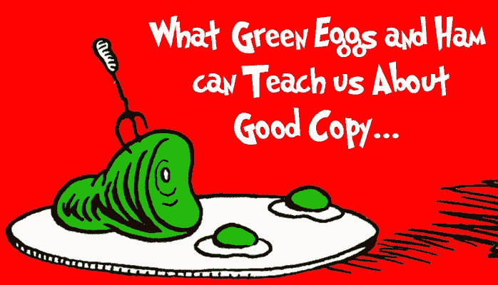

# 广告文案可以向苏斯博士学习的 3 件事

> 原文：<https://medium.com/swlh/3-things-copywriters-can-learn-from-dr-seuss-7baff1c1d8d1>

Image created by author

> “我不喜欢绿鸡蛋和火腿。我不喜欢他们，山姆，我是"

你知道吗，编辑班尼特·瑟夫和苏斯博士打赌说，他写不出使用不超过 50 个单词的儿童读物。结果是绿色鸡蛋和火腿——只用了 50 个不同的单词，仍然成功地讲述了一个抓住了孩子们想象力的故事…