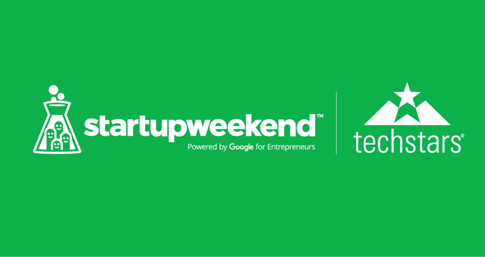
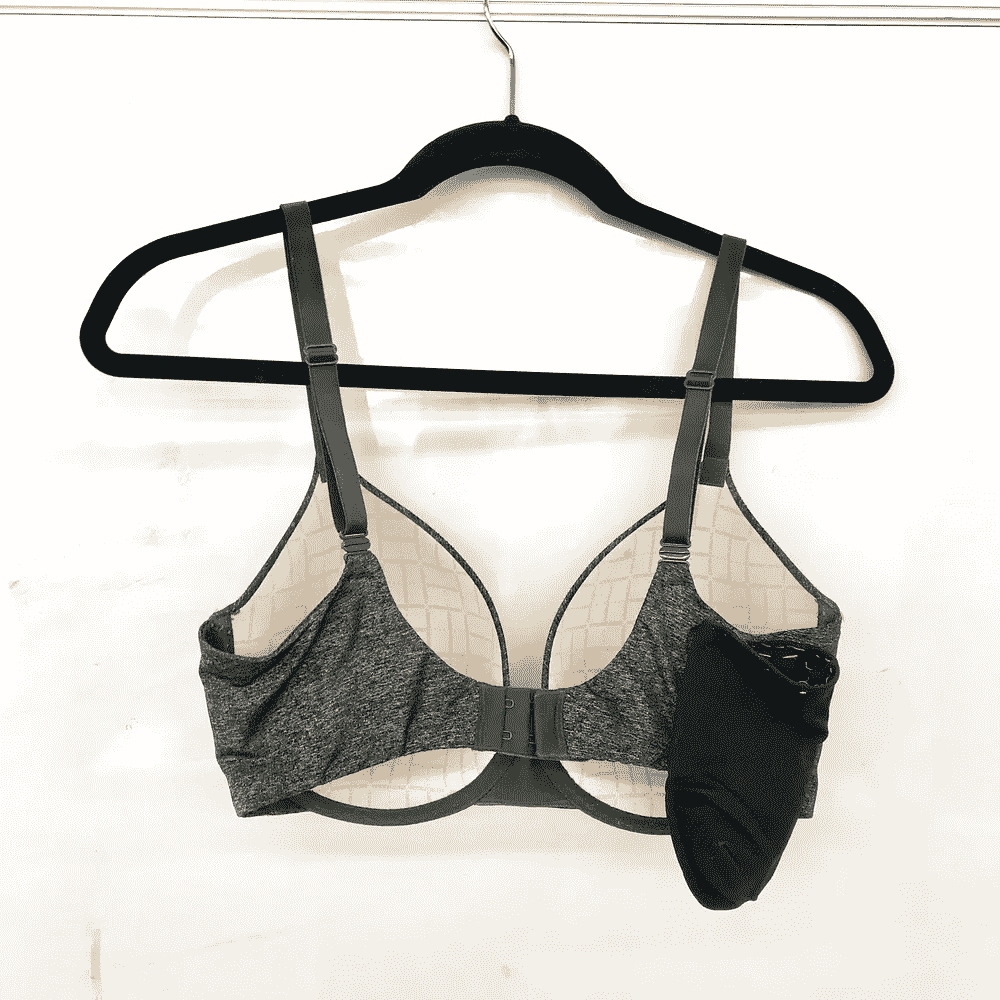
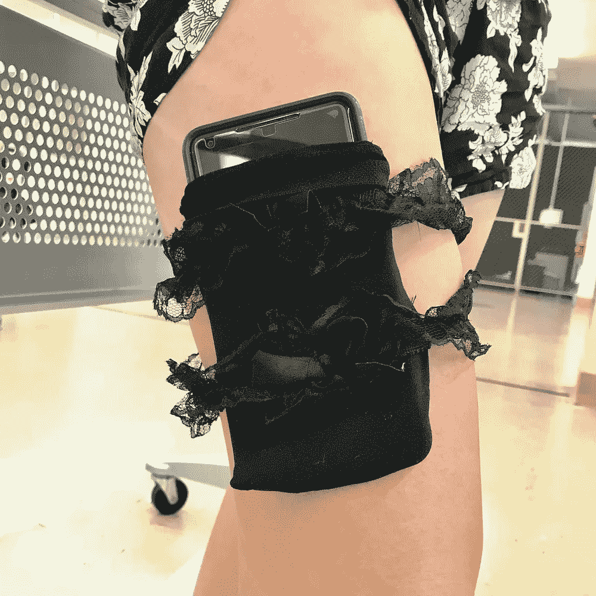

# 我在第一个创业周末学到的 3 件事

> 原文：<https://medium.com/swlh/3-things-i-learned-at-my-first-startup-weekend-a81976a6084e>

对于那些不熟悉创业周末的人来说，这是一个跨越整个周末的活动，你可以在 54 小时内创建一家公司，从构思到执行。该活动由帮助创业者成功的全球网络[**【tech stars】**](https://www.techstars.com/)**赞助。除了 Startup Weekend，Techstars 还因其为期三个月的加速器项目而闻名，并在全球多个城市策划 Startup Digest 和举办 Startup Week。在整个周末，你将获得各种各样的资源来帮助你的创业公司实现，包括一群导师、投资者和创始人在那里提供建议和反馈。通过 Startup Weekend 已经构思了几个创业公司，包括 [**Rover**](https://www.rover.com/) 、 [**Haiku Deck**](https://www.haikudeck.com/) 和 [**Foodspotting**](http://www.foodspotting.com/) ，这是对整个周末活动所提供的机会的真实证明。**

****

**我参加了 UCSB 的“创业周末”,在那里我和我的团队创立了“口袋科学”,这是一个服装品牌，其使命是消除选择时尚而非功能的需要。我们的想法是在发现一种在大学年龄女性中非常普遍的常见疼痛后产生的。因为在某些情况下，比如在音乐会、音乐节、酒吧或夜总会，提着包可能有点麻烦，所以许多女性开始决定把包留在家里。将必需品塞在口袋里也不是一个选择，因为大多数迎合女性的裤子没有足够深的口袋。因此，这使得许多年轻女性没有地方存放她们的必需品，如手机、身份证、钥匙、现金和信用卡。这导致了一个巨大的问题。在走访 Isla Vista 并与我们的目标客户交谈后，我们了解到他们经常丢失自己的物品，并且由于没有合适的地方放置手机，他们的手机屏幕经常会掉落或摔碎。我们创造了一个最小可行的产品，包括胸罩和吊袜带，还有缝在侧面的口袋。**

****口袋科学最终获得了第三名和人民的选择(woooo** 🙌🏼🙌🏼🙌🏼**)！我们还获得了免费的专利和法律咨询。****

********

# **吸取的教训:**

*****1。一点幽默可以带来很大的帮助***
每个人都知道，精彩的故事对于传播你的创业愿景和向客户传达你的产品/服务的需求非常重要。然而，如果你能让你的观众开怀大笑，你就已经挖到金子了。说到讲故事的艺术，有两条路可以走——悲伤的、引人入胜的路或者娱乐大众的有趣的路。我们团队做的一件事让我觉得我们赢得了第三名和人民的选择，那就是我们在推介开始时做了一个喜剧小品，逗得观众大笑。我们描绘了一幅画面，通过重现现实生活中的情景，让人们更好地理解不带包随身携带必需品是多么痛苦。在几支铅笔、几块橡皮、一个计算器和一些花生酱的帮助下，我们的小品让观众们在座位上捧腹大笑。如果你能让你的观众发笑，通过展示你人性的一面，你会变得更有亲和力。**

*****2。展示是关键在商业中，展示就是一切。别人如何看待你的产品/服务会影响它的感知价值。你在世界上的形象会影响人们对你和你的公司的印象。无论你的产品或服务有多好，如果它的价值没有被恰当地传达和理解，人们就不会知道它的价值。除了短剧之外，我们的团队还制作了一个简单易读的宣传资料，以流线型的方式组织，并配有丰富的视觉效果来帮助传播信息。我们的资料(附在本文末尾)简明扼要，清楚地表达了我们想要传达的信息。我们还制作了我们产品的实物原型，并在推介时将它们交给评委们去玩。这无疑有助于观众迅速理解我们的想法，因为他们有一个实际的有形物体进行互动。*****

*****3。有时是一些简单的事情***
在出席的 10 个团队中，我们的团队是唯一一个没有提出技术相关想法的团队。我们的产品包括从 K-Mart 购买的简单的手工缝制的衣服和在我们的衣柜里找到的其他旧衣服。尽管我们的产品很简单，但我们已经实现了产品/市场的契合。许多新的创业公司迷失在最新的小玩意和小发明中，依附于潮流公司，并使用花哨的流行词来放大他们在别人眼中的“尖端”程度。请记住，最终，重要的是你为客户提供的价值，追赶最新的技术潮流并不总是最好的方式。**

**Pocket Science Pitch Deck**

**对于任何有兴趣参加创业周末的人:
我强烈推荐任何对创业有一丁点兴趣的人参加创业周末。您将学习如何在有限的时间内快速迭代想法并构建 MVP。该活动也是一个很好的社交机会，因为除了接触当地的创业场景之外，你还会被志同道合的个人、创始人、投资者和其他有影响力的人所包围。你可以找到更多关于全球各地各种创业周末的信息，并在这里找到离你最近的**！****

*******原帖***[**https://www . unosusanto . com/blog/3-things-I-learned-at-my-first-startup-weekend**](https://www.unosusanto.com/blog/3-things-i-learned-at-my-first-startup-weekend)**。******

> *****喜欢你读的东西？去我的* [*博客*](https://www.unosusanto.com/blog/) *看看我写的更多文章吧！也可以随时关注我的* [*推特*](https://twitter.com/unosusanto) *和*[*insta gram*](https://www.instagram.com/unosusanto/)*敬请关注最新更新:)*****

********

## ****这个故事发表在 [The Startup](https://medium.com/swlh) 上，这是 Medium 最大的创业刊物，拥有 309，732+人关注。****

## ****在这里订阅接收[我们的头条新闻](http://growthsupply.com/the-startup-newsletter/)。****

********