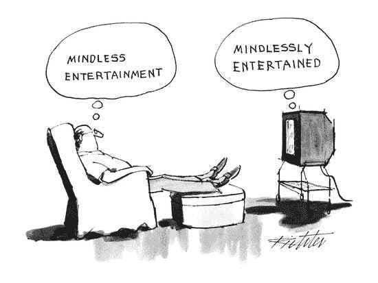
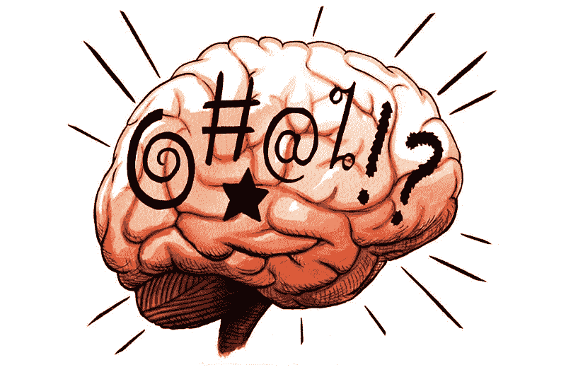
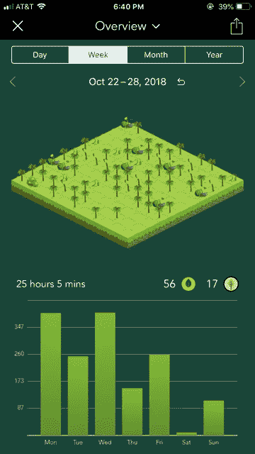
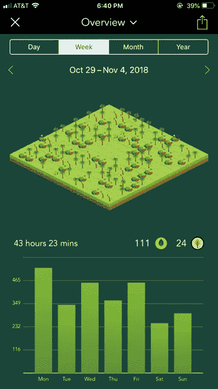

# 3 种不同寻常的有研究支持的方法来提高定向聚焦

> 原文：<https://medium.com/swlh/3-unusual-research-backed-ways-to-boost-directed-focus-8219a0f04de1>

## 提高工作和业务效率

我们都知道专注对我们日常目标的重要性。每当我想到焦点，它就让我想起龟兔赛跑的故事。众所周知，龟兔赛跑是一个永恒的童话。它包括两个角色之间的比赛，一只乌龟和一只兔子。乌龟缓慢而稳定地移动，而兔子跑得如此之快，以至于他对自己的速度变得自大起来。

在我成长的过程中，我总是被告知，兔子远远领先于乌龟，以至于他决定在一棵大树下小睡一会儿。当兔子醒来的时候，乌龟已经设法赢得了比赛！我认为这个故事的真正意图是突出兔子的傲慢和乌龟的坚持。然而，我从这个故事中得到的教训与众不同。我以为乌龟赢了是因为他的专注能力！

Photo Credit: Wikipedia.com

在现实生活中，我们不一定能像乌龟一样慢慢地工作。然而，如果我们想在职业生涯中持续下去，我们确实需要调整自己的速度。神经学家将我们专注于一项任务的能力称为*定向注意力*或*定向注意力*。事实证明，心理学研究表明，我们集中注意力的能力利用了看似有限的认知资源。(鲍梅斯特等人，2007 年)

众所周知，这种认知资源(尚未完全确定)可以通过睡眠和冥想来补充。(唐&波斯纳，2012)由于人体只能接受这么多的睡眠，由于每个人和他们的兄弟都已经建议在自我改善的世界里冥想，我想探索更多不同寻常的方法来补充我们执行需要直接注意力的任务的能力。

常见的建议包括自律技巧的教授。诚然，这包括了我自己给出的一些建议。虽然自律很重要，但它只能在你的认知极限允许的范围内进行。我想找到一种方法从根本上解决一天中注意力不集中的问题。如果我们能学会如何保存*和*补充定向聚焦所必需的认知资源，我们就能在更短的时间内完成更多的事情。不仅如此，我们还可以这样做，而不会在一天结束时感到筋疲力尽。

我今天要分享的三种方法都是为了达到这个目的。它们都有心理学研究的支持，我自己也尝试过，结果出人意料的好。我相当有信心，这些方法可以为你做同样的事情。话虽如此，还是从第一种方法开始吧。

# 1.避免“傻瓜-黄金”补货活动

通常，我们试图通过做我们喜欢的事情来补充我们的注意力。事实证明，这并不总是有效的。定向注意力的补充实际上取决于我们在休息和下班时间所做的活动。

你认为在休息日看电视、YouTube 或网飞是放松的好方法吗？我当然这样认为，但我最近的探索让我有了不同的看法。我已经意识到我珍贵的休闲时光只不过是傻瓜——黄金！

Photo Credit: Art.co.uk

当我深入研究定向聚焦时，我惊讶地发现几项研究证明了电视对我们补充必要认知资源的能力的阻碍作用。Kaplan & Berman (2010 年)的一篇研究论文中的一个特别之处引起了我的注意:

> 正如曼德(1978)如此有效地指出的，电视是精心设计来阻止人们离开正在观看的频道的。换句话说，电视创造了注意力的捕捉。这种令人不满意的状况的一个迹象是，很大比例的电视观众希望他们能花更少的时间看电视。因此，观看的行为很可能会造成冲突的局面。这种情况的一个迹象是，人们看电视的时间越长，他们就变得越易怒。因此，许多人认为是娱乐性的活动实际上是在增加而不是减少精神疲劳。

你可能会想:如果是这样的话，为什么像电视这样的活动很少需要参与，而我们却很难专注于像周三到期的商业报告这样的活动？

Kaplan & Berman (2010)解释说，当我们执行大脑认为天生无趣但对长期目标很重要的活动时，我们会使用*自愿注意*。主动注意意味着我们必须做出深思熟虑的选择，排除其他干扰，专注于手头的任务。另一方面，像电视这样的活动充满了各种内在有趣的东西，如性、暴力和戏剧，只需要*不自觉的注意力*去处理。

Ruff 和 Rothbart 的另一项研究(1996 年，第 29 页)指出，你的注意力的刻意性和定向聚焦的利用并不相互排斥。就像，你可以参与一项有趣又轻松的活动，比如看电视(这需要无意识的注意力)，但还是要使用定向注意力来做这件事。

Photo Credit: Spectator.co.uk

这些研究人员试图得到的只是因为一些事情不需要我们投入注意力，并不意味着它不会耗尽我们的认知资源。除了电视之外，还有许多其他活动对我们来说本身就很有趣，但仍然需要直接关注。这些活动可以包括体育赛事、浏览社交媒体、视频游戏，甚至是阅读有趣的文章！

我是不是在暗示做这些事情是错误的，或者这些活动应该永远从你的生活中消失？当然不是。这里的关键要点是:**如果你想补充你的注意力，不要把你大部分的休息时间和休息日都花在这种活动上。**

这当然引出了一个问题:我们应该做什么？

# 2.通过自然来补充定向聚焦

根据研究，一项很有可能补充我们注意力的活动是与自然环境的互动。(伯曼、约尼德斯和卡普兰，2008 年；Kaplan，1995) **这意味着补充直接注意力的最简单、最便宜、最有效的方法之一就是花些时间凝视自然风景！**

这可能包括湖泊、森林、海滩、丛林、河流或任何其他没有工业/人造特征的完全自然的环境。我还应该提到，像城市、住宅区、甚至度假村这样的城市风景对补充定向聚焦是无效的。我很快会解释为什么，但首先我想展示一个有趣的研究来支持这个方法。

Photo Credit: People.com

这项特殊的研究是关于癌症患者康复的表现(Cimprich 1993)。这项研究中的所有癌症患者都获得了医疗许可，可以回家恢复正常生活。显然，在刚刚度过一个潜在的威胁生命的状况后恢复正常说起来容易做起来难。可悲的是，许多癌症幸存者在离开医院后的某个时候还在与婚姻和工作相关的困难作斗争。

研究人员假设，癌症患者的困难可能与无法专注于使他们的事业和婚姻成功的事情有关。为了测试这种情况，他们让一半的参与者报名参加认知恢复活动，如自然散步或园艺，而另一半作为对照组，没有被分配活动。实验组每周只进行三次这种恢复性活动，每次最少持续 20 分钟。Cimprich 和他的同事记录的结果令人难以置信。以下是 Kaplan & Berman (2010)的重复结果:

> *实验(修复)组显示稳步改善；对照组没有。此外，恢复性小组的参与者更快地重返工作岗位，更有可能重返全职工作。另一个显著的不同是恢复性小组的成员倾向于开始新的项目(例如，学习一门语言或减肥)。对照组参与者没有报告新的项目。最后，实验组成员在生活质量评分上表现出明显更大的提高。*

对我来说，最令人惊讶的是这种方法有效所需的时间很短。表现出惊人改善的癌症患者每周只参加一小时的自然散步。想象一下，如果我们每天都使用这种方法，我们会变得多么有效？

我决定测试一下这种观察自然环境的方法。那些和我亲近的人可以证明，我有一个习惯，那就是记录我几乎每天花多少时间专注于我的目标。我是通过一个叫 [Forest](https://www.forestapp.cc/en/) 的 app 做的(非挂靠，只是粉丝)。我不会告诉你这个应用程序如何工作的细节，但请记住我将要向你展示的对我来说重要的目标的工作时间记录的结果。话虽如此，以下是结果:

The previous week was below average. I usually average 30–35 hours. Regardless, this serves as a decent comparison.

This is the first week that I’ve practiced the 3 methods shared in this article. I’ve never been able to focus so intently!

我的个人经历本身并不能证明这种方法的有效性(这就是科学的作用)。然而，我想分享我所做的，希望对你有用。首先，我试着在开着的窗户附近工作。我没有坐在我的家庭办公室里，而是坐在了用餐区。从餐桌上，我可以看到后院的树林。我这样做是因为研究表明，在能看到自然环境的教室里学习的学生比能看到城市环境的同学表现得更好(Inzlicht，m .，& Good，C. 2006)。

接下来，我会大约每小时休息 10 分钟去外面散步。我会凝视树木，灌木，小石头，也许一只小鸟会飞过。我真的能感觉到我的心在放松，远离紧张的工作。如果夜幕降临，我会简单地观看 YouTube 上的自然漫步或风景视频，效果非常相似。我现在正在考虑买一个虚拟现实耳机，这样当我碰巧无法接触到真实的东西时，我就可以真正沉浸其中了！

观看自然恢复直接注意力的原因是因为这种活动具有高度的*软魅力*。软魅力是一个心理学术语，用来描述在没有利用我们的定向注意力能力的情况下，捕捉我们的无意识注意力的活动。自然界中的各种各样的物体恰好足够有趣，在我们的大脑感到厌倦并转向场景中的下一个物体之前，只需看几秒钟。不仅如此，这个场景吸引我们的注意力是如此之少，以至于我们的思想可以同时转移到其他想法上。

这一观点也解释了为什么城市环境不利于注意力恢复。如果你在繁忙的城市街道上散步，试图给你的认知资源充电，你会惊讶地发现各种各样的事情偷走了你的注意力。你会忽略广告牌上的广告，留意交通状况，留意混凝土上潜在的坑洞。呀！

不知何故，这种*无定向注意力*的状态似乎补充了与定向注意力相关的认知资源。我无法找到这背后确切的神经机制，但不管怎样，它似乎是有效的。

# 3.停下来。首先解决内部噪音

改善定向聚焦的最后一个方法是另一个预防措施。我们都有生活中的问题，只是我们还没有花时间去处理。我们经常引用忙碌作为我们没有花时间处理问题的原因。这些问题通常是情绪化的，会涉及到我们与他人的关系。你知道吗，未解决的问题会产生一种内部噪音，这种噪音会阻碍其他任务的认知功能。(伯曼、乔尼德斯和刘易斯，2009 年；Jonides 等人，2008 年；莱万多夫斯基、盖革和奥伯劳尔，2008 年；Wixted，2005)在我花时间做更多的研究之前，我真的不知道是这种情况。

也就是说，脑子里有问题会极大地消耗你的注意力。你可以通过花时间反思你无法改变的负面事件来避免这种额外的认知负担。充分体验你的情绪，释放与那些事件相关的情绪。如果你有能力纠正你脑海中的某些想法，也许是时候去面对它了。试图强迫自己解决生活中的问题是不健康的。从实用的角度来看，这也是低效的。

Photo Credit: Truestressmanagement.com

我的建议很简单:**如果你发现自己不停地在想一个与手头工作无关的问题或困难，叫一个暂停，然后马上处理它。你将节省更多的脑力，更不用说安心了。一旦你解决了引起内部噪音的问题，你的大脑就会感到自由。然后你就可以全力以赴去做对你来说最重要的工作。**

我希望这篇文章能帮助你学会一些提高注意力的新方法。总的来说，你会想少做一些分散注意力的休闲活动。你也想通过柔和的魅力进行更多的利用非直接注意力的活动(比如自然漫步)。最后，在开始工作之前，你应该处理好影响你生活的内部冲突和问题。如果你有任何进一步的问题或想分享你的两美分，我很乐意听到你的下面！

## 这篇文章发表在[《创业](https://medium.com/swlh)》上，这是 Medium 最大的创业刊物，有+399，714 人关注。

## 在这里订阅接收[我们的头条新闻](http://growthsupply.com/the-startup-newsletter/)。

