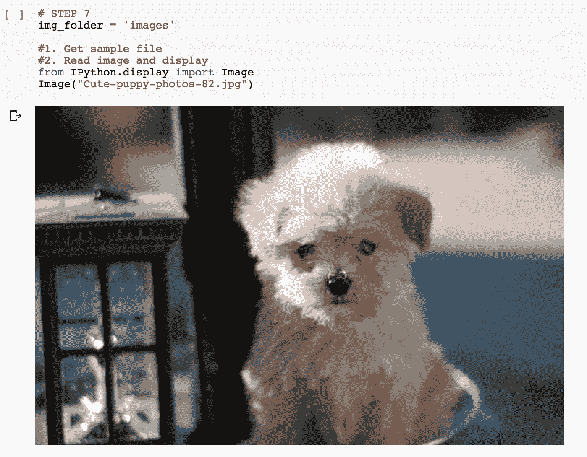

# 用 1 美元建造人工智能的 3 种方法

> 原文：<https://medium.com/swlh/3-ways-to-build-an-a-i-using-1-476f1bf51ec3>

这篇文章概述了三种在不破产的情况下构建人工智能的方法。


unsplash: [https://unsplash.com/photos/JW6r_0CPYec](https://unsplash.com/photos/JW6r_0CPYec)

为了简化起见，我将重点介绍三种常见的使用情形:

1.  用户数据—了解改善体验的见解—行为特征
2.  对话界面——客户支持助理(Siri、Google Home、Alexa……)
3.  图像分类—使用图像数据自动发现见解(用于自动驾驶汽车、苹果 FaceID)

要建立任何人工智能系统，你需要的是被正确标记的数据。例如，信用卡购买项目的每个数据点都有一个描述和类别:

```
category: food, description: mcdonalds, price: $4.95, timestamp: 04092018 12:10:00 PM
```

如果没有这个，你的电脑将无法从你提供的东西中学到任何东西…

> 垃圾进垃圾出！

# 如何开始

用免费的网络/开源工具自己做所有的事情！

你会惊讶地发现，有多少公司专注于开发工具，让构建人工智能像使用 Photoshop 一样简单！

对于上面的三个用例，这里有一些工具，我会用不到 10 个小时的努力就能得到一个原型，并且**不用花超过 1 美元就能使用所有的工具！**

# 1.[h20 . ai——无人驾驶人工智能](https://www.h2o.ai/driverless-ai/)


credit: screenshot from h20.ai website

你可以导入一个 csv 格式的数据，它将开始根据这些数据为你提供见解，想想……导入你的信用卡数据，找到一些个人见解。

## 优点:

*   mac 和 windows 的桌面应用程序；轻松入门的教程视频
*   轻松导入逗号分隔值文件(csv)
*   点击界面

## 缺点:

*   很难让工程师从最初的应用程序中复制模型代码
*   与现有服务集成的灵活性有限(除非您是工程师)

# 2.[对话流](https://dialogflow.com/)


credit: screenshot from dialogflow.com

你可以建立一个对话式的聊天界面，并将其与 slack、messenger、telegram、twitter 集成在一起，只需点击几下鼠标就可以了，对吧？

## 优点:

*   Web 应用程序和拖放界面；帮助您快速入门的示例项目
*   可集成到许多消息应用程序 telegram，slack，messenger…
*   使您的系统更加智能的附加服务，如对话流和消息变体类型
*   可集成到任何源项目中

## 缺点:

*   如果需要，限制对源代码的访问以进行复制，**但是您真的打算这么做吗？！**

# 3.谷歌协作笔记本



credit: screenshot from tutorial notebook

这个工具有点难用，在之前的帖子中我整理了一个教程让人们从这里开始使用[。](https://medium.freecodecamp.org/learn-to-build-a-convolutional-neural-network-on-the-web-with-this-easy-tutorial-2d617ffeaef3)借助这些笔记本电脑，您可以在几分钟内建立开发和培训环境，并在不到一小时的时间内开始对数据或图像进行分类。

## 优点:

*   轻松安装图像分类所需的支持库，如 keras、tensorflow 和 openCV
*   代码级别的控制，并可在您的开发团队中共享
*   可集成到您现有的开发周期中

## 缺点:

*   最适合开发人员和工程师
*   如果您需要在自己的服务器上实现本机解决方案，可能需要额外的开发时间

有了这些工具，你应该能够在不到 10 个小时内为你的用例建立一个原型。你甚至可以和朋友一起测试，太棒了！


喜欢这篇文章吗？点击“掌声”推荐给其他感兴趣的读者！感谢👍

[](https://medium.com/swlh)

## 这个故事发表在[的创业](https://medium.com/swlh)上，这是 Medium 最大的创业刊物，有 314，785+人关注。

## 订阅接收[我们的头条新闻](http://growthsupply.com/the-startup-newsletter/)。

[](https://medium.com/swlh)