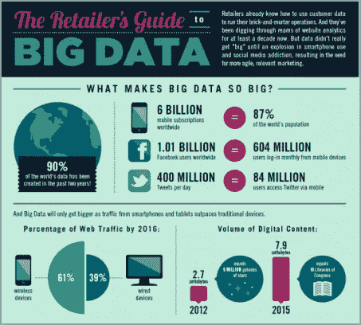
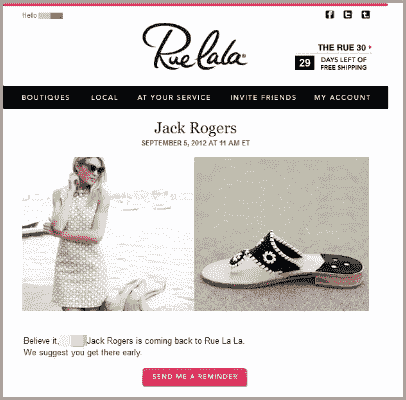
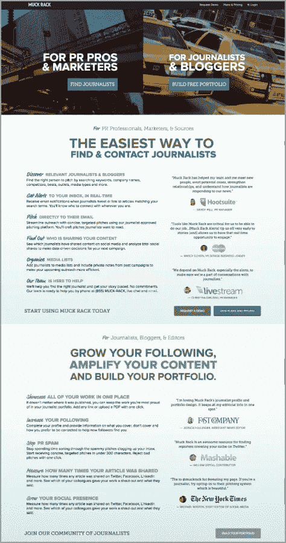

# 创建数据驱动营销活动的 3 种方式

> 原文：<https://medium.com/swlh/3-ways-to-create-data-driven-marketing-campaigns-39064ec3ff7b>

我们曾经熟知的市场营销已经死亡。

过去，喊得最响、给的激励最多、在自己的领域最有权威的品牌赢得了战斗。但今天，我们已经进入了一个更加以客户为中心的时代，在这个时代，你的品牌的价值取决于它与你的目标受众联系的能力，并通过超越和满足他们的所有需求、需要和兴趣来赢得他们。

虽然这听起来对每个人来说都是双赢，但大规模获得好感是极具挑战性的。这就是为什么最终，每个营销人员都必须求助于数据，在深层次、个人层面上了解他们的客户。

有了数据，您可以获得基本信息，如位置、年龄、性别等，以及更有利可图的信息，如以前的购买、购买模式等。

当然，这些信息丰富了你的营销活动，使它们更贴近你的受众。请继续阅读，了解使用数据和市场研究来重新定义您的营销工作的最佳方式。

# 什么是大数据技术？

[大数据技术正在众多行业掀起波澜](http://www.mckinsey.com/business-functions/business-technology/our-insights/big-data-the-next-frontier-for-innovation)。虽然互联网上有很多关于大数据的讨论，但对于我们这些不熟悉这种策略的人来说，这个术语可能会感到模糊和难以捉摸。

简而言之，大数据是分析大型数据集以获得行为、活动和许多其他重要影响的模式的过程。

从[营销的角度来看](http://www.inc.com/mick-hollison/5-ways-big-data-will-change-sales-and-marketing-in-2015.html)，这是一个游戏改变者。在一个简单的地方收集所有关于特定用户群的购买习惯、趋势和好恶的必要信息，可以帮助您更好地适应客户需求，从而使您的目标计划更上一层楼。最终，你会获得更多的销售额、更高的忠诚度和客户保持率。

以[沃尔玛](http://searchcio.techtarget.com/opinion/Ten-big-data-case-studies-in-a-nutshell)为例。这家零售巨头通过使用大数据来更好地了解客户的搜索词，使在线购买量增加了 10-15%。因此，他们能够为用户的每次搜索提供更相关的产品。

虽然大数据肯定是创新的，但将其付诸实践可能会有点复杂，这就是为什么聪明的营销人员利用大数据技术提供商的原因。让我们学习如何。

# 让它发挥作用:情境营销和精准营销

有了大数据做后盾，下一步就是利用获得的信息来创建超有针对性的数据驱动型营销活动。使用诸如[情境营销](http://www.marketingprofs.com/articles/2015/28431/five-best-practices-for-real-time-contextual-marketing)和[精准营销](http://www.seraphscience.com/precision-marketing-serves-audience-creep/)等策略将帮助你做得更好。

顾名思义，情境营销是利用数据得出各种情境，在这些情境中，特定的营销推广会取得成功。通常，他们关注五个主要因素:地理位置、时间、设备、语言和性能。

例如，一个当地的小企业可能希望使用地理定位作为一种策略来赢得他们所在地区的客户。同样，巧克力企业可能想利用以时间为导向的环境，如情人节或母亲节。

正如你所看到的，这种策略更加个人化，因为它是为了理解客户的推理和推动购买特定产品和服务。

另一方面，精确营销让营销人员更好地了解需求、行为模式和兴趣，使营销人员能够根据每个细分市场的个人偏好调整产品和促销活动。这样，当客户对特定的摇滚乐队表现出兴趣时，你可以通过向他们展示相似艺术家的歌曲来锁定他们。

现在你有了超越个性化的数据和策略，是时候进行实际应用了。这是你进入创建数据驱动营销活动的本质的地方。

# 策略# 1——有针对性的电子邮件营销

记住以上几点，你就可以将你的下一个[电子邮件营销活动提升到下一个水平](https://blog.kissmetrics.com/6-email-personalization-techniques/)。

大数据技术将帮助您收集所有必要的信息，以创建各种微观细分的人物角色。例如，您可以将加利福尼亚州所有 50 岁以上的女医生配对，或者将居住在新泽西州的青少年足球迷分组。然后你可以[开发专门针对他们需求和兴趣的电子邮件活动](http://www.jeffbullas.com/2016/07/02/6-warning-signs-email-marketing-scaring-away-subscribers/)，以便从一开始就抓住他们。

你甚至可以通过创建[电子邮件来触发他们的行为](https://www.clickz.com/clickz/column/2406613/behavior-triggered-email-campaigns-win-and-keep-customers)。根据 ClickZ 的调查，这种策略已经被证明可以重新获得 10-20%的不参与客户。

以下面 Rue Lala 的电子邮件活动为例，它的目标客户是以前的购买记录。这项活动更有效，因为它注意到了用户的口味和预测行为，以驱使他们再次购买。

# 策略 2——重新定位营销活动

重新定位对所有专业营销人员来说都至关重要。根据[Conversion XL](http://conversionxl.com/ppc-retargeting-case-studies/),[watch finder](http://www.watchfinder.com/)的重新定位努力导致投资回报率增加了 1300%，这当然揭示了重新定位活动的有效性。

像这样令人难以置信的结果，以及客户参与度和忠诚度的提高，使得目标重定位如此受欢迎，尤其是在电子商务和其他类似行业领域。

由于[重新定位](http://marketingland.com/every-marketer-leverage-retargeting-96352)本质上是针对那些之前对特定产品表现出兴趣的人，当你能够汇总重要数据，如位置、兴趣和客户过去看过哪些产品时，重新定位显然会更有效。

成功的重新定位活动依赖于大数据分析软件解决方案来帮助公司实时接收、处理和分析如此大量的数据。这些解决方案可以是基于云的、内部部署的，也可以是两者的组合。

例如，Expedia 的这一重新定位活动针对的是以前搜索度假、机票和/或酒店房间的用户。由于他们知道如何联系对旅行感兴趣的人，他们能够自动向感兴趣的用户提供相关交易，从而显著提高搜索结果。

# 策略#3 —登录页面

[登陆页面](http://www.jeffbullas.com/2015/11/04/leverage-true-potential-landing-pages/)允许你根据一个合乎逻辑的用户旅程来吸引你的客户。这样，他们可以通过与您提供的产品和/或解决方案相关的各种搜索词找到您，并且更有可能执行您期望的行动号召。

由大数据支持的有针对性的登录页面将此提升到了一个新的水平。与典型的登录页面不同，目标登录页面使用数据来确定哪些受众对特定主题感兴趣。通过这种方式，你可以针对每个登录页面的最相关的人物角色，每次都获得更大的兴趣和更多相关的潜在客户。

比如[渣渣架](http://muckrack.com/)下面的登陆页面，有两个特定的目标受众。因此，为了取得成功，登录页面本身必须满足他们的特定需求。

# 最后的想法

使用数据来推动你的营销活动可以帮助你的营销飙升到新的高度。你变得与你的观众的需求联系得更紧密，因此，他们更有可能在未来几年向你寻求解决方案。

## 这个故事发表在 [The Startup](https://medium.com/swlh) 上，这里有 258，400 多人聚集在一起阅读 Medium 关于创业的主要故事。

## 订阅接收[我们的头条](http://growthsupply.com/the-startup-newsletter/)。

