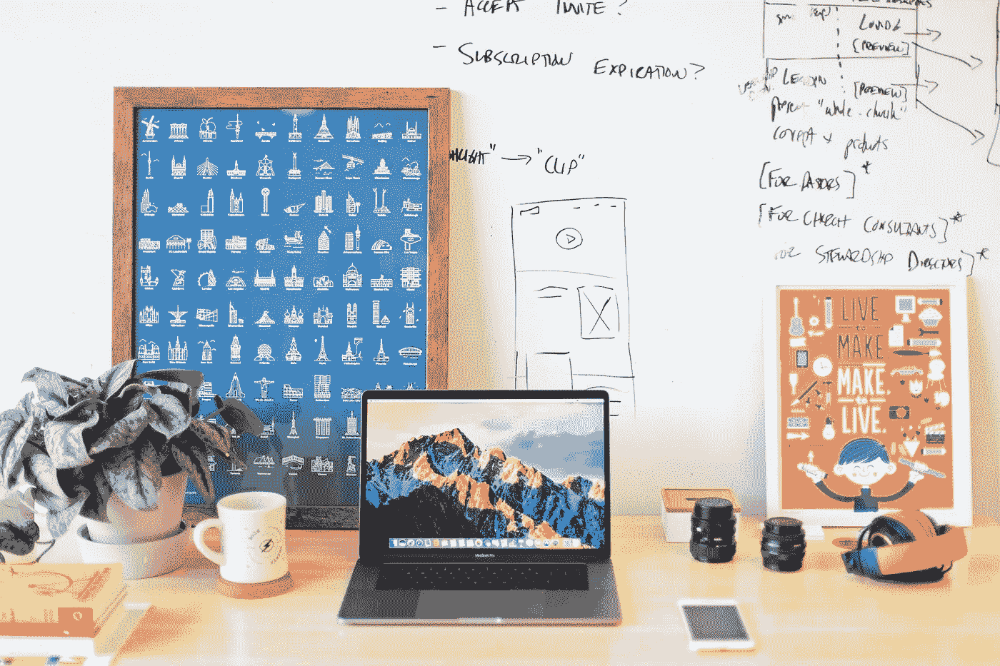

# 让自己在余生保持动力的 3 种方法。

> 原文：<https://medium.com/swlh/3-ways-to-keep-yourself-motivated-for-the-rest-of-your-life-f3b7f49d6528>

3 ways to keep yourself motivated for the rest of your life

# 1.目标

最重要的是，写下你的目标。

那些写下目标的人和那些不写下目标的人之间有很大的不同。

为什么不疯狂一点呢？更进一步，把你的目标框在墙上。最好是一堵你会遇到几次的墙…