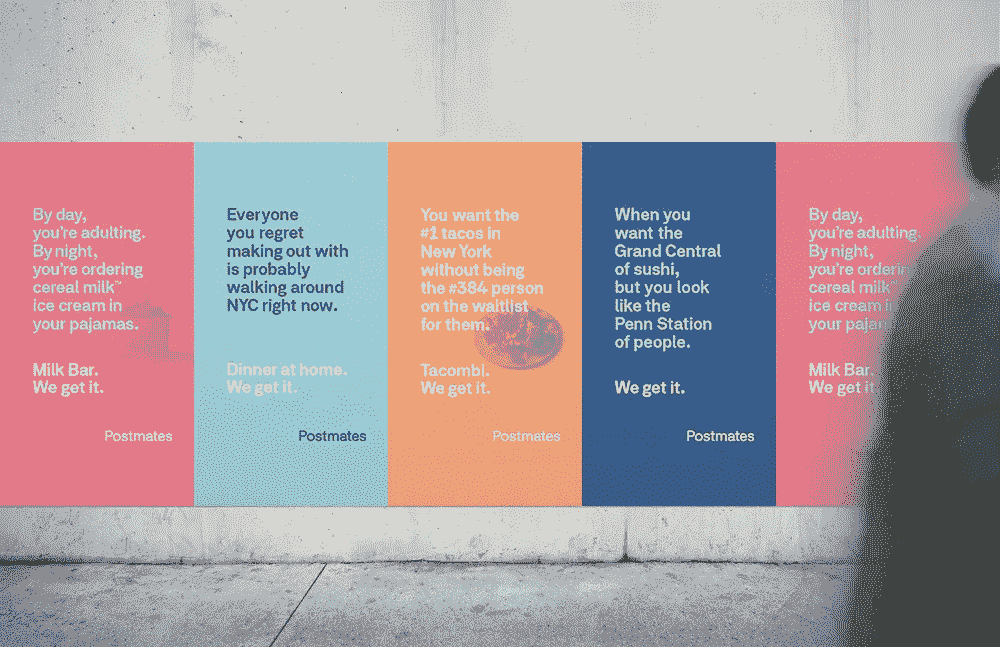
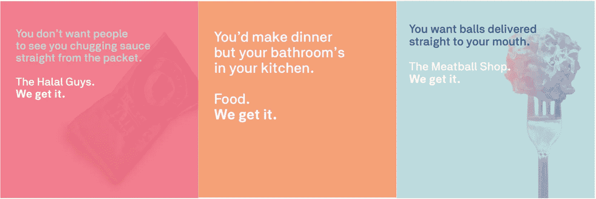
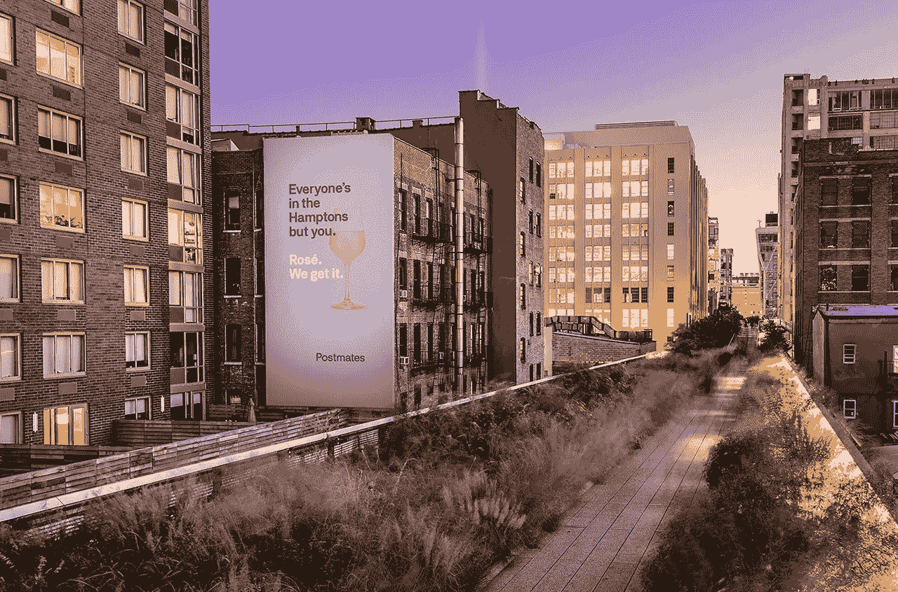

# 让您的品牌首次活动产生关联的 3 种方式

> 原文：<https://medium.com/swlh/3-ways-to-make-your-brands-first-campaign-connect-bf98ff5cd080>

今年 1 月，按需交付应用 Postmates 在洛杉矶推出了首次 360°品牌活动。这个月，他们把他们的信息带到了纽约——创意让纽约市民说，“我是❤️邮局局长。”

> 了解为什么这一活动与客户联系如此紧密，以及如何将其经验应用到您品牌的初始营销工作中。

> **#1:通过了解客户的需求和动机建立联系**

Postmates 的顾客想要美味的食物，他们希望有人为他们代购。他们不想从沙发上站起来，假装换下睡衣，穿上外套和靴子，或者以任何方式走出去。

他们的动机可能是多种多样的(小厨房，不会做饭，懒惰的一天，恶劣的天气，躲藏起来，网飞狂欢，宿醉等)。).但是他们的需求还是一样的。他们渴望在此时此地，在自己家中的私密空间里，纵情享受他们所渴望的一切。如果这意味着在浴缸里狼吞虎咽一整盒牛奶饼干，那就这样吧。那是他们的特权。

> **2。通过直接谈论这些需求和动机来建立联系**

像这样的营销信息“每个你后悔和他亲热的人可能现在都在纽约闲逛。在家吃晚饭。我们明白了。”Postmates 很快向客户表明，它了解他们的需求和动机。

文案的语气告诉他们，邮局主管**比理解的更多——邮局主管同情他们的城市千禧一代的困境。邮局主管可以和他们一起笑。**

邮局主管可以用一种超级简单的方式解决他们的问题，不需要额外的解释:他们可以给你你想要的那道菜；他们可以很快得到它；他们可以继续前进(也就是没有问题、混乱、大惊小怪或评判)。

> **3。通过尽可能个人化的方式建立联系**

将竞选活动个性化并不意味着在电子邮件中直呼其名。通过强调纽约人特定趋势的渴望+情境难题——这些广告牌已经占领了这座城市——post mates 与他们的客户建立了个人联系。

邮局主管有他们的怪癖。给他们想要的东西。更重要的是#赢得那个那个？

⚡️**⚡️的半斤八两的总结**

Postmates 的新“We Get It”活动是一个极好的例子，说明公司(1)了解其受众的需求(2)利用这些见解以对话和巧妙的语气直接与他们交谈(3)将内容本地化，以创造一个完美的品牌参与机会。

⚡️ **你的快速洞察力** ⚡️

找出你的客户想要什么，然后找到一种新的方式来表达他们的语言——并展示你如何比别人更好地得到他们。

这就是 [#brandsthatgetyou](https://www.instagram.com/explore/tags/brandsthatgetyou/) 在连接上的表现。你也可以。

## 这个故事发表在[的创业](https://medium.com/swlh)上，这是 Medium 最大的创业刊物，有 320，924+人关注。

## 订阅接收[我们的头条新闻](http://growthsupply.com/the-startup-newsletter/)。

