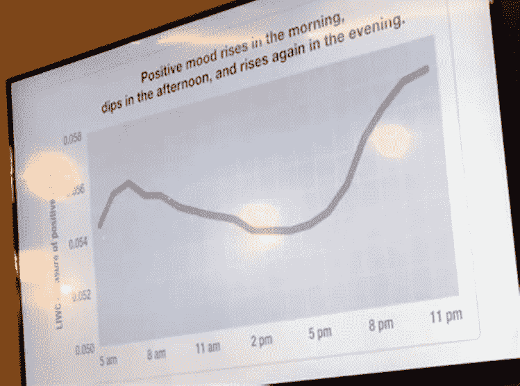

# 优化你一天的三种方法——利用时间和精力

> 原文：<https://medium.com/swlh/3-ways-to-optimize-your-day-with-timing-and-energy-209fa6b18fc4>

> 每天我们的身体都经历一个自然的能量循环，有两个高峰和一个低谷。

credit: [https://unsplash.com/photos/FJ9NAgNkrCM](https://unsplash.com/photos/FJ9NAgNkrCM)

几年前，Scott Golder 和 Michael Macy 进行的一项研究收集了超过 200 万条推文，并分析了它们的积极和消极情绪。

作者丹尼尔·H·平克写了一本书，详细探讨了这项研究，并深入研究了时间科学——看看这个——[何时——完美时间的科学秘密](https://www.amazon.com/When-Scientific-Secrets-Perfect-Timing/dp/0735210624)。这是一本很好的读物，你可以在下面的笔记的基础上，就时间如何改善你的生活提出自己的假设。

以下是他们发现的世界上不同年龄、性别、地点的平均每天的样子:

credit: [https://www.sourcetoad.com/wp-content/uploads/2018/02/positive-mood.x36254.jpg](https://www.sourcetoad.com/wp-content/uploads/2018/02/positive-mood.x36254.jpg)

这表明一天中有两个时间我们处于逻辑思维的高峰:

> **早上 8 点和晚上 8 点**

需要注意的一点是，有两种人:

1.  **云雀**(早上高峰)
2.  **猫头鹰**(夜间高峰期)

它们的曲线是相反的，因为对于一只百灵鸟来说，你的路径看起来就像上面的图像，猫头鹰每天都有相反的时间线，晚上 8 点是它们的最佳状态，早上有一个小高峰。

# 1.基于积极心态的逻辑任务

诸如计划、电话会议、会议、编程、设计……这样的认知任务是有成效的。

这并不意味着重新安排你的一天，在这些时间做所有的事情。

更确切地说，是学习在这些时候什么对你最有效，然后围绕它进行优化。

# 2.直觉解决问题

第二种类型的思维过程是直觉——已经被证明在下午效果更好。例如，发现问题中的非逻辑项目或构思新想法。

这可能是为什么在北美文化中，计划会议往往在上午举行，而头脑风暴通常在下午进行？我们下意识地朝这个方向优化，也许…

# 3.重做你的低点

在一天中下午 1-3 点的低能量点，也许最好执行一些可以帮助你重新获得能量和重新评估的项目；这可能很简单，比如散步一小时去思考需要解决的问题，或者在西班牙文化中，午睡(午睡)被用作一个重置点。

综上所述；看看你是否能找到一个适合你的周期，利用我们的身体每天经历两次高峰，低谷最适合直觉的新思维模式。

**喜欢这篇文章吗？点击“掌声”推荐给其他感兴趣的读者！**

## 这篇文章发表在《初创企业》杂志上，这是 Medium 最大的创业刊物，有 322，555 人关注。

## 订阅接收[我们的头条新闻](http://growthsupply.com/the-startup-newsletter/)。

