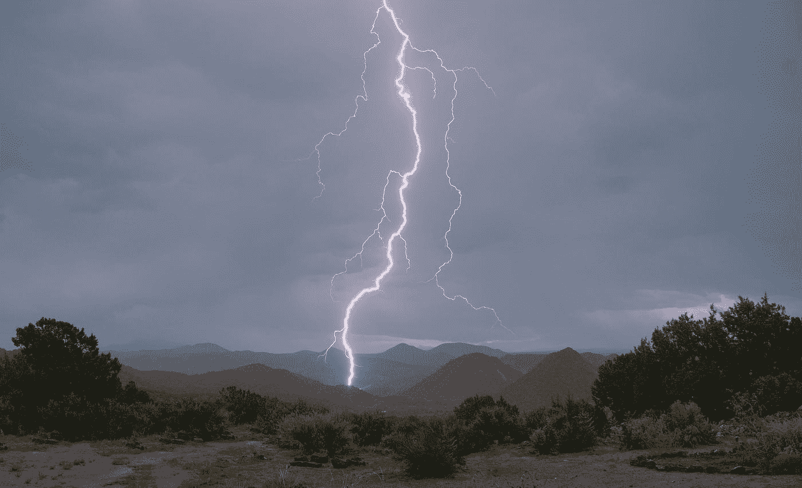

# 生活中抵御风暴的三种方法

> 原文：<https://medium.com/swlh/3-ways-to-weather-storms-in-life-b98dfb30cde4>

## 生活课程

Photo by [Mike Lewinski](https://unsplash.com/@ikewinski?utm_source=medium&utm_medium=referral) on [Unsplash](https://unsplash.com?utm_source=medium&utm_medium=referral)

去年，我听到一位来自阿尔伯塔省的校长对老师们说，他们中的大多数人要么正在接近风暴，要么正在风暴中，要么正在离开风暴。

所有人都是如此。

在你自己的生活中，你总会发现自己处于生活中不同领域的风暴中的一个部分。