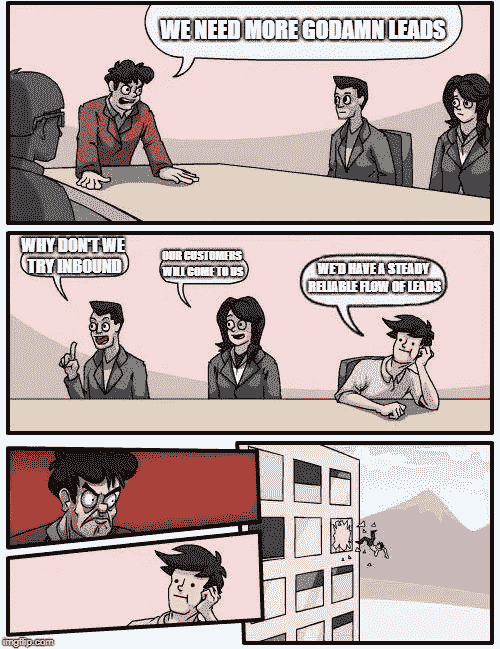
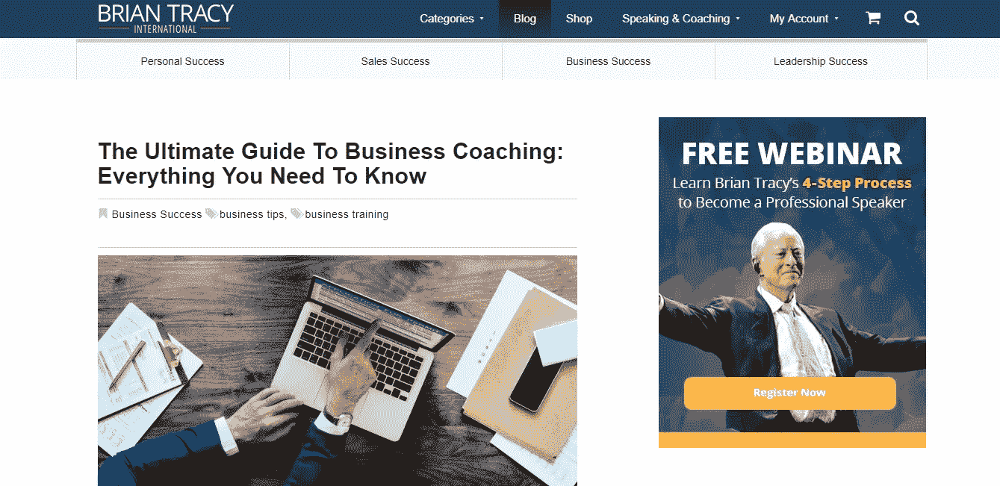

# 30.你的内容比你的电话更有利可图——30 天的媒介

> 原文：<https://medium.com/swlh/30-you-dont-need-to-do-outbound-30-days-of-medium-5bd0a0d34e61>

感谢到目前为止一直在阅读和跟随我的 30 天中期帖子的每一个人。

确保你**使用底部的小**注册框**订阅我的内容**，以确保我可以通过电子邮件向你发送每个新帖子。

如果你刚刚发现我的帖子，你可以看看下面的其他 **30 天介质**。

## [0。30 天的培养基](/swlh/30-days-of-medium-c7ab34953c6c)

## [1。建立自己的网站需要什么？— 30 天中值](/swlh/1-what-do-you-need-to-build-your-own-website-30-days-of-medium-1ed1ad4e505c)

## [2。如何找到你热爱的事业——30 天的媒介](/swlh/2-how-to-find-a-business-you-love-30-days-of-medium-cb7a4a702d1b)

## [3。如何建立自己的网站—媒体 30 天](/swlh/3-how-to-build-your-own-website-30-days-of-medium-587f994672ec)

## [4。如何衡量你网站的表现——30 天媒体](/swlh/4-how-to-measure-your-websites-performance-30-days-of-medium-75e650969695)

## [5。如何通过回答他们的问题获得更多的客户-30 天的媒介](/swlh/5-how-to-get-more-customers-by-answering-their-questions-30-days-of-medium-b462d237533e)

## 6。成功的商业网站备忘单——30 天的媒介

## 7。如何衡量成功——30 天介质

## 8。了解在线销售漏斗——30 天媒介

## 9。什么是流量，为什么流量很重要？— 30 天的培养基

## 10。什么是 Google URL Builder，为什么要使用它？— 30 天的培养基

## [11。通过自动化您的社交媒体日程，让您的流量翻倍——30 天中等](/swlh/11-double-your-traffic-by-automating-your-social-media-schedule-30-days-of-medium-ac9aa74f7927)

## [12。如何辨别什么好卖— 30 天介质](/swlh/12-how-to-tell-what-sells-30-days-of-medium-ba3291d029d2)

## 13。我如何在 6，500% — 30 天的培养基中培养我的培养基

## [14。你如何看待事情很重要——30 天中期](/swlh/14-how-you-look-at-things-matters-30-days-of-medium-f641b9733b90)

## [15。如何向小型企业销售服务— 30 天介质](/swlh/15-how-to-sell-services-to-small-businesses-30-days-of-medium-d6604c63b3b7)

## 16。如何通过有效的提案赢得更多交易— 30 天的媒介

## [17。如何在 10 分钟内建立一个网上商店——30 天的媒介](/swlh/17-how-to-setup-an-online-store-in-10-minutes-30-days-of-medium-a4f955e9b493)

## [18。如何在任何地方工作— 30 天介质](/swlh/18-how-to-work-from-anywhere-30-days-of-medium-1c9cfa2d662f)

## [19。为什么你的网站会破坏你的销售——30 天媒体](/swlh/19-is-your-website-sabotaging-your-sales-30-days-of-medium-f63bdbdb350)

## [20。你的流量从哪里来？— 30 天中值](/swlh/20-where-does-your-traffic-come-from-30-days-of-medium-a9b2d2c088bb)

## [21。如何真正识别倦怠——30 天中等水平](/swlh/21-how-to-actually-recognise-burnout-30-days-of-medium-7972a7a7a89e)

## [22。如何修改你的时间表并完成两倍的工作——30 天中等时间](/swlh/how-to-hack-your-schedule-and-get-twice-as-much-done-30-days-of-medium-441a509dc9be)

## 23。不要复制你的竞争对手——30 天的媒介

## 24。如何 SEO 优化一篇博文——30 天的媒介

## 25。独一无二或者被遗忘——30 天媒介

## 26。跟着感觉走——30 天中等水平

## 27。人们不支付平均 30 天的中等费用

## [二十八。如何做关键词研究— 30 天介质](/swlh/28-how-to-do-keyword-research-30-days-of-medium-5fd0fc0f5523)

## [29。为什么帕累托原则是世界上最大的诀窍——30 天中期](/swlh/29-why-the-pareto-principle-is-the-worlds-biggest-hack-30-days-of-medium-1c225f5c8aa1)

# 你的内容比你的电话更赚钱

多年来，我一直认为对外销售是发展业务的最佳方式。

然后我在 6、7 年前通过 [**Hubspot**](https://www.hubspot.com/) **发现了**的集客营销。****

在对这个概念有了一个模糊的理解并且取得了一般的结果之后，我把它搁置了一段时间，以后再来回顾。

快进到今天，我不再做任何**对外销售。**

我的意思是，我 100%的新业务努力都集中在**授权营销和集客营销上。**

我想让新客户**找到我。**

我不想每个月都要做大量的拓展工作，或者尝试去追逐新的业务。

你也不应该。

你的内容比你的电话更有利可图。

如果你花一个小时写一篇好的、简短的内容，它会在一年内为你带来 2-3 个客户，你的**投资回报**是巨大的，这**会自动发生**，不需要你进一步的时间投入(除了接受订单)。

你所需要的只是对 SEO 和你正在讨论的主题有足够的了解。

从零开始在电话上招揽一笔冰冷的生意要花多少时间？

在发现潜在客户、致电、资格确认、演示等方面花费了多少工时？

一旦成交，该客户的利润有多高？

对于交易价值巨大的企业销售，我可以看到其中的逻辑。如果你不是在做有巨大终身价值的大生意，那就不值得。

如果你是一家小企业，在把工资、工作时间、软件、办公空间和呼叫过程中涉及的所有其他成本都计算在内之后，我看不出这有什么好处，也不是扩大规模的好方法。

雇佣一个**火热成长的营销人员**要花多少钱，他能写出杀手级内容，优化搜索引擎优化，管理你的入站过程，以确保稳定的销售线索流？

这似乎是所有高增长技术公司都在做的事情，为什么对一个小企业来说有什么不同呢？

当然，科技公司的可扩展性更强(一般来说),它们的利润可能更高，但如果你的小企业**采用内向型**而不必为销售人员强行推销你的产品支付数十万美元，那么你的利润可能会高得多。

# 讲述不是销售。

现代销售教父之一布莱恩·特雷西说过的一些话，一直萦绕在我的脑海中。

> “讲述不是销售。”

他的意思是，与你的顾客交谈或试图向他们推销，不是销售。

销售是热情转移的 T2。这就是了解你的**潜在客户的需求**，并提供解决这些需求的**解决方案**。

最优秀的销售人员能够建立融洽的关系、收集需求和匹配利益，同时挑战他们对潜在客户的假设，并在必要时提出备选方案。

如[挑战者销售](https://www.amazon.co.uk/Challenger-Sale-Control-Customer-Conversation/dp/0670922854)所谈。

证明这一点的证据是，布莱恩·特雷西比我见过的大多数人都更好地采用了内线战术。查看他的博客。

Inbound in action

他还有一个非常有用的 YouTube 频道，在那里他一直在创作新的视频内容。

这是因为**视频内容**是**一对一销售类固醇**。

如果你了解你的产品和市场，你为什么不制作视频内容呢？

有了视频，你就有可能一口气卖掉成百上千甚至上百万的人。

视频内容尤其是热情的视觉传递，可以吸引并说服全球观众。

这就是为什么所有最伟大的励志演说家和商业教练都在锤打视频内容，像 [**托尼·罗宾斯**](https://www.tonyrobbins.com/) 。

# 利用内容向你的客户大量销售

内容营销就是**回答你的客户的问题**或者让他们意识到**他们不知道存在的问题和机会。**

集客漏斗的三个阶段是:

*   **意识**。你的潜在客户不知道他们有一个问题，或机会。
*   **考虑事项**。您的潜在客户知道有些事情不对劲(或者他们没有利用某些优势)，并且正在研究解决方案。
*   **决定。**您的潜在客户已经缩小了解决方案的范围，需要找到一家供应商来提供解决方案。会是你吗？

可以从 Hubspot 营销学院免费学习[入境。](https://academy.hubspot.com/courses/inbound)

Inbound Certification

如果你是一个好的销售人员，你可能也是一个好的内容营销者。

内容营销不仅仅是写博文或文字。有很多不同的方式来传达你的信息。如果你自信并擅长演讲，**视频就是你的平台。**

还记得那些**销售电话**吗？你和狡猾的客户谈论**为什么**他们首先需要你的产品？

将它们制作成**视频——认知**

那些**销售拜访**怎么样，在这些拜访中，你必须将你的产品与你客户的特定需求相匹配。

更多视频— **考虑事项**

你还记得曾经试图接近那位想知道**你和谁一起工作过**以及你是否有他们行业的经验的客户吗？

将它们制作成展示最终结果的杀手级视频成功故事。—决定

如果你采用内向型方法，并在你的内容和分发方式背后制定一些策略，你将能够自动生成、培育和关闭线索。

你制作的每一个伟大的内容都成为一种资产，可以吸引新客户，并在这个过程中帮助你的销售团队。

外向变得越来越容易，然后随着你的内向渠道的增长，就没有必要了。

你不这么认为吗？请在评论中告诉我为什么。

对于那些一直关注我的《30 天媒介》的人，非常感谢你们到目前为止的阅读，感谢你们的掌声和反馈。别担心，这不是结束。将会有更多的内容出现！

## 你可能也喜欢这个:

## [为什么 WordPress 是在](/swlh/why-wordpress-is-the-best-platform-to-build-your-business-or-startup-website-on-df3fe932fad7)上建立业务或创业网站的最佳平台

## [如何建立网站——终极指南](https://www.squareinternet.co/how-to-build-a-website-ultimate-guide/)

## 如果你喜欢这个故事，请点击👏按钮，并跟随我的其他 30 天的媒介。

## 这个故事发表在 [The Startup](https://medium.com/swlh) 上，这是 Medium 最大的创业刊物，拥有 339，876+人关注。

## 在这里订阅接收[我们的头条新闻](http://growthsupply.com/the-startup-newsletter/)。

