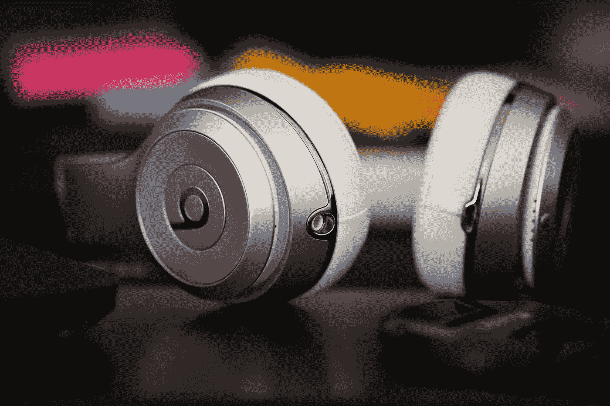

# 2018 年 5 月 31 日:神秘领域最大的故事

> 原文：<https://medium.com/swlh/31-05-2018-biggest-stories-in-the-cryptosphere-7691135c2215>

**1。荷兰政府表示，加密对该国金融稳定的风险很低**

荷兰政府的一个分支机构最近[发布了一份关于加密货币的经济风险报告。CPB 荷兰经济政策分析局得出结论，加密货币对该国金融稳定的风险较低。低资本化水平，加上与传统金融机构和体系的联系薄弱，解释了为什么会得出这一结论。还有人指出，随着政府越来越多地参与，风险将会增加，需要平衡的金融监管。俄罗斯央行也表达了同样的观点。该银行还](https://cointelegraph.com/news/low-capitalization-institutional-exposure-make-crypto-low-risk-says-dutch-govt-report)[发布了](https://cointelegraph.com/news/central-bank-of-russia-crypto-assets-do-not-pose-risk-to-global-financial-stability)一份报告，称加密不会对全球金融稳定构成高风险。金融稳定委员会还建议使用“加密资产”一词，而不是加密货币。

**2。第十大加密货币 Tron 迁移到自己的区块链**

创(TRX)正在从以太坊平台迁移到它自己的区块链。Tron mainnet 于世界标准时间今天上午 12 点发布。Tron 市值 40 亿美元，是第十大加密货币。开发人员将在 6 月份配置他们的钱包和浏览器，因为在这段时间的大部分时间里，该网络仍处于测试阶段。令牌过渡将在 6 月 21 日至 6 月 24 日之间进行，该过程将于 6 月 25 日结束。这意味着加密货币将不再仅仅作为以太坊网络上的 ERC-20 令牌。

**3。印度拒绝用石油支付委内瑞拉石油 30%的折扣**

委内瑞拉向印度提供 30%的原油折扣，条件是用石油支付。然而，印度决定拒绝这个提议。印度外交部长苏诗马·斯瓦拉吉在新闻发布会上讨论了这一消息。在印度储备银行禁止使用加密货币进行交易后，Swaraj 表示，该国不会参与委内瑞拉的国家加密货币。我们之前[报道过](https://hackernoon.com/23-04-2018-biggest-stories-in-the-cryptosphere-by-blockex-952cdea9ea97)印度储备银行禁止加密公司接受银行服务引发的争议。

**4。Beats 耳机发明者想推出 3 亿美元的 ICO**

音频/视频电缆制造商 Monster Inc. [想要推出价值 3 亿美元的 ICO](https://cointelegraph.com/news/us-inventor-of-beats-headphones-applies-to-sec-for-300-mln-ico) 。该申请被提交给美国监管机构，但[被证券交易委员会(SEC)确认](https://www.sec.gov/Archives/edgar/data/1675583/000149315218007872/forms-1.htm#a_003)。根据美国法律，该公司必须将有问题的代币作为证券向 SEC 登记。该计划是发行 5 亿个 Monster Money Network (MMNY)代币，然后通过 ICO 出售其中的 60%。代币将用于购买，而筹集的资金将用于创建一个平台。

> 本新闻综合报道由 [BlockEx](http://bit.ly/BlockEx_) 为您带来。

> *要想在你的邮箱里收到我们的每日新闻综述，请在这里注册:*[*http://bit.ly/BlockExNewsAndUpdates*](http://bit.ly/BlockExNewsAndUpdates)

## 这个故事发表在 [The Startup](https://medium.com/swlh) 上，这是 Medium 最大的创业刊物，拥有 330，853+人关注。

## 在这里订阅接收[我们的头条新闻](http://growthsupply.com/the-startup-newsletter/)。

