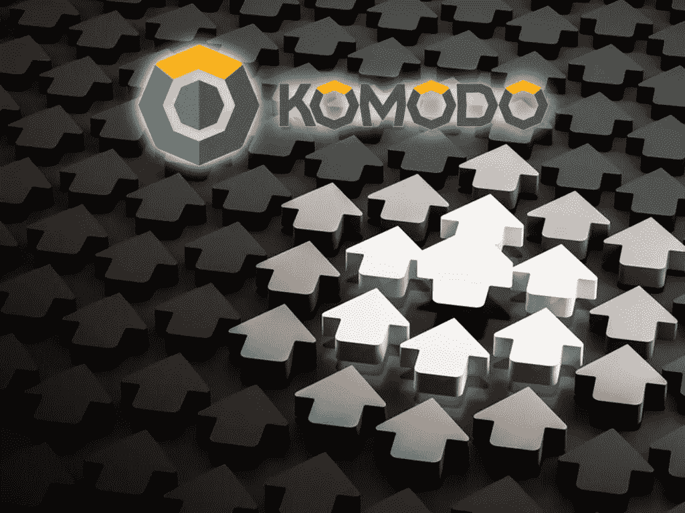

# 4 月 7 日这一周有重大事件的 4 个备用硬币(IOST、XES、KMD、PRL)

> 原文：<https://medium.com/swlh/4-altcoins-with-major-events-the-week-of-april-7-iost-xes-kmd-prl-3f5ba44d911c>

每周，加密货币交易者和投资者都会急切地分析日历，看看未来几天的哪些事件会给特定替代硬币带来最大的动力转变。本周有四个有重大事件的山寨币:**[【XES】](https://proxeus.com/)**[【KMD】](https://coinmarketcap.com/currencies/komodo/)**[PRL](https://coinmarketcap.com/currencies/oyster/)**。********

# ****市场状况****

****涨的必跌，跌的[最终会涨回来。市场有趋势，而这些趋势会被波动性放大。对于那些投资于加密货币领域的人来说，早就知道波动性是极端的。众所周知的是，牛市](http://bitcoinist.com/25-billion-taxes-cryptocurrencies-selling-tom-lee/)[和熊市](http://bitcoinist.com/parabolic-bitcoin-price-bullish-future/)[的趋势](http://bitcoinist.com/altcoin-bear-market-bitcoin-tom-lee/)在几乎没有任何预警的情况下翻转。****

********

****本周有多种替代货币和加密货币，通过发布新闻和满足截止日期来提供宣传和积极的情绪。当路线图的最后期限到来时，会进行演示，并且效用已经增加，与 BTC 和其他替代货币相比，基础资产的价值往往会增加。本周有四种独特的硬币，都与即将到来的重大事件有关:IOST，XES，KMD 和 PRL。****

# ****牡蛎(PRL)PRL 快照和 SHL 空投****

****SHL 令牌的 PRL 空投仍在进行，没有被延迟。此次空投发生在街区高度 5436000，可能发生在美国东部时间 2018 年 4 月 13 日下午 12 点左右。****

****PRL 持有者已经等待 SHL 空投很长一段时间了，这个日期正在迅速接近。前一周的一个积极消息是，PRL 宣布他们主要交易的交易所将促进和支持空投。这意味着 PRL 持有者不必将 PRL 转移到场外钱包(除非他们愿意)来接收 SHL 令牌。****

****PRL 已经找到了一种方法，通过提供交易的后端确认，让网站访问者帮助支持 PRL 区块链。这使得网络主机理论上可以删除所有广告，提供一个“干净”的网站。即使有了“干净”的网站，虚拟主机仍然可以获利，因为他们可以根据网站访问者的数量获得 PRL 令牌。访问者越多，就有越多的后端交易可以被访问网站的访问者所确认。PRL 旨在彻底改变网站主持人的谋生方式，同时简化网站的易用性，使它们不会充斥着广告。****

****雄心越大，实现的可能性就越小，但看到 PRL 继续努力实现这些重要的里程碑是非常积极的。****

# ****IOST(在 GITHUB 上开始开源)****

****IOST 的市值为 2.25 亿美元，面值为 0.026 美元。IOS 代表服务互联网。这枚硬币旨在为在线服务提供商提供高质量的基础设施。这种创新的 altcoin 带有安全区块链，可提供无与伦比的水平可扩展性。在 2018 年 1 月完成他们的 ICO 后，这枚硬币才存在了几个月。这表明，仅在几个月的时间里，IOST 就能够巩固他们在加密领域的地位，市值超过 2 亿美元，并能够在 GitHub 上发布他们的开源代码。****

****一旦来自世界各地的开发者能够查看他们的源代码并对其进行微调，IOST 似乎将继续攀升他们的价值。如果密码社区看到代码，并认为它是无价的或冒牌货，IOST 可能会有一个重大的价值修正。GitHub 开源发生在 2018 年 4 月 9 日，这一天应该被重点关注，以观察主要的价格变动。****

# ****PROXEUS (XES 关于数字瑞士的声明)****

****Proxeus (XES)本周宣布了由 XES 与 IBM 和瑞士电信合作举办的“数字瑞士”竞赛的结果。XES 尚未在任何主要交易所上市，最近完成了 ICO，仍在发行硬币的过程中。对于一个刚刚从 ICO 时代步入婴儿期的 token 来说，看到他们与 Swisscom 和 IBM 这样的大公司合作是一个非常积极的迹象。****

****由于 XES 只有在上市后才能交易或积累，因此这只是一种未来的象征。XES 将于 2018 年 4 月 9 日宣布 Proxeus 与 IBM 和 Swisscom 合作举办的数字瑞士挑战赛的结果。这个日子应该为 XES 硬币的宣传和相关性提供催化剂。它是否会对价格产生巨大影响还有待观察，可能很难判断，因为交易所目前不进行 XES 交易，并且它们的价格在通用加密定价网站上不可用。****

# ****科莫多(KMD，乌特鲁姆。KMD 的 IO ICO 和 BLOCNATION 空投)****

****本周为科莫多(KMD)提供了两个巨大的催化剂。第一个重大事件是 Utrum.io ICO，这是一个在 Komodo 平台上举行的分散式 ICO。几乎紧接着这一事件，KMD 持有者将收到一个 BlocNATION 空投。****

********

****这两件大事都应该提供正面的宣传，增加市场对 KMD 的信心。分散式 ICO 似乎是 ICO 市场将继续发展的方向，尤其是随着更多监管机构开始调查可疑行为。分散的 ICO 和大规模空投应该会在短期内提振 KMD，并至少增加围绕它的市场情绪。****

****KMD 目前的交易价格为每枚硬币 2.43 美元，市值为 2.52 亿美元。2017 年 12 月 21 日，KMD 的交易价格超过每枚硬币 12.89 美元。过去几个月的市场调整迫使 KMD 的价格下跌了 80%以上。随着下周非常积极的事件发生，价格从历史高点下跌了 80%以上，在空投和 ICO 之前，KMD 可能是一个有趣的选择。****

****科莫多区块链平台使用 KMD 的开源加密货币进行透明、匿名、私人和可替代的交易。一个延迟的工作证明协议通过使用比特币的区块链使它们变得超级安全。超网生态系统也使用 KMD 作为他们的官方加密货币。SuperNET 是一个分散的组织，为加密市场开发开源和分散的工具。****

****2018 年 4 月 10 日，在 dICO token 平台上推出了 Utrum.io，随后在当天晚些时候，KMD 第一个去中心化 ICO BlockNATION 进行了空投；KMD 应该会有积极的一周。几个月来，市场一直处于负面熊市趋势，但像 KMD 这样的重大事件很可能会逆转这一趋势。****

*******阅读王者*** [*往期文章*](http://bitcoinist.com/5-altcoins-major-events-week-april-1-2018-gains-likely-beat-bitcoin-returns/) ***，了解他目前推荐哪些 ICO，或者直接与王者取得联系，可以在 Twitter (@JbtheCryptoKing)或者***[*Reddit*](https://redd.it/81hj5q)***(ICO 更新和每日报道)。*******

****这篇文章是由 CryptoKing 撰写的，最初发表在 Bitcoinist 上。要阅读它的原始形式(每个列出的加密的扩展硬币分析)请随意查看这里:[**http://bitcoinist . com/4-alt coins-major-events-week-April-7-2018-ist-xes-kmd-PRL/**](http://bitcoinist.com/4-altcoins-major-events-week-april-7-2018-iost-xes-kmd-prl/)****

********

## ****这篇文章发表在《T4》杂志《创业》(The Startup)上，这是 Medium 最大的创业刊物，有 314，785 人关注。****

## ****在这里订阅接收[我们的头条新闻](http://growthsupply.com/the-startup-newsletter/)。****

********