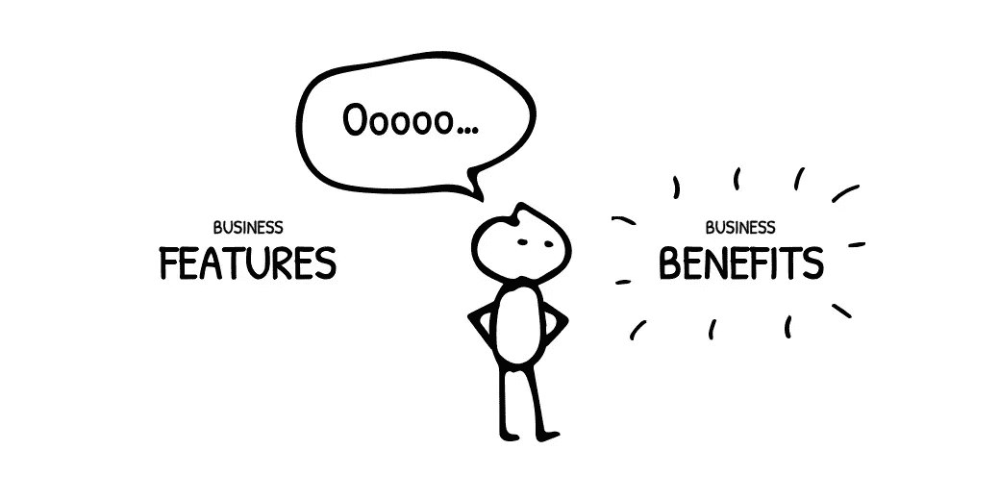
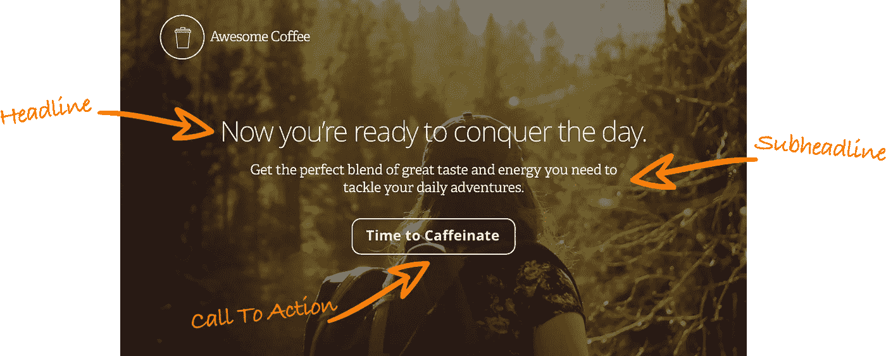
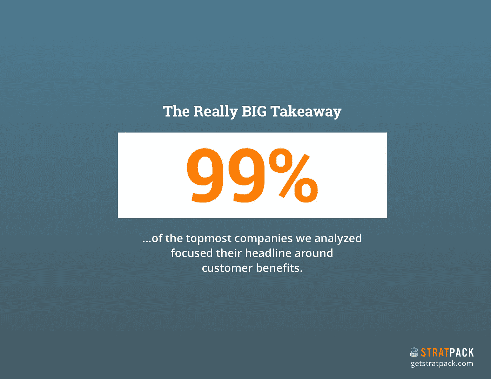
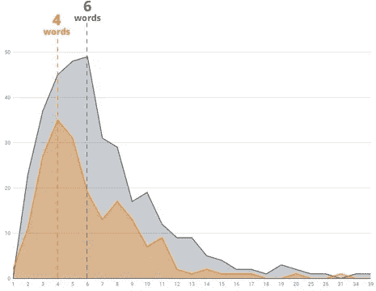
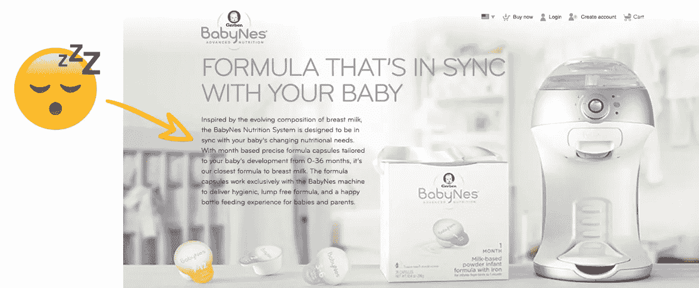

# 将改进您的信息传递的 4 个最佳实践

> 原文：<https://medium.com/swlh/4-best-practices-that-will-improve-your-messaging-c9bf2be7ed14>

## 我的公司 [Map & Fire](http://mapandfire.com/?utm_source=medium&utm_medium=article&utm_campaign=takeaways) 最近在[发表了一份原创研究](https://getstratpack.com/marketing-messages-research-and-best-practices/?utm_source=medium&utm_medium=article&utm_campaign=takeaways)，该研究着眼于 600 家公司的营销信息。目标是提取可以成为其他企业最佳实践的见解和模式。

这项研究特别关注每个公司的网站信息。

We made this up, but it does sound awesome!

当然，我们无法访问每个公司的分析，所以我们需要另一种方法来衡量这种信息的有效性。为此，我们使用了网站[产品搜索](https://medium.com/u/b8b4445269d0?source=post_page-----c9bf2be7ed14--------------------------------)。

如果你不熟悉 Product Hunt，这是一个你可以每天查看和评论新产品的网站。网站上的用户可以“投票支持”他们喜欢的产品。

获得投票的能力取决于公司是否能够用他们创造的东西吸引观众。它与行业、公司规模和成熟度无关。

每个公司只需要向社区传达他们创造了一些有价值的东西，并希望社区对此做出回应。

这才是市场营销的真谛。

你可以在完整的研究中阅读关于我们方法的更多细节([点击免费获取](https://getstratpack.com/marketing-messages-research-and-best-practices/?utm_source=medium&utm_medium=article&utm_campaign=takeaways))，但这里有 4 个快速要点。

# 1.谈论你提供的好处，而不仅仅是功能。

这项研究得出了几个好的趋势，但是有一个很突出:

**Spoiler Alert:** this is the 2nd page of our study.

利益陈述之所以强大，是因为它们让客户了解他们将获得的价值。这有助于他们想象更美好的生活。它旨在创造一种情感联系。

当你专注于基本的描述和特性时，你就要依靠客户来完成繁重的工作。首先，他们必须了解你在提供什么，然后*他们还必须想象这对他们有什么好处。*

这一结果与我们宣扬的一切一致，但它得到了我们最高投票公司中令人震惊的 99%结果的支持。在这一组的 116 家公司中，有 115 家使用了关注利益的标题。相比之下，在投票率最低的群体中，这一比例仅为 35%。

# 2.使用所有 3 个信息元素来吸引客户

**三要素:**

1.  头条新闻
2.  副标题
3.  行动号召。

在我们的研究中， **90%的高票公司使用标题**。 **78%的人将副标题**与标题搭配在一起。 **97%的人使用 CTA** 。

相比之下，投票率最低的公司有 92%使用标题，但只有 63%使用副标题，78%使用 CTA。

当你生活和呼吸着你的业务时，很容易忘记当顾客第一次来到你的网站时，他们对你的了解是多么的少。一般来说，他们什么都不知道。*归零*。

我们可能认为一个简短的陈述就足以概括我们提供的一切。或者产品或服务本身就说明了一切。

That’s probably not enough.

使用所有核心信息元素与新客户沟通。不要相信他们会自己想出办法。

# 3.标题应该简短，但不能太短

基于其他研究，普遍认为最佳标题长度约为 6 个字。我们对最高投票公司的结果与平均 6.4 个单词的结果一致。

最受欢迎的标题长度是 6 个字。最低投票组最受欢迎的是 4 个词:

这突出了一个机会，因为如果你太短，你的陈述可能会变得宽泛或模糊。在这里或那里添加一个额外的描述词有助于向客户阐明和巩固你的价值。

# 4.副标题会更长，但仍然要保持简洁

副标题更像是狂野的西部。

对于使用它们的公司来说，我们看到从几个单词到 70 多个单词段落的长度无处不在。

看看这个来自 Gerber 的杂乱无章的庞然大物:

*Getting your baby to sleep is great, putting your customers to sleep with rambling copy not so much.*

总体而言，得票率最高的公司将副标题保持在平均 16.5 个字的水平。这比得票最低的公司**少了 **2.7 个单词**19.2 个单词**。

人们有一种自然的欲望，想马上谈论贵公司提供的一切。但事实是，较长的信息更容易让用户浏览过去。

突出几个关键特征，然后使用支持部分来提供额外的细节。

# 获得完整研究的免费副本

没有适用于每家公司信息传递的灵丹妙药。产品和受众各不相同，因此您必须进行测试，以验证哪种产品最适合您的情况。

然而，围绕人们通常如何消费跨越不同行业和产品的消息传递，仍然存在趋势。这就是这些最佳实践的目的。

如果您想了解更多信息，请下载完整研究的免费副本，了解:

*   所有公司的单词和字符计数的最佳实践
*   标题、副标题和 CTA 中使用的流行关键词
*   优势与特性陈述的示例
*   遵循这些准则的所有消息元素的其他示例
*   还有更多！🙂

# [点击此处免费获取研究报告！](https://getstratpack.com/marketing-messages-research-and-best-practices/?utm_source=medium&utm_medium=article&utm_campaign=takeaways)

# 如果你做到了这一步，请在下面为它鼓掌:)

*原载于 2018 年 8 月 21 日*[*【getstratpack.com*](https://getstratpack.com/blog/4-best-practices-that-will-improve-your-messaging/)*。*

## 这篇文章发表在 [The Startup](https://medium.com/swlh) 上，这是 Medium 最大的创业刊物，有 361，652+人关注。

## 在此订阅接收[我们的头条新闻](http://growthsupply.com/the-startup-newsletter/)。

