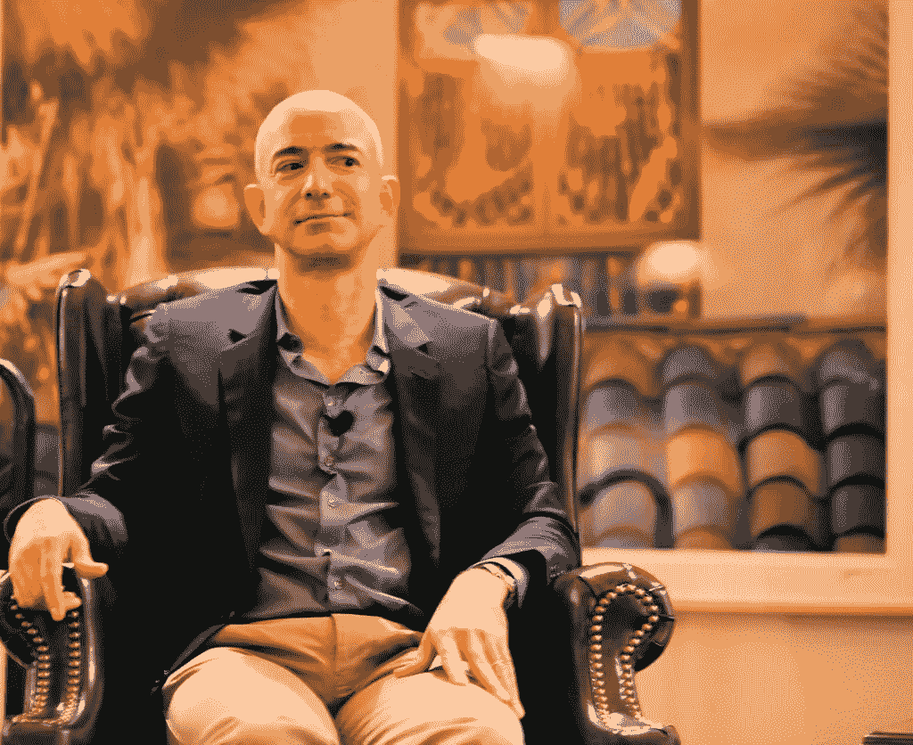

# 杰夫·贝索斯给年轻企业家的 4 个商业想法

> 原文：<https://medium.com/swlh/4-business-thoughts-from-jeff-bezos-for-young-entrepreneurs-f021315221d>

Image Courtesy: [https://www.flickr.com/photos/jurvetson/5129303018](https://www.flickr.com/photos/jurvetson/5129303018)

众所周知，杰夫·贝索斯曾经开了一家书店——而不是实体店，他更喜欢新事物——互联网和他的公司是互联网泡沫中幸存下来的少数公司之一，今天杰夫·贝索斯正在努力成为世界首富，同时拥有亚马逊公司(以前是书店)、蓝色起源、华盛顿邮报。

当我在互联网协会 2017 年年度慈善晚会上观看他的炉边聊天时，Jeff B 抛出了一些对年轻企业家非常有价值的想法，因此列出来:

# 4.客户痴迷 vs 竞争对手痴迷！

企业主要是为了服务消费者而建立的，因此建立一个以顾客为中心的愿景是明智的(但也是有风险的)。Jeff B 本人承认，对竞争对手或产品着迷的企业可以/将会奏效，但这不是拯救任何企业的最后通牒，但如果你的企业专注于你的消费者想要什么，而不是你的竞争对手在制造什么(反过来，你的竞争对手也在为你的消费者制造)，你就可以从灾难性的失败中恢复过来。

# 3.失败:实验/卓越运营:

当你在建立一个以顾客为中心的企业时，不仅要在竞争中保持领先，还必须在考虑顾客需求方面保持领先。正如马尔科姆·格拉德威尔曾经说过的，

> 没有人知道他们想要什么；头脑不知道舌头想要什么

但是为了生产出你的消费者想要的东西，你需要发明，为了发明，你需要实验。根据杰夫·B 的说法，

> 如果你知道它会起作用，那么它就不是一个实验。

所以，不要担心你对成功有把握的事情。

与此同时，Jeff B 在失败(尝试新方法)和糟糕的运营卓越(现有流程中的失败)之间划出了一条细微的界限。实验过程中的失败是可以接受的(尽管 Jeff B 觉得这很尴尬)，但在一个完善的过程中出现的意外结果(又名失败)并不完全是失败，而是“糟糕的运营卓越”，他提到的例子是，如果亚马逊的新履行中心设置(在建立了数千个履行中心之后)进展不顺利，这不是失败，而是必须受到惩罚的糟糕的运营卓越。

# 2.中断:

如今，在每份商业计划或推介报告中用正则表达式搜索关键词“disrupt ”,结果总是为真。因为企业家天生相信他们的想法或他们想出的东西是破坏性的。杰夫 B 为他们打破了它:

> 发明不是破坏性的；只有客户采用是破坏性的！

他是绝对正确的，因为没有一项发明是颠覆性的，除非使用它的人让它具有颠覆性。智能手机并不具有破坏性，苹果和安卓让它变得具有破坏性。Jeff B 继续说，亚马逊创造了如此多的发明，这些发明并不具有破坏性，因为客户不喜欢它们。

# 1.一夜成名:

成功是我们生活中最有争议的事件之一。大多数人仍然相信成功是突发奇想，这是一个谬论，即使是以冒险著称的企业家也没有意识到这一点。大多数人仍然认为 AWS 就这样成为了云业务的市场领导者。杰夫·B 对此嗤之以鼻，说这是又一次一夜成名，

> 任何一夜之间的成功都需要 10 年的时间！

正如马尔科姆·格拉德威尔所言，

> “成功取决于坚持不懈、顽强不屈，以及愿意花 22 分钟努力去理解大多数人在 30 秒钟后就会放弃的东西。”

因此，目前世界第二富有的人杰夫·B 揭穿了这种一夜成功的神话，这是许多年轻企业家陷入的最大陷阱之一(想快速扭转他们的业务，他们刚刚开始)。

点击此处观看完整采访:

## 这篇文章发表在《创业公司》杂志上，这是 Medium 最大的创业刊物，有 318，983 人关注。

## 订阅接收[我们的头条新闻](http://growthsupply.com/the-startup-newsletter/)。

