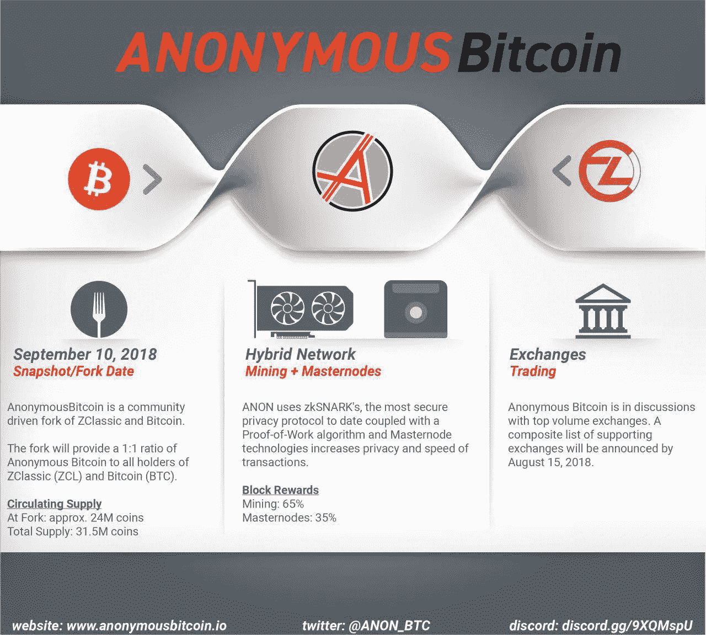
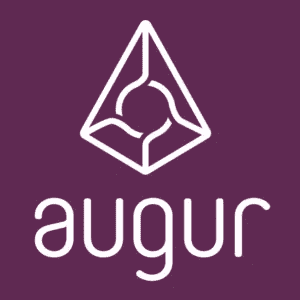

# 4 种加密货币和一个做出重大动作的 ICO(WAN、ANON、VEN、REP、TZERO)

> 原文：<https://medium.com/swlh/4-cryptocurrencies-and-an-ico-making-major-moves-wan-anon-ven-rep-tzero-99852adaefc9>

[**JAKETHECRYPTOKING**](https://bitcoinist.com/author/cryptoking/)**[**@ JBTHECRYPTOKING**](https://twitter.com/jbthecryptoking)**|**2018 年 7 月 07 日** | **11:00******

****过去一年，加密货币经历了过山车般的旅程，但随着时间的推移，新的机遇不断涌现。2017 年是一个史诗般的牛市，但那些涨幅最大的人不是在 2017 年的牛市中进入的，而是在几个月前进入的。让我们看看未来一周可能的机会。****

# ****4 种加密货币— WAN、ANON、VEN、REP****

****大海捞针找到可能快速升值的 ICO 或加密货币是每个投资者的梦想。一种加密货币的价值会随着它的发展而大幅波动。从 2018 年 7 月 7 日开始的这一周，我们看到许多加密货币都有了重大发展。****

****四种加密货币在短期内有令人兴奋的发展，值得关注、分析和监控市场的反应。这些密码包括 WAN、ANON、VEN 和 REP。****

# ****万链 MAINNET 2.0 以太坊跨链 7 月 7 日****

****[WAN chain](https://wanchain.org/)(WAN)$ 2.32856**-0.35%**原本是以太坊(ETH)的一个叉，但不再是 ERC-20 令牌，维持着自己的区块链。万通过实施跨链转移，为数字资产创造了一个新的金融市场。代币、密码和区块链的数量不断增加，但却没有有效的分散方式来交换它们。****

****WAN 远远超出了专注于智能合同、隐私保护以及 WAN 币的财政转移。广域网目前的市值为 2.6 亿美元。2018 年 7 月 7 日，对于万来说，是一个非常激动人心的日子。****

****今天，万的 mainnet 2.0 与 ETH 上线，提供跨链交易。这是许多阶梯中的一小步，但如果实施得当，万应该会做出积极的反应。能够在没有 exchange 2.0 的情况下提供跨链交易，这一点今天已经实现，加密社区认为有必要吗？****

# ****匿名比特币(ANON)亚洲顾问，第二次美国消费者新闻与商业频道访谈，白皮书，赏金计划****

********

****[匿名比特币](https://www.anonymousbitcoin.io/) (ANON)是 z classic(ZCL)$ 8.30676**-0.04%**和比特币(BTC) $6625.01 **-0.06%** 的一个即将到来的分叉，最近有了很多发展。ANON 在美国消费者新闻与商业频道 crypto trader 上又出现了一次，发布了他们的白皮书，开始了一个分发 5，500 ZCL 的社区建设计划，同时还准备宣布他们的亚洲顾问、交换列表/支持，并继续他们的会议之旅。本周对 ANON 来说很重要，因为他们的亚洲顾问公告即将发布。****

****随着新的顶级顾问加入到 Ran Neu-Ner(美国消费者新闻与商业频道的密码交易员)和 Steven Nerayoff(瑞士联邦理工学院 ICO)的团队中，ANON 应该会取得成功。在过去的一个月中，ANON 发布了他们的白皮书，进行了第二次美国消费者新闻与商业频道采访，并开始了一个有 200 多名参与者的社区建设奖金计划。ANON testnet 将于 8 月中旬上线，快照将于 2018 年 9 月 10 日发布。主要交换支持将于 2018 年 8 月 15 日或之前宣布。这些日期都很重要，因为最大的波动发生在这些事件前后。****

****阿农是 ZCL 和 BTC 的分支。这意味着在快照日期之前，利用重要新闻的唯一方法是持有 ZCL 或 BTC。ANON 将按照 1:1 的比例提供给在拍摄快照时持有 ZCL 或 BTC 股票的投资者。他们发布的白皮书中透露了一个新颖的选择。所有无人认领的无名氏将于 1 月 1 日被烧毁，大大减少流通供应量。****

****ANON 有一个非常重要的夏天，直到分叉日，并满足了迄今为止的每个截止日期。ZCL 将是未来几个月关注的一枚有趣的硬币，因为它是获得匿名的最简单方法。****

# ****VECHAIN (VEN) THOR 移动钱包 7 月 9 日****

****VeChain $2.46018 **-0.25%** 市值 14 亿美元。这是一种大型加密技术，在供应链管理领域得到了广泛的市场应用。VEN 是一个建立在区块链之上的平台，旨在增强供应链管理。VEN 通过利用防篡改分布式账本技术实现了这一目标。最终目标是零售商和消费者有能力毫无疑问地确定特定产品的真实性。奢侈品、药品和食品被假冒已经成为一个严重的问题。****

****VEN 今年更名为 VeChain Thor，并推出了新的钱包。2018 年 7 月 9 日全新 VeChain Thor 手机钱包发布。通常情况下，一个钱包并不是一个令人兴奋的理由，但即使他们特意去宣传它，也可能意味着它有一些特别独特的地方。****

****甚至很可能有一个钱包，不仅仅是在地平线上留下深刻印象。如果钱包值得关注，7 月 9 日的市场反应将很能说明问题。****

# ****占卜(代表)迁移到新合同 7 月 9 日****

****奥格(REP) $35.6447 **-0.32%** 是一个建立在以太坊区块链之上的去中心化[预测市场平台](https://bitcoinist.com/prediction-market-platform-augur-launches-crowdsale-today/)。REP 的目标是利用“群众的智慧”来更好地预测特定事件的结果。Augur 目前的交易价格为 39.90 美元，市值为 4.38 亿美元。自 1 月份高点以来，这一价格已随市场其他部分大幅回调。然而，即使在最近的调整中，占卜者也将经历一个向新合约的转变。****

********

****所有代表令牌余额必须迁移到 genesis Augur universe 内的新代表令牌合同中。Augur 的合同将于 7 月 9 日 18:01 UTC 部署到 ETH 主网络。此时，当前的代表令牌合同将被无限期冻结，代表余额将自动迁移。那些在集中交易所拥有代表权的人不需要做任何事情。如果在分散的 exchange 中保留销售代表，您的销售代表必须在迁移日期之前转移。****

****这是预示迁移发生的一周。会成功吗？这似乎是可能的，但市场定位是否允许成功反映在价格上。时间会证明一切。****

# ****ICO 腕表:TZERO****

****tZERO 是美国证券交易委员会监管的[另类交易系统](https://bitcoinist.com/investment-into-overstocks-cryptocurrency-exchange-causes-share-price-to-rocket/)，由[Overstock.com](http://overstock.com/)的首席执行官领导。是的，证交会监管的[overstock.com](http://overstock.com/)。在这场史诗般的调整中，市场似乎忘记了站在监管一边有多重要，因为它已经赶走了大多数小投资者和日内交易者。这就给像 tZERO 和上周 Fantom 这样的 ico 留下了被忽视的机会。像 tZERO 和 Fantom 这样的硬币正在建立巨大的社区，具有重要的效用和对其发行的预期。对于价格来说，这通常意味着一件事(除非整个市场出现调整)，价格呈上升趋势。****

****tZERO 只允许合格的投资者，但他们必须遵守所有的规定，并得到 SEC 的批准，才能在美国境内经营。这一点的重要性不能低估。2017 年底和 2018 年初困扰 ICOs 的最大问题是 SEC 和其他监管机构的[警惕的眼睛。tZERO 能够通过 SEC 的审查，现在被批准成为 SEC 监管的替代交易系统。](https://bitcoinist.com/john-mcafee-says-he-is-no-longer-promoting-cryptocurrency-icos/)****

****像 Fantom 和 tZERO 这样在 2018 年市场调整期间躲过雷达的 ico 将成为 2019 年的“eth”。****

*****【全面披露:JbtheCryptoKing 参与 ANON 项目】*****

*******阅读国王之前的文章，了解他目前推荐哪些 ICO，或者直接与国王取得联系，可以在 Twitter (@JbtheCryptoKing)或者***[Reddit](https://redd.it/81hj5q)***(ICO 更新和每日报道)。这不是投资建议，它总是建议你 DYOR。这篇文章的作者对上述硬币感兴趣。*******

********

## ****这个故事发表在 [The Startup](https://medium.com/swlh) 上，这是 Medium 最大的企业家出版物，拥有 343，876+人。****

## ****在这里订阅接收[我们的头条新闻](http://growthsupply.com/the-startup-newsletter/)。****

********