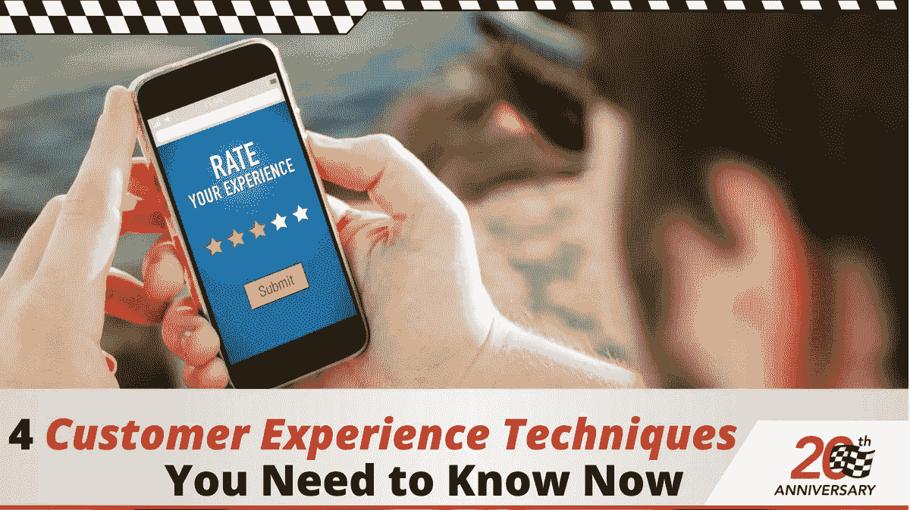

# 你现在需要知道的 4 种客户体验技巧

> 原文：<https://medium.com/swlh/4-customer-experience-techniques-you-need-to-know-now-8e7f1aebee06>

为客户提供积极的体验是成功企业建立的关键。重要的不仅仅是卓越的客户服务；更重要的是在整个顾客旅程中提供全面优质的体验。

为了更好地理解这两者的区别，让我们来定义这两个概念。顾客体验可以定义为一个人对品牌的内在看法。另一方面，客户服务是*塑造*内部视角的外部因素。

如今，客户的信息越来越丰富，要求也越来越高。他们通过多种渠道和接触点与企业互动。他们希望品牌在顾客旅程的每一步都能给他们带来惊喜。即使是最小的相互作用也很重要。

根据 Dimension Data， [84%致力于改善客户体验的组织](https://dimensiondatacx.com/?utm_source=Referral&utm_medium=PR-Regional&utm_campaign=GCXBR2017)报告收入有所增加。品牌知道这一点，因此，他们正在将重点转向为客户创造更好、更独特的体验。

然而，他们中的许多人没能正确执行。但是不要担心。如果你正在寻找客户体验管理的高手，这四个宝石一定会帮助你赢得他们的心。

# 1.了解你的目标受众

消费者非常重视一个品牌是否理解并适应他们的需求。事实上， [79%的美国人](https://www.wantedness.com/)表示，他们更有可能从展示这些品质的品牌购买产品。

这些数字本身就说明了理解你的目标受众的重要性。试着为你的团队面对的不同类型的客户建立买家角色。如果你想了解你的听众，你需要能够与他们沟通并感同身受。

构建这些角色时要考虑的一些因素是:

*   **人口统计数据:**分析你的客户群的人口统计数据。年龄、性别、种族、地点等因素。
*   心理学:了解他们对产品的心态和偏好。
*   经济:记得说明他们的经济背景，比如职业、行业和收入。

# 2.与他们建立情感联系

能够与客户建立情感联系是提供最佳客户体验的关键。弗雷斯特集团最近的一项[研究得出了同样的结论。品牌应该注重情感联系，以成为客户体验的领导者。](https://www.visioncritical.com/wp-content/uploads/2017/08/The_US_Customer_Experience.pdf)

社交媒体是你在这方面最大的强项和弱项。根据消费者的体验，他们不会羞于在网上给你留下评论。让他们对你的生意有一个积极的感觉会帮助你在他们的圈子里获得印象分。同样，如果你给他们留下不好的印象，你的客户流失率肯定会上升。

如果顾客对你的品牌有情感依恋，他们更有可能成为忠诚的顾客。没有人比捷步达康更了解这一点。他们提供最好的客户体验，因为他们如此厚颜无耻地炫耀他们的“真实客户故事”YouTube 系列。这里有一个:

# 3.走向移动

就客户体验管理而言，当我们谈论移动化时，有两个角度需要考虑。首先，是消费者方面的问题。移动互联网流量几乎占到了全球网页浏览量的一半。

有了移动应用，企业就有了一个系统化的方法来接触和联系他们的目标受众。他们也是收集重要客户信息的资源丰富的工具。利用移动设备极大地改善您提供的客户体验。

为他们提供个性化的内容，与他们建立更深层次的联系，并收集他们的反馈。为什么？因为 90%的消费者认为移动设备使他们能够做出更好的购买决策。这是根据之前引用的温德曼小组的研究。

难怪 2017 年见证了更多企业将移动性纳入其业务解决方案和流程。这就引出了我们的第二个视角——涉及品牌的视角。

拥有一个具有移动功能的 CRM 解决方案是你能为你的销售团队做的最好的事情。除了管理你的销售渠道，像 [Salesmate](https://www.salesmate.io/) 这样的工具可以确保你的团队不再被束缚在办公桌前。

他们可以随时随地访问关键客户信息，并开展业务。有了重要的客户和潜在客户信息，您将看到销售、生产力和客户数据质量的提升。

# 4.捕捉实时反馈并采取行动

像任何其他营销策略一样，客户体验管理需要迭代改进。获取实时反馈，然后及时采取行动，将有助于你实现这一目标。记住要考虑客户和员工的反馈，以获得全面的信息。

采取全渠道的方法来倾听客户对你的品牌和产品的评价。不要仅仅局限于调查或单一的社交媒体网络来获得这种非常重要的反馈。你可以打电话给你的客户，发送互动后调查，并在社交媒体上发布民意调查。

从面对客户的员工那里收集反馈同样重要。考虑他们的建议，努力改善顾客旅程的每一步。鉴于他们通常是消费者的接触点，没有人比他们更了解他们的问题。他们的宝贵见解会对你的战略产生重大影响。

显然，仅仅收集所有这些反馈是不够的。您需要知道如何从中获得可操作的见解，然后及时执行它们。没有什么比知道一个品牌重视他们的意见更让消费者感到特别的了。这就是为什么对他们的反馈及时采取行动至关重要。

看看上面星巴克做了什么。他们在自己的网站上有一个专门的页面，让顾客就星巴克如何更好地为他们服务提出建议。众所周知，他们会实施许多这样的建议，尤其是在新产品方面。

顾客是任何企业的生命线。我这样说不仅是从销售的角度，也是从营销的角度。让顾客对你的品牌赞不绝口的最简单的方法就是为他们提供一次非凡的顾客之旅。一旦他们站在你这边，他们将会是你生意最强有力的支持者。这些技巧是开始建立客户体验战略的好方法。

***最初发表于*******。****

***关于作者***

*谢恩·巴克是[内容解决方案](https://contentsolutions.io/)和[礼品公司](http://gifographics.co/)的创始人兼首席执行官。你可以在[推特](https://twitter.com/shane_barker)、[脸书](https://www.facebook.com/ShaneBarkerConsultant/)、 [LinkedIn](https://www.linkedin.com/in/shanebarker/) 、 [YouTube](https://www.youtube.com/channel/UCiD3HGr_vpDp0ApavL-bEGA) 、 [Instagram](https://www.instagram.com/shanebarker/) 上和他联系。*

**

## *这个故事发表在 [The Startup](https://medium.com/swlh) 上，这是 Medium 最大的创业刊物，拥有 361，652+人关注。*

## *在这里订阅接收[我们的头条新闻](http://growthsupply.com/the-startup-newsletter/)。*

**