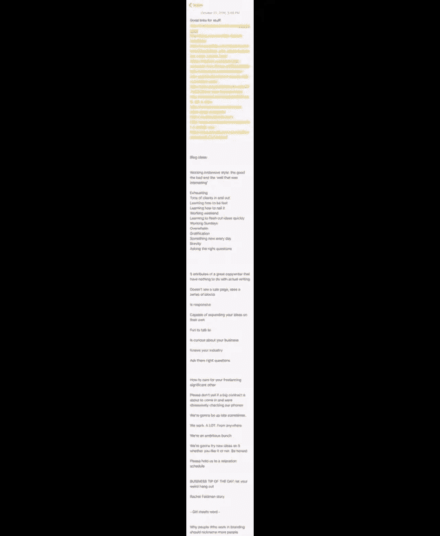
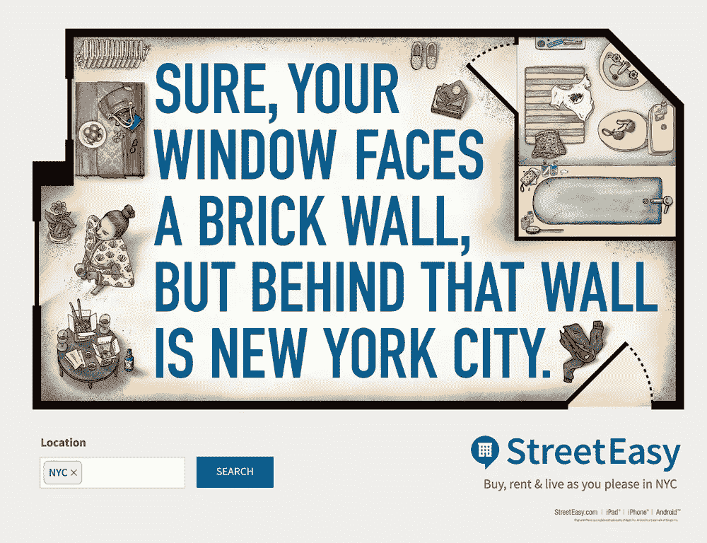

# 4 个能激发你创造力的日常习惯

> 原文：<https://medium.com/swlh/4-daily-habits-that-will-boost-your-creativity-ad6bd3812bd1>

## 因为我们不能都等着缪斯女神出现…

Image by [Greg Rakozy on Unsplash](https://unsplash.com/@grakozy)

*这个帖子最早出现在剧组博客上。* [*在这里得到更多的喜欢。*](https://crew.co/backstage/)

每当问到“那么…你是做什么的？”说到创意，我们大多数人都会得到两种回答:

1: *“哦，酷！总之，[插入主题-改变天气/食物/他们的工作/行尸走肉的最新一集]"*

2: *【睁大眼睛】“哦哇。所以你必须有创造力，就像，所有的时间？!"*

第二个回答让我震惊的是,“持续的创造力”会威胁到人们(即使他们自己有很多天赋)。)

就好像设计师/文案/开发者/战略家等的生活是某种神秘的召唤缪斯的马拉松，由咖啡和 Spotify 提供燃料，需要大脑不断燃烧和搅动。

事情是这样的:虽然日复一日为生活带来创意而获得报酬，但日复一日有其挑战，这不是火箭科学。

因为不可能。

你不会担心你的外科医生是否有足够的“灵感”来做手术，或者问你的机械师他是否有“合适的空间”来修理你的车，对吗？

创意人员也是一样。

当时间一小时一小时地溜走，你的最后期限向你冲来时，没有时间等待某朵甜美的天才之花从天而降。

幸运的是。

那么，这是怎么做到的呢？即使在你最无聊的一天，你怎么能找到方法去挖掘你的创意源泉，并制作出你的客户会喜欢的东西——准时，而且每次都是？

这都与你的习惯有关。

# 好的创造习惯#1:开始一个精神和身体的“刷卡文件”

灵感无时无刻不在你身边。绝对每一件你喜欢的，欣赏的，讨厌的，让你思考的，让你疯狂的，让你厌恶的，改变你想法的，或者让你行动的，等等，都需要成为你的“刷卡文件”的一部分。

刷卡文件可以采取多种形式。我的 iPhone 上有一个持续数页的便笺，里面写满了一天中任何时刻打动我的博客帖子和项目想法，以及我认为很棒的其他帖子的链接。

我还保存了一个运行 word 文档，里面有随机的广告词和引起我共鸣的网站，我的桌面上还有一个文件，里面有我认为很棒的广告、图片、新闻资料袋、书籍、歌曲和视频的截图。

你的 swipe 文件是完美的资源，当想法还没有出现的时候，当完美的项目出现的时候，当你有东西藏起来并准备好建立的时候。

例如，我在一个客户的标题中使用的一句俏皮话(我已经看到它被重复和模仿了十次)是我两年前在 reddit 关于动机的评论帖子中注意到的。

另一个例子:我自己的网站整体氛围和颜色的灵感来自一个流行的“前卫”时尚品牌。

底线:永远睁大你的眼睛。写下、保存和拍摄对你有意义的事物。但是无论你做什么都要拯救它。你会需要它的。

# 好的创造习惯#2:密切观察颠覆者，分析他们的不同之处

有影响力的创意陈述不遵循单一的模式。事实上，不遵循共同公式的工作往往是最值得关注的东西。

我的意思是:

今年早些时候，一家名为 [StreetEasy](http://streeteasy.com/) 的纽约房地产搜索引擎发起了一项令人敬畏的活动，从我第一次看到它开始，我就一直对它念念不忘。

虽然大多数房地产公司的广告都包含房产或幸福夫妻坐在新家的图片，但这一活动有两个目的:

1.  它引发了我对纽约生活的最大抱怨之一(不幸的窗外风景——如果你有窗户的话)。)而且，作为一个卧室基本上面对砖墙的纽约人，我能立即产生共鸣。开怀大笑。好好想想。并且想了解更多。
2.  短语“……但那堵墙后面是纽约市”体现了纽约的“魔力”。是的，很贵。是的，你的公寓很小，从这里看你的风景也不那么令人兴奋，但是你在大城市，宝贝！欢迎来到丛林。

明白这是怎么回事了吗？仅仅两个简单的句子就引发了一种情绪反应，让我觉得 StreetEasy ' gets me '。太棒了。

这种诚实的幽默和简洁是我在处理广告内容时总是试图传达的东西:我如何才能以类似的方式抓住人们，无论我谈论的是房地产、科技、健康还是其他什么？我怎么能像那样挖掘他们的私人笑话和挫折呢？

从长远来看，保险公司 [Oscar](https://www.hioscar.com/) 的网站因为不同的原因而具有开创性。

奥斯卡选择了简单、没有行话的术语和人类的兴趣，而这个行业往往缺少这三样东西。没有欢笑的模范家庭、休息良好、看起来诚实的医生、或看起来自信能按时服药的老人的照片。

你知道吗？令人耳目一新！

因此，当我为更复杂或“无情”的行业制作内容时，我总是先快速浏览一下奥斯卡网站，看看有什么想法。

只要确保一件事:当你捕捉到中断，弹出它到你的刷卡文件，统计。

# 好的创造习惯#3:问更多(更多)的问题，并认真倾听答案

当涉及到创造性工作时，你问的问题就是一切。

像这样的问题:

*   你的灵感从何而来？
*   你想解决什么问题？
*   你在为谁服务？
*   为什么只有您能提供这种解决方案，它有何独特之处？
*   你希望人们在与作品/产品/项目互动时有什么样的感受？
*   为什么有人不购买所展示的产品/与之互动？

尽可能详细地写下答案。然后，继续问后续的问题，直到你完全相信你已经掌握了正在发生的事情。

确保你挖掘得尽可能深的一个好方法是使用[5 个为什么技巧](http://crewblog.wpengine.com/strange-customer-behavior/)。

最多问 5 次“为什么”,以确定他们前面的陈述的原因。每个问题都会引出接下来的“为什么”。

例如，以下是 StreetEasy 如何通过问“为什么”得出他们的活动创意:

**你为什么要创建这项服务？**
“让在纽约寻找公寓更容易。”

**为什么？**
“因为在任何时候，纽约市只有不到 1%的房地产可供出租。”

**这有什么关系？**
“因为这让搬家/租房变得异常困难。”

**为什么难？**
“因为人们在选择公寓时，往往不得不牺牲空间、安全或者便利。”

那人们为什么住在那里？因为纽约是一个充满活力的地方，这里的人们同样充满活力。"

明白这是怎么回事了吗？

继续问那些为什么。他们将帮助你了解目标市场的感受、目标和欲望，并为那些创造性的“灵光乍现”时刻提供充足的机会。

# 好的创造习惯#4:(重新)发现让你兴奋的东西

通常，在危急时刻缺乏灵感意味着你与你正在做的工作联系不够紧密。如果你没有完全兴奋起来，你的观众可能也不会。

所以，如果你陷入了困境，回到基础(以及你之前问的那些问题)。

*   是什么让你正在讨论的这个产品/项目/概念如此棒？
*   这对谁有帮助，他们在幕后有哪些可能没有告诉朋友的私人抱怨？
*   对你来说最酷的方面是什么？你想联系的人呢？
*   你如何以一种完全颠覆性的方式来解释这个产品/项目/概念？

对你正在做的工作感到兴奋将会使聚焦过程变得更加容易，并帮助你创作出吸引每一个目标观众的作品。

# 最重要的是，不要停止享受乐趣

当你在工作中找到乐趣时，你会保持思维活跃，享受足够的娱乐，继续推动“跳出框框”的概念或大满贯。

这也有助于你在伟大的想法出现时保持警惕，因为不要用“为什么我没有做到呢？”来给自己压力思考，当你看到它时，你会欣赏它，并给自己精神空间，以自己的方式建立它。

无论我们去哪里，创意人员都会“带着我们的作品”。让我们把它变成祝福而不是诅咒。