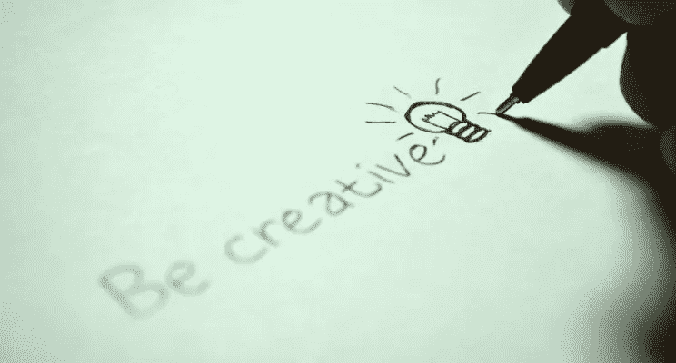

# 4 个习惯会释放你的创造力

> 原文：<https://medium.com/swlh/4-habits-that-will-unlock-the-creative-person-in-you-ae9296a51326>

“如何释放你的创造潜力？”—这个词在谷歌的搜索次数为 38，90，000 次。震惊？好吧，这里有另一个令人震惊的统计数据——Adobe 发布的一项研究表明，75%的人认为他们在提高生产率的压力下没有充分发挥创造力。

如果你觉得自己也是这 75%中的一员，是时候去寻找能提高你工作效率的事情了。是时候释放你的创造潜能了。这里有一些简单的方法来做到这一点-

> “想成为最擅长管理团队和项目的人吗？停止依赖电子邮件，[改用 ProofHub](https://www.proofhub.com/?utm_source=Medium&utm_medium=Referral&utm_campaign=Leadership&utm_term=CTA-1&utm_content=4%20habits%20that%20will%20unlock%20the%20creative%20person%20in%C2%A0you)

# 在不舒服中寻找安慰

安逸是创造力最大的敌人。为了实现你一直想要却从未拥有的东西，你必须走出这个危险的舒适区。

如果你想有创造力，你需要超越舒适。你可能会觉得日复一日在工作中做同样的事情很舒服。但是，如果你想挖掘隐藏在你内心的真正的创造潜力，你需要超越这些方式。挑战自己，开始在不舒服的环境中寻找快乐——因为它们会激发出你最好的一面！

# 尝试技术排毒

放下 iPhone 在过去的半个多小时里，我一直盯着手机，妈妈就是这么喊的。她大喊大叫，因为几分钟前我和她讨论过，我没有新的写作思路。"*盯着你机器的屏幕不会带来创造力。走出去，看看，感受一下。”她完成后回到自己的房间。*

天哪，她是对的。采纳她的建议，我决定每天花几个小时进行科技排毒。这是我远离所有技术的时候，无论是智能手机，笔记本电脑还是任何可以分散我注意力的东西。我会利用这段时间出去见见人们，在公园里散散步，做些他们过去常做的事情。这有助于我更加意识到周围的环境，正如下一点所解释的。

 [## 工作与生活平衡的秘诀

### 不平衡的生活方式会破坏工作场所的物质环境。至关重要的是创造一个…

www.proofhub.com](https://www.proofhub.com/articles/the-secret-to-work-life-balance) 

# 更加注意你周围的环境

我们被如此多的人和事物包围着。在变得更有效率、超越他人努力的激烈竞争中，我们常常忘记了我们的周围。这使得我们的努力更像是机器生产的。但是，我们不应该表现得像人类一样吗？

更多地意识到周围的环境让我们能够从周围的一切事物中学习。它会灌输一种动力感。看看自然界的事情是如何发生的。其他人如何处理你也面临的类似情况。听起来很有哲理，但事实是这些东西激发了创造力。不相信我？试着从你正在做的事情中休息一下，观察窗外乌鸦的叫声。放慢生活的节奏，你会发现创造力的琴弦自动拨动正确的和弦，奏出交响乐。

# 活在当下

最后，但同样重要的是，忘记过去发生的事情。让你对未来的想法休息一下。并且，开始活在当下。你不能改变过去发生的事情。你不知道未来会发生什么。但是，通过你的行动，你肯定可以控制此刻将要发生的事情。

如果我们知道如何以最好的方式生活，当下就是上天赐予我们的礼物。而且，最好的方式就是摆脱过去的担忧和对未来的紧张。开始活在当下，你会看到你思维的瞬间改变，让你的创造力流动起来！

> *“在寻找更有效地管理任务的方法吗？* [*开始使用 ProofHub*](https://www.proofhub.com/?utm_source=Medium&utm_medium=Referral&utm_campaign=Leadership&utm_term=CTA-1&utm_content=4%20habits%20that%20will%20unlock%20the%20creative%20person%20in%C2%A0you) *。”*

*原载于*[*HuffigntonPost.com*](https://www.huffingtonpost.com/entry/4-habits-that-will-unlock-the-creative-person-in-you_us_5a584abfe4b0c198cb444be6)*。*

**关于作者**:

Vartika Kashyap 在 [**ProofHub**](https://www.proofhub.com/?utm_source=Medium&utm_medium=Referral&utm_campaign=Leadership&utm_term=Author%20Bio&utm_content=4%20habits%20that%20will%20unlock%20the%20creative%20person%20in%C2%A0you) 运营着一个营销团队，这是一个面向各种规模团队的项目管理软件。她是一位经验丰富的营销专业人士，是数字营销和创业方面的专家。

**如果你喜欢读这篇文章，你肯定也会喜欢上它**

1.  [5 种在工作中保持充沛精力的简单有效的方法](https://fityourself.club/5-easy-and-effective-ways-to-remain-supercharged-at-work-eef135832ecb)
2.  [项目经理必备的 7 项技能](https://www.proofhub.com/articles/project-management-skills)
3.  [如何成为一名成功的项目经理](https://blog.proofhub.com/how-to-become-a-successful-project-manager-86c548aafd87)

## 这篇文章发表在 [The Startup](https://medium.com/swlh) 上，这是 Medium 最大的创业刊物，有 314，551+人关注。

## 订阅接收[我们的头条新闻](http://growthsupply.com/the-startup-newsletter/)。

