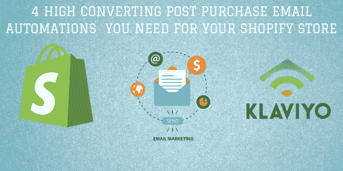

# 您的 Shopify 商店需要的 4 个高转化率购买后电子邮件自动化

> 原文：<https://medium.com/swlh/4-high-converting-post-purchase-email-automations-you-need-for-your-shopify-store-3c4d7377d5ff>

如果你一直关注我最近的几篇博客文章，你会发现它们都非常关注电子邮件营销。这是因为我觉得电子邮件营销是一个领域，许多店主在营销工作上做得不够，只是因为他们没有意识到他们可以用电子邮件营销做更多的事情。我看到的最常见的错误之一是，商店和品牌没有在电子邮件策略中实现电子邮件自动化，或者自动化程度很低。如果你已经关注了我最近的两篇博客，你希望至少会有一个很棒的欢迎系列和废弃购物车系列([如果你没有去读我过去的两篇博客](/swlh/how-to-create-a-high-converting-automated-abandoned-cart-email-series-for-shopify-e8241b8348db))但是电子邮件自动化并没有就此停止。我们花了这么多时间培养销售线索来促成销售，那么一旦他们购买了产品，为什么还要停止与他们的互动呢？顾客购买后，你可以通过许多自动化的电子邮件流程向他们发送信息，以帮助提高你的商店的销售额，我在下面解释了其中的 4 种类型。在有人购买后，你选择做什么将对你的电子邮件策略和销售的整体成功有很大的影响。

# 自动化流程# 1——品牌强化策略

这一流程的目标是强化购买者的决定，确保你让他们知道他们做出了正确的选择。你可以通过为顾客订单的到来制造兴奋感来做到这一点，让顾客在订单到来之前就喜欢上你卖给他们的产品。你要做的是设计一个在购买后不久发送 2-4 封电子邮件的流程(第一封电子邮件在购买后 1-3 小时发出)。将剩余的电子邮件分散在客户收到订单通常需要的时间内，如果通常需要 7-10 个工作日，则将它们分散在最初几天。你必须小心，不要在别人可能已经收到产品后，还在给他们发邮件，告诉他们期待收到产品。

基本上，这一系列的电子邮件应该围绕着感谢客户、让他们了解你的品牌和产品，以及建立收到产品的兴奋感。你可以在电子邮件中实现的一些想法有:自动发送企业所有者的个人感谢信息，提醒客户关于你的品牌和你的品牌故事，向客户展示购买过该产品的其他人的评论，以及通过将他们发送到博客帖子来教育和教导你的客户他们刚刚购买的产品。通过能够用这些类型的电子邮件建立这种自动化流程，你将与你的客户建立品牌信任和关系。此外，你还会从这些电子邮件中看到更多的销售收入，因为你增加了与客户的接触点。

# 自动化#2 —产品追加销售

这个流程的目标很简单，就像副标题表明你试图立即追加销售另一个产品。你要做的是在客户购买后立即给他们一个不可抗拒的优惠，以增加客户的终身价值。在这个流程中，您的第一封电子邮件应该在有人订购后的 1-2 小时内发出，其背后的策略是给客户一个仅针对首次客户的限时优惠，并说明折扣在接下来的“X”小时内有效(为了推动紧迫性，我建议在 24-48 小时内)。现在，您可以将它设置为在每个人第一次购买后自动发送给他们，或者您可以将其触发为特定于产品。这种策略的一个例子是，我的一个销售 CPAP 机器的客户，我们建立了一个自动电子邮件系列，如果客户购买了一台 CPAP 机器，但没有任何额外的配件或供应品，我们会在购买后给他们发送一封电子邮件，给他们一个折扣代码，只在接下来的 24 小时内为他们的 CPAP 机器节省 25%的配件。你要让报价尽可能地不可抗拒，同时也要让它与已经完成的购买相关或互补。如果操作正确，您会注意到很高的打开率和点击率，对于这一系列，1-2 封电子邮件就足够了，第一封电子邮件应在购买后 1-2 小时发送。

# 自动化 3 —收集 UGC(用户生成内容)

如今有如此多的网上商店，能够获得登陆你的商店的潜在买家的信任是非常重要的，你可以通过对你的商店进行社交验证来获得他们的信任。社交证明你的商店对你的成功至关重要，因为社交证明是有人可能从你这里购买的一个重要原因。为你的商店获取用户生成的内容(如评论、视频评论、社交媒体上的标签、顾客使用你产品的照片)同时还能实现销售的一个超级简单有效的方法是建立一个自动的电子邮件系列，重点是为 UGC 提供激励。在客户可能收到他们订购的产品后 1-2 周，向他们发送一封自动电子邮件，说明他们将收到一个优惠券代码，用于对他们购买的产品留下评论，或者要求他们将他们使用该产品的照片上传到 Instagram。你不仅建立了大量强大的社会证明内容，用于未来的营销和你的商店，以增加转化率，而且你还会从你发送给为你生成内容的人的优惠券中获得许多回头客。

# 自动化 4 —特定产品的交叉销售

如果你以前在网上购买过任何东西，你以前可能会遇到这样的电子邮件，这封电子邮件系列是你典型的“我们看到你买了 ABC，所以你可能会对 XYZ 感兴趣”。该策略的目标是通过一系列自动化的电子邮件自动向人们销售相关的免费产品。同样，您希望在客户收到他们的第一个初始产品并有机会使用它之后，将这些电子邮件发送给他们。您希望根据客户刚刚购买的内容来策划这些电子邮件。考虑推荐最常一起购买的产品，给他们发电子邮件，告诉他们你可以追加销售或创造的捆绑产品和系列，或者称赞他们刚刚购买的产品的配件，甚至发电子邮件提醒他们过一段时间后更换产品，这些类型的交叉销售电子邮件真的很有创意。

我希望这几个购买后策略的概述能帮助你通过电子邮件营销为你的商店创造更多的销售。尝试并确保尽可能多地实施这些策略，以最大化您的电子邮件营销潜力，并从您的策略中获得最大收益。请记住，与之前在您的商店购买过产品的顾客保持联系，与让新顾客第一次购买同样重要。

如果你对这些自动化流程有任何疑问，或者想获得 30 分钟的免费咨询，请给我发电子邮件至 brent@onlygrowth.com

或者在[https://onlygrowth.com](https://onlygrowth.com/pages/audit)报名参加免费的现场审计

## 这篇文章发表在 [The Startup](https://medium.com/swlh) 上，这是 Medium 最大的创业刊物，拥有+404，714 名读者。

## 订阅接收[我们的头条](http://growthsupply.com/the-startup-newsletter/)。

