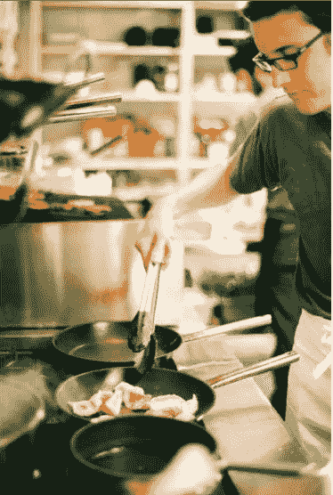
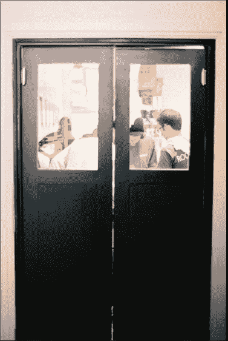

# 一名因谋杀罪受审的毒贩给我们上了 4 堂重要的创业课

> 原文：<https://medium.com/swlh/4-important-startup-lessons-from-a-drug-dealer-on-trial-for-murder-df91dc4d1bc2>

> 为了保护无辜，名字被改了。有罪的人。

我的第一个商业导师是一个毒贩。他的名字叫乔希。

我遇见他时，他正因谋杀罪受审。他把毒品卖给了一个朋友。他的朋友用毒品自杀了。

他们扇了乔希一个大耳光，因为他朋友的爸爸是个政客。我猜政客的儿子是不允许自杀的。

我和他一起从零开始建立了一个全新的餐厅。我们用了别人的钱。真的，我们只是被雇佣的枪手。

乔希是第一次创业的企业家聘请的主厨。在我的第一份高端厨房工作中，我是他的副主厨。他的得力助手。

Me working the line.

我们两个人每周工作将近 170 个小时。我确信乔希在周末礼拜后睡在吧台下面。是的，至少两次。

餐馆开张 6 个月后，生意火爆起来。我们一晚上赚了 4000 美元。就像地狱厨房，隆胸手术少了，暴力多了。

我每小时挣 11.5 美元。

六个月后，我们都被解雇了。

六个月后，餐馆倒闭了。

介于两者之间，乔希教给了我一些关于商业、生活和追求卓越的最诚实、最有力的教训。

我每天都试着使用它们。他们让我赚了很多钱。

也许他们也会帮助你。

## 第一课

# 企业主和企业负责人并不总是同一批人。这是一件坏事。

乔希经营这家餐馆。

乔希是个小时工。

店主唐大多数晚上都围着桌子转，惹恼顾客。他认为自己很迷人。

当员工需要答案时，他们会去找乔希，而不是唐。乔希不在的时候，他们会来找我。只是因为乔希让他们这么做。

乔希是负责人。

唐开了支票。

除了，最后他甚至不能做到这一点。

乔希在监狱里学到了他的管理风格。他恐吓人们。他扔东西。他经常尖叫。

史蒂夫·乔布斯会喜欢他的。

一天晚上，唐试图与乔希对质。重新控制他的餐馆。我一直在想，“*乔希，你已经因谋杀罪受审了。不要。*“但他做到了。

他甚至没有被解雇。这就是他拥有的力量。

最终，唐不再出现了。他甚至在城镇的另一边开了第二家餐馆。一个给大学生买披萨的地方。

我觉得他害怕再面对乔希。

但最终，唐不得不收回对餐馆的控制权。

他解雇了乔什。然后他解雇了我。

我认为他必须这么做。

乔希太强大了，而我是乔希的得力助手。

唐让夺权进行得太久了。

我也会做出同样的决定。实际上，我一开始就不会让乔希有这么大的控制权。

我们被解雇 6 个月后，唐不得不永远关闭餐馆。据我所知，他在那地方损失了 25 万美元。他开始的时候并不富有。现在他破产了。

一旦兵变发生，秩序永远无法完全恢复。最好在她躺着的地方把她沉了，然后在安全的码头上造一艘新船。

或者只是做一个更好的队长。

## 第二课

# 如何赢得持久的消耗战

大多数厨师筋疲力尽，辞职不干了。或者进监狱。大部分都是。

大多数企业主筋疲力尽，辞职不干了。或者进监狱。有时两者都有。

在一个餐馆特别忙的晚上，唐的侄子进来帮忙洗碗。我们被堵住了，队伍排到了门外。

乔希心情特别不好。经过一个小时的监狱猥亵，唐的侄子退出。我不记得他的名字了。我确实记得他打电话让他爸爸来接他的时候他在哭。

我还记得那天晚上我不得不呆到凌晨 4 点才洗碗。第二天早上 7:30，我回到餐厅，准备一整天的晚餐服务。

我讨厌放弃者。他们总是把屎留给不放弃的人去捡。

一周后，唐的哥哥来了。他对儿子辞职很生气，想因此责怪乔希。

"*你为什么让我儿子退出*？

"*我所做的只是给了你儿子他一直在寻找的东西:一条简单的出路*"

有时候我问自己:

"*我在寻找一条简单的出路吗？*

在我的一生中，有两次每当我问的时候，我都能回答“是的”。

两次我都花了大量的时间和精力寻找更容易赚钱的方法。更简单的方法来收取更多费用。更简单的工作方式。

然后我就无家可归了。两次都是。

现在我只是试着坚持更久。坚持最久。生存。持久。找到一些我能做的简单的事情，并且不放弃。永远不会。不管怎样。

乔希是个瘾君子。他也因谋杀罪受审。

但他还是出现了。

他被解雇后，我邀请他去我的公寓。我们煮虾，谈论唐，他哭了。

”*男人我该怎么办？没人会在谋杀审判中雇佣一个重罪犯！我完蛋了。*”

我可能给了他一些建议。可能是我在电视广告上听到的。那时我还年轻。我以为所有的建议都适用于每个人。

上次我听说，乔希是滑雪胜地附近一家詹姆斯·比尔德获奖餐厅的行政主厨。那些人一年挣 20 万美元。至少。

我并不惊讶。

乔什能比任何人都活得久。

Through these doors walk the last remaining band of pirates. Fearless men who play with fire and knives.

## 第三课

# 专心

我的前臂上有一道垂直的伤疤。它是紫色的，闪闪发光。它完全符合煎锅的边缘。

乔希给我的。

一天晚上，我在跑关隘。大声点单，给食物上盘，让服务员忙个不停。

在混乱中，我弄乱了一个订单。我告诉乔希做一样东西，顾客想要别的东西。我不记得是什么了。我只记得他做了什么。

首先，他把整个订单扔在地板上。盘子爆炸了。餐厅变得安静了。价值 200 美元的食物，不能吃。

然后，当我弯腰开始捡起它时，我被一个热煎锅击中了。就在手臂上。它燃烧了。

注意，该死的！

我有个文案朋友，说他边看电视边写。他的收入只有一个好文案的六分之一。他想不通为什么。

"*注意，该死的！*

切斯利·舒伦伯格[将一架空客 A320-214 迫降在哈德逊河的一个小狭长地带，救了 155 人](https://en.wikipedia.org/wiki/US_Airways_Flight_1549)。法国航空公司 447 航班的机长在飞行途中睡着了，导致 228 人死亡。包括他自己。

"*注意，该死！*”

2011 年，休豪伊意识到自助出版是潜在的赚钱工具。那年年初，他出版了《羊毛》的第一部分。本周，他首次将自己定制的双体船下水。他计划环游世界，并用数百万美元的版税资助他的冒险。

"*注意，该死！*

## 第四课

# 这是关于真实的人类

我把乔希描绘成一个暴君。

他确实是。

但他也是我见过的唯一一个看起来真实的人。

他从未试图躲在品牌背后。他非常诚实。

如果他不喜欢你做的东西，他会把整个东西扔到地板上，让你从头开始。

如果你做对了，你可以依靠从他的三个字的赞美中获得的信心骑上好几天:“*该死，那太好了*”

他非常关心完美。食物和人类。主要是在人身上。

他比我认识的任何人都努力工作。我从没见他休息过。我从没见过他付出的少于他拥有的一切。甚至在事情开始倒退的最后。

他是乔希，他不想做任何事。他对你也有同样的期望。

员工对他非常忠诚。我尤其。

我们对他如此忠诚，以至于唐别无选择，只能解雇他。还有我。他最好的工人。他机器后面的引擎。想象一下。

但愿更多的初创企业更人性化。我希望他们能找到勇气去做。来建立这种忠诚。

为什么公司很难真实？

为什么我们必须开会来设计一个品牌？

如果你不像对待“*用户*”那样对待你的客户，而更像对待“*人类*”那样对待他们，会发生什么？

我希望我能告诉乔什，我一直都是我自己。我从未试图构建一个隐藏的想法。我写的每一个字都是真实和诚实的。

我让你失望了，乔希，我很抱歉。

我所知道的是，每当我利用“*诚实*”而不是“*营销*”时，我就赚了更多的钱。无一例外。

也许乔希会因此而为我骄傲。

或者他会让我从头开始。

*想要更多这样的文章吗？注册* [*我的私人每日简讯*](https://mikeshreeve.clickfunnels.com/mediumnewslettersignup) *我在这里写关于创业、成功心理、写作以及这之间的一切。*

*发表于* **创业、旅游癖和生活黑客**

-