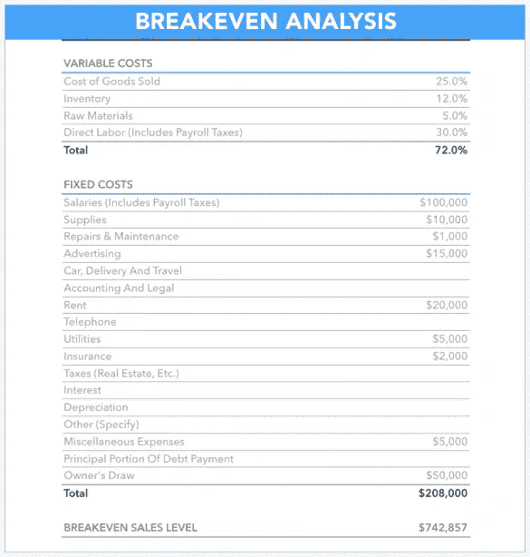

# 所有初创公司都应该衡量的 4 个关键财务指标

> 原文：<https://medium.com/swlh/4-key-financial-metrics-that-all-startups-should-measure-8302ea640f6f>

Originally published on [http://www.appsterhq.com](http://www.appsterhq.com/?utm_source=CP&utm_medium=Medium)

超过 90%的创业公司最终都会失败。

归根结底，创业公司之所以会消亡，是因为它们没有建立在**健康的、可以长期持续的商业模式**之上。

经济增长对创业成功至关重要:[没有规模的公司无法生存](http://www.appsterhq.com/blog/realities-21st-century-start-ups)。

然而，你能确保你的商业模式是健全的，能让你的创业公司随着时间的推移而扩张吗？这就是**测量**发挥作用的地方。

在这篇文章中，我将讨论所有初创公司创始人都应该密切关注的 4 个关键财务指标。

# 1.固定成本与可变成本

作为一名初创公司的创始人，你必须收集(并随着时间的推移不断更新)的最重要的财务数据之一是经营企业的总成本。

你的总成本由你的*固定成本*和你的*可变成本*的总额组成。

**固定成本**:

*   **做*不*的成本随着公司的生产量**而变化，也就是说，不管公司生产多少商品或服务，成本都保持稳定；
*   例子包括租金、贷款偿还、保险和办公用品。

**可变成本**:

*   ***做*的成本随着公司的生产量而变化**，即成本随着公司生产的商品或服务的多少而变化；
*   这些成本随着产量的增加而增加(即变得更加昂贵)，随着产量的减少而减少。
*   例子包括直接材料成本、直接人工成本、销售佣金和服务器成本(来源: [1](http://www.investopedia.com/terms/v/variablecost.asp) 、 [2](http://www.investopedia.com/ask/answers/032515/what-difference-between-variable-cost-and-fixed-cost-economics.asp?lgl=rira-baseline-vertical) )。

出于各种原因，了解你的总成本是至关重要的，包括你的业务支出的金额会影响你是否可以盈利，如果可以，那么何时可以盈利(以及盈利多少)。

O 支出资金(即成本)也会严重影响你的初创公司**跑道**的长度，即你的公司在没有稳定收入的情况下可以生存的时间。

你可以通过计算你的**现金余额**，也就是你的创业公司必须为烧钱提供资金的金额，然后除以你的**烧钱率**，也就是你的企业每月的赔钱率。

例如:

*   *跑道* = *现金余额*125，000 美元/ *每月消耗率*25，000 美元
*   *跑道* = 5 个月(直到你的钱用完)(来源: [1](https://www.capshare.com/blog/burn-rate-101/) 、 [2](https://www.thebalance.com/what-does-burn-rate-mean-and-how-is-it-calculated-393196) )。

除了烧钱率明确提醒你，如果你最终没有带来足够的收入，你的初创公司确实会在未来的某个时候耗尽资金，这也是衡量吸引投资的一个重要指标。正如罗斯玛丽·皮弗勒解释的那样:

> *“投资者观察一家初创公司的烧钱速度，并将其与该公司的未来收入进行比较，以决定该公司是否值得投资。如果烧钱速度比预测的要快，或者如果公司的收入增长没有预测的那么快，那么投资者可能会认为这家公司不是一个好的投资。这可能风险太大，所以他们可能不会投资。”*

你如何有效地延长你的风险投资的烧钱速度？这里有 3 个策略:

1.  **尽可能精简地运营****尽可能保持合理的低成本:保持低消耗率将最大化您的财务选择，从而允许您在到达跑道尽头之前中止、调整或重启一个或多个流程。**
2.  ****努力让你的固定成本更有效率**:例如，利用新技术——如 Google Docs、Quora、Skype 和 Slack——与你的客户和同事/合作伙伴交流，收集数据，和/或进行研究，与更传统的市场研究、广告和沟通方式相比，成本更低。**
3.  ****增加你的收入**:一个方法是确保你在[最大化你的创业公司的货币化](http://www.appsterhq.com/blog/app-monetization-models)。**

****

**(顺便说一句:如果你正在寻找一些可用的最佳创业工具的全面指南，那么我建议查看史蒂夫·布兰克的资源[这里](http://steveblank.com/tools-and-blogs-for-entrepreneurs/)和阿里·梅斯的主列表[这里](http://growthsupply.com/free/)。**

# **2.得失相当分析**

****

**美国小企业协会对“[盈亏平衡分析](https://www.sba.gov/starting-business/business-financials/breakeven-analysis)”进行了简明而有用的描述，指出:**

> ***“盈亏平衡分析用于确定你的企业何时能够收回所有费用并开始盈利。重要的是要确定你的启动成本，以确定你的销售收入需要支付持续的业务费用。”***

**你公司的" [**"盈亏平衡点**](https://www.business.qld.gov.au/running-business/finances-cash-flow/managing-money/break-even-point) "是你的收入(即你从销售中获得的金额)与你的支出(即你的固定成本和可变成本的金额)完全匹配的点。**

**超过的点*你的盈亏平衡点是你开始积累 [**利润**](http://www.investopedia.com/terms/p/profit.asp?lgl=rira-baseline-vertical) 的点，也就是超过支出、成本和税收的财务收益。***

**计算盈亏平衡点有很多好处。通过了解你的盈亏平衡点在哪里，你能够算出:**

*   **你现在的产品线有多赚钱**
*   **在你开始遭受损失之前，销售可以下降到什么程度**
*   **在你获利之前，你需要卖出多少单位**
*   **降低价格或销售量将如何影响你的利润**
*   **你需要增加多少价格或销售量来弥补固定成本的增加**

**下面是一个完整的盈亏平衡分析的示例:**

****

**数学上，盈亏平衡点是这样计算的:**

> ***盈亏平衡点* = *固定成本* / ( *单位售价* — *可变成本*)**

**昆士兰州政府提供了一个交互式网页，企业主可以在上面计算他们的盈亏平衡点。**

**完成盈亏平衡分析后，谨慎考虑以下关键问题非常重要:**

1.  **这是现实的销售目标吗？**
2.  **你预计什么时候能够达到这个目标？**
3.  **你需要哪些资源才能到达那里？**
4.  **在此期间，你会消耗掉多少现金？**

**回答这些问题对于深入了解 a)你需要筹集多少资金，b)在收支平衡之前你需要投资这些资金多长时间至关重要。**

# **3.CAC & LTV**

****

**连续创业者[史蒂夫·布兰克](https://steveblank.com/2010/01/25/whats-a-startup-first-principles/)将创业定义为“一个为寻找可重复和可扩展的商业模式而成立的组织”**

**正如我最近在[指出的](http://www.appsterhq.com/blog/start-ups-business-plans-lean-canvases-pivots):**

> ***“创建可重复和可扩展的商业模式是初创企业生命周期中的一个阶段，在这一阶段，新企业会想方设法以低于预期收入* *的价格* ***持续获得新客户，从而创造利润。”*****

**C 创造一个可重复和可扩展的商业模式是创业公司生命力的基础，因为它使创业公司有可能实现其最重要的目标，即[成长和规模](http://www.appsterhq.com/blog/realities-21st-century-start-ups)。**

**为什么会这样呢？**

**因为成功实施可重复和可扩展的商业模式的公司开始确保真正的销售和营销效率。**

**这种效率根据两个关键指标来衡量:**

1.  **[**【CAC】**](https://blog.kissmetrics.com/customer-acquisition-cost/):说服潜在客户购买产品或服务的总成本。通过划分获得新客户的成本(营销、广告等)来计算。)通过在花费资金期间获得的新客户的数量。例如:如果你每月花费 5000 美元用于促销，你获得了 20 个客户，那么你的 CAC 就是 250 美元。**
2.  **[**【LTV】**](https://blog.kissmetrics.com/how-to-calculate-lifetime-value/)【客户终身价值】 :客户一生中预期产生的收入。在最简单的情况下，计算方法是将你服务的年成本乘以一个人预期成为你公司客户的年数。例如:如果你的服务成本是每年 100 美元，你的平均客户停留 5 年，那么你的 LTV 是 500 美元。**

**在创业的最初几个月或几年，当你缺乏具体数据时，LTV 可能很难准确估计。如果发生这种情况，考虑看看你所在行业的类似公司，了解一下你的 LTV 可能是什么样的。**

****

**为什么对于创业公司创始人来说，了解这两个指标并针对他们的具体业务进行计算是如此重要？**

**因为弄错这些数字对一家新公司来说绝对是致命的。**

**2012 年[创业基因组](https://s3.amazonaws.com/startupcompass-public/StartupGenomeReport1_Why_Startups_Succeed_v2.pdf)报告分析了 650 家互联网创业公司，揭示了“过早的规模化是创业公司表现不佳的最常见原因，因为他们往往会因为超越自己而在早期输掉战斗。”**

**本质上，过早的扩展是在你成功地敲定一个可重复和可扩展的商业模式的复杂细节之前，试图大规模地扩展和壮大你的新公司。**

**换句话说，未能确定 CAC 和 LTV 的细节会加速过早的扩展，从而导致启动失败。**

**许多风险资本家和企业家的普遍共识似乎是，盈利的商业模式是 ltv 比 CAC 至少高 3 倍的模式:**

****

**此外，为了可持续发展，你的初创企业应该追求一个雄心勃勃的目标，即在花费现金的一年内收回你的 CAC 费用。**

**这看起来似乎是一个简单的任务，但在 21 世纪实际上很难实现，特别是考虑到互联网现在已经完全被广告、产品/服务和科技初创公司所饱和。**

# **4.现金流预测**

****

**所有新公司必须衡量的第四个关键指标是 **"** [**现金流**](http://www.investopedia.com/terms/c/cashflow.asp) **"** ，也就是说，对你的企业流入的资金量和流出的资金量进行比较。**

**正现金流指的是你的企业收入大于支出的情况，而负现金流指的是相反的情况，也就是说，当你企业的收入少于支出时。**

**现金流是每一个创业组织的*血液*:没有现金流=没有商业运作——句号。**

**在[最近的一篇文章](http://www.appsterhq.com/blog/costly-mistakes-avoid-first-time-entrepreneur)中，我详细解释了初创公司理解并持续跟踪其现金流数字的必要性，指出所有谨慎的企业家都应该定期练习[现金流预测](https://www.cashanalytics.com/cash-flow-forecast/)(也称为现金流预测)。**

**现金流预测是一种预测技术，用于确定企业的“财务健康状况”。**

**美国小企业管理局[解释了](https://www.sba.gov/blogs/projecting-your-business-cash-flow-made-simple)为什么预测如此重要:**

> ***“预测让你清楚地看到钱什么时候进来，什么时候出去，以及在你支付了你的支出和记录了你的收入之后，每个月底你还剩多少钱。了解现金流预测方面的数字，可以让你看到企业现金流入和现金流出中的潜在陷阱。”***

**因此，预测为你提供了所需的关键数据，以确保你的初创企业烧钱的速度不会超过你维持经营所需的速度。**

**许多第一次创业的人往往会把利润和现金流混淆。**

**利润指的是收入减去支出，但问题在于人们误解了“收入”并不总是“现金收入”的同义词。**

**正如我之前用下面的[假设例子](http://www.appsterhq.com/blog/costly-mistakes-avoid-first-time-entrepreneur)解释的那样:**

> ***“完全有可能有一个‘蓬勃发展’的业务，但仍然是负现金流:***
> 
> **你已经开始销售你的产品；**
> 
> ***-您的客户群正在大幅增长；和***
> 
> ***-你的长期销售潜力巨大***
> 
> ***然而:***
> 
> **为了达到这一点，你已经承担了很多债务(例如，雇佣你的员工，开发你的 MVP，营销你的产品，等等)。);和**
> 
> ***-您每月的开支(如租金、工资等。)超过你的收入总额***
> 
> ***因此:***
> 
> **如果你的收入不开始超过你的支出，那么你将会耗尽现金，被迫关门大吉。"**

**当然，现金流预测不能预测不可预测的事情，但它们可以提醒你可预见的潜在危险。**

**虽然让专业会计进行定量分析可能是最好的，但作为创始人，你掌握现金流预测的原则仍然很重要。**

**现金流预测最基本的形式是使用电子表格，列出每月收入和每月成本以及每年的总额。**

**为了增加细节，你可以将成本分成不同的类别，这对于确定费用的季节性变化非常有帮助(例如，如果你租了一间办公室，你的取暖费可能会在冬天上涨)。**

**现金流预测电子表格示例:**

****

**//**

## **感谢阅读！**

# **如果你喜欢这篇文章，请随意点击❤下面的心形按钮，帮助其他人找到它！**

****

> **最初发表于 http://www.appsterhq.com[的](http://www.appsterhq.com/?utm_source=CP&utm_medium=Medium)**

************