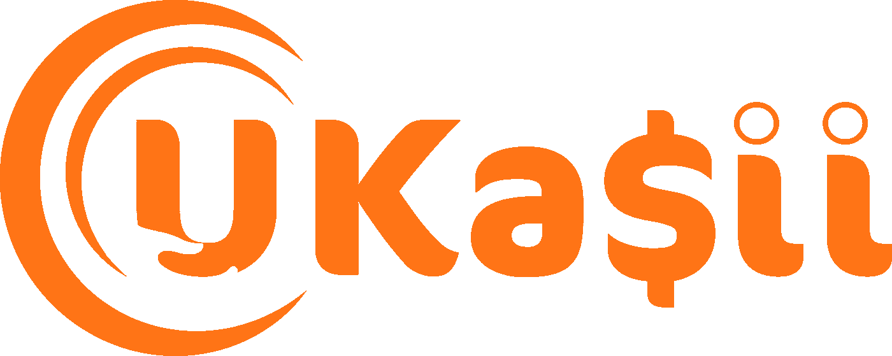

# 评估初创企业时需要回答的 4 个关键问题

> 原文：<https://medium.com/swlh/4-key-questions-to-answer-when-valuing-your-start-up-a17f0a32b0c3>

# 区块链奖励和电子商务平台的制作:创业之旅——第五部分

> “除非你有勇气看不到海岸，否则你无法发现新的海洋。”

Z ero。

当你的公司还没有开始交易，没有任何资产，而你正试图对它进行估值以从投资者那里获得第一笔资金时，这正是你的公司的价值。

事实上它甚至不是零。

这是地狱。

我不是在说舞会。

> 困境:一种你无法控制的不确定的情况，在这种情况下没有进步或改善。
> 
> 剑桥词典

在你拥有任何资产、销售或任何形式的销售订单之前，你都是悬而未决的。那么，你如何摆脱困境，得出一个投资者愿意支付、你也愿意接受的数字，来入股你的企业呢？

我想一开始就说这不是一篇技术论文。因此，如果你在期待如何计算 [**净现值**](https://bit.ly/2TMiZiP) 或如何计算 [**现金流折现**](https://bit.ly/2a2EQuW) 的信息，你最好去谷歌一下。我可以告诉你，但是在你的冒险中找到平静之前，你在许多场合的心情也是如此，我只是不能被激怒。有什么意义？

在你的创业之旅中，这个问题你会问自己的次数比你愿意记住的次数还要多。尽管你在创业中倾注了所有的努力、奉献、鲜血、汗水和泪水，但很少有人会在乎。他们为什么要这么做？这就是你要问自己的第一个关键问题:

## “为什么有人会在乎？”

我不是开玩笑或试图不敬，这个问题不是指与你的产品相关的市场。(当你对此坚定不移的信念消退的时候，一切都结束了)。“没人在乎”是一种矛盾的感觉，你在旅途中不止一天会有这种感觉。我说冲突，是因为尽管自我规定的单独监禁可能会导致一阵阵的疯狂，但这比你允许朋友和家人不断询问你的进展如何更好。

所以，如果你的答案是“为什么有人在乎？”除了耸耸肩或类似的言语，你可能需要重新评估自己是否适合创业。如果你耸了耸肩，或者类似的口头表达，那么在评估你的风险时，你需要问自己的下一个问题是:

## “我愿意放弃多少？”

第一个答案可能会包括，家庭(时间)，友谊，收入，休闲，理智，希望…

对于积极发展的每一天，都会有看似无穷无尽的日子。而且很容易停滞不前，失去希望。虽然这种情况可以适用于任何业务，甚至生活的方方面面，但你经营的公司目前处于不稳定状态，你的收入为零，这种情况会加剧你的挫折感。一个即使在最安静的日子里“噪音”也会让人无法忍受的时候，如上所述，你会问自己，“这有什么意义？”。这就引出了一个问题:

## “我愿意放弃多少？”

虽然你可能会强烈地感觉到你想要放弃这一切并退出，但你应该权衡一下，如果你真的退出并回到岸上，你肯定会感到遗憾。据我所知，没有数学上的“后悔率”可以像其他财务比率一样参考来评估你的公司，但是“后悔的可能长度”可能是一个很好的起点。你相信你会后悔退出的时间越长，你的冒险就越有价值。

如果你不想下沉，永动机绝对是关键。就像电子邮件营销活动的点击率一样，只有很小一部分会带来销售。但是没有活动，就没有点击。所以你必须继续前进，最终会有事情发生，这将引发一连串的其他事件。

或者就像在区块链事件中发生的那样。

一旦[通过 ICO](/swlh/what-guns-n-roses-and-entrepreneurs-have-in-common-d263e5cc73bc) 向 UKa ii 提供资金的机会成为一个可行的选择，我们就不可能以传统的方式被“估价”。我们会让顾客重视我们。这将是集实时市场研究和投资于一体的。如果顾客看到我们的[移动现金回馈奖励计划](http://www.ukasii.com)的价值，他们会[购买 UKa$ii 硬币](http://www.ukasii.com)，他们可以立即使用。UKa$ii 将会众筹 101。

避免传统的融资途径也意味着我们不会承受每年必须达到投资者财务回报目标的负担和压力。我们的决策将会更加以客户为中心。

这也意味着问题 4 自己回答了:

## “我愿意放弃多少？”

零。

[**继续第六部分**](/swlh/the-ico-is-not-dead-sorting-the-wheat-from-the-chaff-5f6c11fc50d0) **。**

[**在 Twitter 上关注我们**](http://www.twitter.com/UKasii)

## 这篇文章发表在 [The Startup](https://medium.com/swlh) 上，这是 Medium 最大的创业刊物，有+392，714 人关注。

## 订阅接收[我们的头条新闻](http://growthsupply.com/the-startup-newsletter/)。

