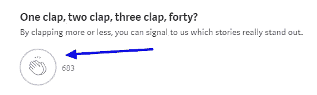

# 我从洗了一周冷水澡中学到的教训

> 原文：<https://medium.com/swlh/4-obvious-lessons-i-learned-from-taking-ice-cold-showers-for-a-week-426401887cf>

我知道你们在想什么，先生们……但它们实际上有助于提高生育能力。

无论如何，寒冷是我最不喜欢的事情。

我身体的核心温度下降一点也不令人愉快。

事实上，我几乎完全对这个实验有负面的感觉，每天都要经历它。

然而，结果和我在体验过程中的感受让我大吃一惊。

你也会的。

# 这一切是如何开始的

我讨厌安逸。

我也非常不喜欢那种走过场，在任何情况下都发挥不出自己潜力的感觉。

虽然我的生活最近经历了[一些疯狂的重大变化](http://wellnessovereverything.com/quitting-your-job-fear-holding-you-back/)，工作和我的日常事务开始拖延。

我意识到一些革命性的东西…

我的成长和能量水平停滞不前，因为我的环境也是如此。

> 无聊的生活来自没有灵感的头脑。

所以我开始想办法让自己不舒服，让我的系统和我的大脑恢复到人们所熟知的那种充满激情和战略眼光的状态。

但是从哪里开始呢？

**在考虑对城市中的陌生人做随机恶作剧，在杂货店约 10 个有魅力的陌生人出去，甚至剃光我的头发(很高兴我没有选择这个选项)之后，我突然想到！**

我会洗整整一周的冷水澡。太棒了。

在之前，我已经读到了[的好处，这看起来是个完美的主意，因为正如我之前所说的，我讨厌全身心的冰冷。这对我还有额外的好处，对我的日常晨间活动有很大的帮助。](https://www.menprovement.com/benefits-of-cold-showers/)

已经设定好了。我会连续一周每天都进行冰冷的跳水。没有回头路了。我的期望很低，而且持怀疑态度。

以下是我学到的…

# 1.它比我想象的要糟糕得多

你听到了。

生活并不总是彩虹和独角兽(这句话是谁说的？？).

尽管我洗了整整一周的冷水澡，但我的身体从未适应最初的寒冷冲击。如果我坚持实验的时间长一点，也许会有，但我对此表示怀疑。冷水淋浴很难。

每次我早上起来，我都充满了怀疑，因为我想起了在浴室里等待我的折磨。

我会去冲个澡，在打开水之前站上足足两分钟。这是一笔巨大的 mindf$%@。

但是日复一日，我决定冒险一试。

为什么这么问？

# 2.我的身体和精神都感觉很好

你知道布莱德利·库珀主演的电影《无限》吗？在这部电影中，他第一次服用了避孕药，周围的一切都变得清晰了 10 倍。

每天走进冷水浴室的感觉就是这样。

每次我都会立刻完全清醒。我对自己和周围环境的感觉和意识比任何一个普通的早晨都要强烈得多。

我的头感觉更清晰，即使我觉得我会死于低温症，我并没有在通常的咖啡前阴霾，我往往会发现自己在一些早晨。

已经证明[冷水澡可以提高警觉](http://www.medicaldaily.com/benefits-cold-showers-7-reasons-why-taking-cool-showers-good-your-health-289524)我 100%同意，尽管我只有轶事证据(这就是你写一篇中等文章所需要的，对吗？).

另外，我的膝盖有点不舒服。我甚至不知道这有什么问题，除了我在高中踢过足球，举过很多重物。结合大半辈子开手动挡的车，早上一般都比较僵硬。

这可能只是安慰剂效应，但我发誓，洗完澡后，我的膝盖感觉比大多数早上都好。一整天我都觉得它的活动范围也更大了。

洗冷水澡感觉非常刺激(不像你这个神经病)。我在想，我应该听运动教练的话，多洗几次冰浴！

如果你有通常只是应付的疼痛，这些冷水澡似乎可以帮助缓解一些疼痛。

批判性思维和精神焕发可能不在你早上的日程上，但对我来说却是必须的。我起得很早，以便在早上完成所有的写作和计划，所以这些冷水澡正合我的胃口。

另外…

# 3.战胜恐惧

每天早上，在我强迫自己去冰冷的监狱里泡一泡之前，我都有理由感到恐惧。

在做这件事之前，我没有一次不花几分钟时间做心理准备的。

但我还是坚持做了，因为我觉得这对我有好处。

**你们中有多少人可以说，你在恐惧或不舒服中工作，是为了最终让你的生活受益？**

甚至我也不得不承认，如果我更经常这样做，我的生活将会完全不同。我的大脑试图让我一直活着，并产生恐惧的感觉，这是我成功的最大障碍之一。

不得不做一些我绝对不想做的事情来开始我的一天，这给了我一种不同的自信。早上第一件事就是洗澡，我有一种感觉，好像我已经战胜了这个障碍。

这是一种持续一整天的动力，也帮助我度过了其他形式的逆境。

> 试图完全消除你的恐惧几乎是不可能的。学习如何有效地控制你的恐惧要容易得多，也有力得多。

这让我想到了这个实验的最后也是最重要的一点…

# 4.事情从来没有你想的那么糟糕&你总是在掌控之中

当你考虑做一些新的、困难的或潜在危险的事情时，你的大脑总是会在你的脑海中创造出最糟糕的场景。

它这样做是为了帮助你活下去。不满足，甚至不快乐。

这当然不是有史以来最糟糕的策略，但它不会帮助你有目的、有动力地创造非凡的生活。

[蒂姆·费里斯](https://medium.com/u/56d3bc91794f?source=post_page-----426401887cf--------------------------------)说得好:

> 我们最害怕做的事情，通常是我们最需要做的事情。

我喜欢这样，因为尽管洗冷水澡不是我最害怕的事情(失败才是)，但它代表了我们每天生活中面临的恐惧。

尽管我认为我会讨厌它，尽管我认为每次都会很糟糕，但我的身体总能适应。几分钟后我就好了，甚至到最后也习惯了。

淋浴开始的一两分钟很糟糕。我的身体在颤抖，紧张，有点震惊。我的第一反应是摆脱这种局面。

**但是当我在水下站得久了，我变得清晰了。我意识到我们不会死，也没有什么真正的问题。我开始让自己冷静下来，放松身体，像往常一样继续淋浴。**

没有什么事情会像我们想象的那样糟糕。

即使事情变得非常糟糕，这种情况也不是永久的。我们人类具有惊人的弹性，能够以各种方式改变，以应对巨大的挑战。

我们有能力意识到自己的动机和想法，并最终决定什么会发生，什么不会发生。或者至少，我们如何应对发生在我们身上的事情。

这就是为什么我们总是处于掌控之中。

总是控制着我们所做的决定，我们允许自己感受什么，我们如何对待他人，以及我们付出了多大的努力。

# 把一切都包起来

我可能再也不会故意洗冷水澡了。

我还在生活中融入了其他技巧，给我能量，帮助我在早上理清思路。尤其是现在我将永久地制定自己的时间表。

但是如果你对缓慢的早晨有困难，你应该考虑一下。

然而，更重要的是，生活并不意味着总是舒适的。真正的成长发生在你面临最大挑战的时候。

所以不要拒绝或试图避免不适。有目的地直面你的恐惧，看着奇迹开始发生。

## 你好。感谢阅读。真的很感谢！

# 如果你喜欢这篇文章，一定要给它 50 次左右的掌声来支持这篇文章，并在 medium 上关注我以获得更多的宝石。

## PS…..你是一个希望增加网站流量和潜在客户的企业主吗？

## 从下载我的免费的 [WordPress SEO 指南](https://doorbelldm.lpages.co/wordpress-seo-ebook/)开始，我用它来发展我自己的公司或者[联系我的内容营销和 SEO 代理](http://doorbelldm.com/contact/)。我们会照顾你的。

## 这篇文章发表在 [The Startup](https://medium.com/swlh) 上，这是 Medium 最大的创业刊物，拥有 276，798+人。

## 订阅接收[我们的头条新闻](http://growthsupply.com/the-startup-newsletter/)。

