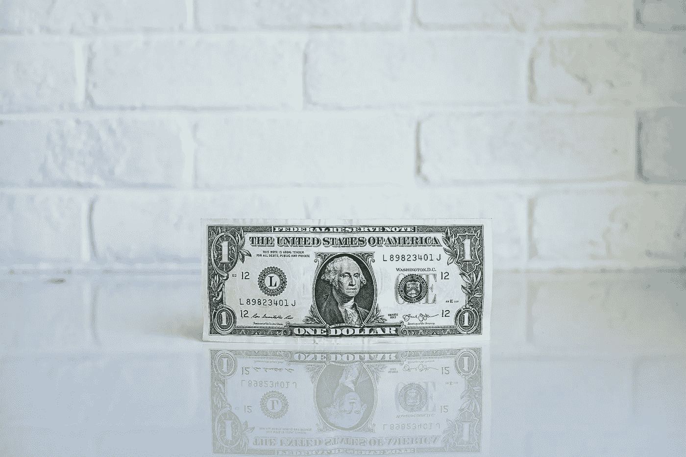

# 查理·芒格的 4 条生活建议

> 原文：<https://medium.com/swlh/4-pieces-of-advice-from-charlie-munger-to-live-by-e814b92a349e>

## 沃伦·巴菲特的商业伙伴，美国最成功的投资者之一的建议。

查理·芒格是一名训练有素的气象学家和律师，从未上过经济学或金融学的课程，他是如何成为我们这个时代最熟练的投资者之一的？他是如何成为伯克希尔·哈撒韦公司的创始人，并积累了近 20 亿美元的净资产的？

世界各地都在研究他的投资和人生哲学，以下是我从他的工作和话语中学到的 4 件事。

## #1.收购更好的企业

> "一笔价格合理的大生意胜过一笔价格合理的大生意."

虽然一些业务在短期内可能看起来很划算，但最好关注一个业务的长期经济效益，而不是它是否便宜。

当芒格和巴菲特买入一家公司的股票，股价下跌时，他们通常会买得更多(与大多数投资者相反)，因为他们意识到了他们所投资的公司的真正价值，并认为股价下跌就像股票正在出售一样。

## #2.心胸狭窄

> “大多数人接受的是一种模式的训练——比如经济学——并试图用一种方式解决所有问题。你知道一句谚语:“对于拿着锤子的人来说，世界看起来就像一枚钉子。”这是处理问题的愚蠢方式。"

当你只在一个狭窄的领域有知识时，你会错过机会，想出解决问题的办法，而这些办法通常可以用另一种方式更好地解决。

## #3.不断阅读

> “在我的一生中，我不知道有哪个聪明人不是一直在读书——一个也没有，零个也没有。你会惊讶于沃伦和我的阅读量。我的孩子嘲笑我。他们认为我是一本有两条腿伸出来的书。”

芒格和巴菲特一直都是忠实的读者，经常被引用来阅读超过 80%的时间(每天大约 500 页)。这种不断的自我教育给了他们在商业上的巨大优势。

## #4.承认你的错误

> “我喜欢人们承认他们是彻头彻尾的蠢驴。我知道如果我正视自己的错误，我会表现得更好。这是一个很好的学习技巧。"

我们能从失败中学习并从中成长的唯一方法，就是接受失败，承认错误。这很可能就是为什么伯克希尔·哈撒韦公司的年度报告总是提前披露所犯的错误和吸取的教训。

你从芒格身上学到了什么，或者关于投资和生活的什么？请在下面留言回应，我喜欢读它们。

## 这篇文章发表在《初创企业》杂志上，这是 Medium 最大的创业刊物，有 322，555 人关注。

## 订阅接收[我们的头条](http://growthsupply.com/the-startup-newsletter/)。

