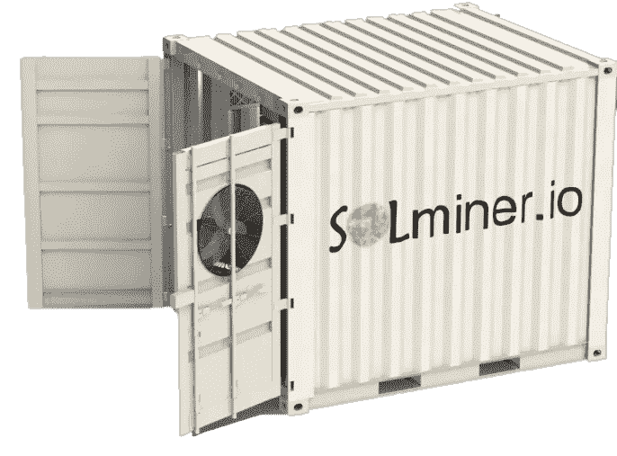

# 加密货币开采项目的 4 个问题

> 原文：<https://medium.com/swlh/4-problems-with-cryptocurrency-mining-projects-70c78b8e28fd>

我们东张西望，寻找一种可靠的方式来投资一个由加密货币采矿支持的加密货币项目。我们找不到它。我们发现有不少项目提议用首次发行硬币(ico)或证券发行(s to)筹集的资金来建设采矿场，但在分析了这些项目后，我们无法说服自己投资，原因是这样或那样的。不幸的是，在跟踪这个行业一段时间后，我们发现我们的直觉完全正确。

加密货币开采项目的 4 个最大问题是:

# 骗局

不管是不是有意的，这个行业里有很多骗局。我们看到一些骗局发生，因为项目缺乏对违反或欺骗投资者的治理。我们看到项目合作伙伴在获得全额资助后欺骗他们自己的合作伙伴，导致他们专注于内部纠纷，而不是执行他们的项目。我们甚至看到项目为同一个项目推出一个又一个令牌产品，将之前创建的令牌留在它们的病床上。由于没有监督或监管，除了道德规范之外，没有什么激励让项目变得合法。

# 交付能力不足

很容易指出一个加密货币开采项目，并有很高的可信度来判断该项目是否会失败。如果你挖掘得足够深入，你会发现许多加密货币挖掘项目要么是虚假的，要么是经过大量修饰的成就。我们看到一些项目声称他们的集装箱里装满了采矿设备，但是经过深入挖掘，我们发现他们的集装箱是空的！有时这需要大量的挖掘，但并不明显。一些项目只是在集装箱上贴上商标，并宣称他们想宣称的集装箱内的东西。确保你要投资的任何项目都合法地建造了至少一个他们产品的原型，这样你就能保证项目能实现他们的要求。

# 不适当的商业模式

加密货币开采领域在未来几年将变得更具竞争力，该领域的项目需要考虑这一点。重要的是将利润再投资于硬件升级、提高效率和发展，以保持项目不仅存活，而且盈利。项目背后的财务和战略商业模型需要支持项目的长期存在。

# 糟糕的投资

重要的是平衡增长与现在和未来为代币持有者提供价值。代币持有者需要激励来贡献代币产品、持有代币和购买代币。如果代币没有获得足够的利润，那么代币对投资者来说就不太可能是有利的投资。我们看到太多项目以对投资者毫无意义的方式分配利润。

# 结论

加密货币行业还非常年轻。与过去相比，现在对夸大其词的象征性发行进行了更仔细的审查。代币投资者变得越来越聪明，他们厌倦了应对本文提到的所有风险。

我们希望看到这个行业充满 100%合法的项目，但这并不现实，而且暂时不会。确保你信任项目创始团队和他们实现承诺的能力。确保至少有一个政府部门监督这个项目，这样如果这个项目没有兑现他们的承诺，就会有后果。

作为这些问题的解决方案，我们创建了一个[加密货币挖掘项目](https://solminer.io/)，解决了本文中概述的所有问题。我们的项目有一个[全功能原型](https://solminer.io/mobile-mining-system/),[代币概念](https://solminer.io/solminer-token/)目前正在接受美国证券交易委员会的政府监管审查，计划包括整合太阳能和正在申请专利的气流技术，以确保长期竞争力，整个项目非常注重为代币持有者提供最大价值。

*请点击*🙌*掌声👏按钮，如果你在这篇文章中学到了至少一件事。*

这是我第一篇关于媒介的文章。如果你喜欢它，请点击☝️关注。

## 这篇文章发表在 [The Startup](https://medium.com/swlh) 上，这是 Medium 最大的创业刊物，有+368，954 人关注。

## 在此订阅接收[我们的头条新闻](http://growthsupply.com/the-startup-newsletter/)。

