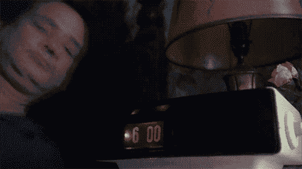

# 立即停止打盹的 4 个理由

> 原文：<https://medium.com/swlh/4-reasons-to-stop-hitting-snooze-immediately-10d28ad33d31>

打盹已经成为我们文化中的一个主要部分。如果你去随便问 10 个陌生人他们是否会打盹，我敢保证至少有 9 个人会说会。不幸的是，点击这个按钮已经成为每个人日常生活的一部分。但是为什么打盹是敌人呢？

**1。它会让你处于不稳定状态——你从贪睡按钮中得到的唯一好处是暂时的安慰。尽管你可能会再次入睡，但你的整体睡眠质量对你的身心几乎没有任何影响。**

**2。这让起床变得更加困难**——当你早上第一次醒来时，你的身体意识到是时候起床开始新的一天了，但当你打了个盹又继续睡觉时，你的身体认为最初的醒来是一场虚惊，所以它又放松了。当你的闹钟下一次响起时，这会让你大吃一惊，导致一种叫做睡眠惰性的东西，基本上就是在你的快速眼动睡眠周期中突然醒来。这将会让你比第一次起床时更加疲劳和迷惑。

**3。这意味着你不兴奋**——如果你打盹的原因之一是你不兴奋地开始新的一天，你需要改变你的生活。说真的。但是，如果不是这样的话，打盹会下意识地告诉你，你对这一天并不兴奋。即使没有什么问题，打盹仍然会发出这些信号，导致更高的压力和炎症水平，就好像你一天都不兴奋一样。

**4。？？？—** [点击这里看 4 号，这是我个人最喜欢的。](https://earlyrisersmovement.com/articles1/stopsnoozing)

## 这个故事发表在 [The Startup](https://medium.com/swlh) 上，这是 Medium 最大的企业家出版物，拥有 286，184+人。

## 在此订阅接收[我们的头条新闻](http://growthsupply.com/the-startup-newsletter/)。

