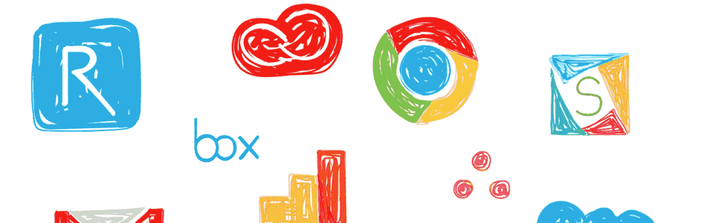

# 集成到您工作流程中的应用是未来的 4 个原因

> 原文：<https://medium.com/swlh/4-reasons-why-apps-that-integrate-into-your-workflow-are-the-future-8862e5186111>

我们生活在一个充斥着成千上万应用程序的世界。在这种情况下，我说的不是 Instagram 或 Venmo——我指的是 B2B 云软件应用。

考虑一下这个特定软件变得如何的例子:就在上周，一家专门定制电子邮件签名的公司向我提供了一些有针对性的营销服务。

这家名为 Sigstr 的公司找到了一种将员工邮件转化为广告渠道的方法。在不涉及太多细节的情况下，公司向 Sigstr 支付了基于最近内容创建“广告”的能力，以便自动为员工签名。听起来很小众，对吧？不对。

作为一名从事软件工作的人，我平均每天都要在 2 到 10 个不同的云软件应用程序之间转换。从 Box 到 Salesforce，再到我的 Gmail，我发现自己不断登录不同的门户网站来找到我需要的东西。我相信我并不孤单。

就在昨天，我快速盘点了我的团队在[reflective](https://www.reflektive.com/)使用的所有 SaaS 应用程序，结果总共有 18 种不同的服务。虽然这些云计算服务中有许多提供了相互集成，但是有相当多的服务缺乏这种集成。

例如，Reflektive 与我的 Slack 和 Gmail(以及其他集成)相集成，使我对这两个应用程序的反馈体验无缝而流畅。但是对于不提供集成的应用程序，我发现自己忘记了在哪里可以找到它们，或者更糟——把它们都忘记了。

# 找不到，不要用

在确定 SaaS 应用程序的质量时，采用率是一个巨大的成功指标，低采用率与工具的可用性和功能性直接相关。

> 2019 年，SaaS 科技产业预计将为 T2 带来 2010 亿美元的年收入

如果用户不得不访问一个单独的门户网站，登录，花几分钟时间搜索信息，他们不太可能采用和使用这个应用程序。

虽然我的团队每天/每周使用大约 18 个 SaaS 应用程序，但数据显示，平均每个中小型企业组织有大约 [14 个不同的云应用程序](https://www.forbes.com/sites/benkepes/2014/06/20/death-by-1000-apps-the-truth-behind-cloud-application-ecosystems/#24a06e0430b9)订阅。

当应用程序提供集成时，这些集成可以作为应用程序的提醒，这可以帮助参与和使用频率。

如果没有这些集成，应用程序可能会与所有其他应用程序一起迷失在大海中，最终，如果没有员工使用和参与某个工具，那么决策者就不太可能更新软件的许可证。

# 留在您的工作流程中可以提高生产率

生产率是集成最有力的地方。如果执行得当，集成可以让您的应用程序在员工的现有工作流程中占据首要位置。插件和 Chrome 扩展是让用户把你的应用放在第一位的解决方案的好例子——同时也不妨碍他们的正常操作。

人事管理软件公司 Reflektive 利用插件的便利的一种方式是允许用户在其原生 Gmail 或 Outlook 应用程序中提供实时反馈。只需简单点击几下，员工就可以向同事或经理致谢或提供建设性的反馈，而无需离开浏览器或网页。

如果没有插件的便利，用户将需要打开一个单独的标签，输入网址，然后花时间从那里登录。

# 单点登录(SSO)软件如此有利可图是有原因的

事实证明，一年中的登录时间加起来是一种巨大的金钱浪费。虽然令人惊讶，但每天浪费在登录上的时间会对日常工作效率和组织的底线造成不利影响。事实上，平均规模的中小企业仅在登录时间一项上每年就要损失近[15，000 美元](https://www.forbes.com/sites/benkepes/2014/06/20/death-by-1000-apps-the-truth-behind-cloud-application-ecosystems/#6a69cf930b9a)。

通过减少登录次数和寻找合适应用程序所浪费的时间，集成允许用户将时间花在更有成效的任务上，从而为他们的组织增加价值。

# 集成支持定制

云软件旨在为公司提供解决方案，以解决业务或组织问题。这就是为什么应用程序集成的最大好处之一是能够为组织提供对其软件和数据的更多控制。

随着公司的发展，插件和扩展使得软件易于扩展。由于具有灵活性，集成有助于在现有客户扩张和增加员工时留住他们。

并不是所有的软件组合都能从集成中受益，但是通过提供机会和选择，应用程序增强了客户的能力。

# 硅谷几乎每天都会产生一家新的软件公司

光是在谷歌快速搜索上就找到了 9 家卖邮件签名软件的公司(旁注:WTF？).在这个世界上，我们的公司致力于像电子邮件签名这样平凡的事情，所有这些事情都是重要的，在设计你想脱颖而出的 SaaS 应用程序时要记住。

很明显，即使在利基市场，公司在寻找云软件选项时也有令人惊讶的选择，这就是为什么随着未来几年竞争的加剧，集成将变得越来越重要。

## 这篇文章发表在 [The Startup](https://medium.com/swlh) 上，这是 Medium 最大的创业刊物，有+ 382，862 人关注。

## 订阅接收[我们的头条](http://growthsupply.com/the-startup-newsletter/)。

