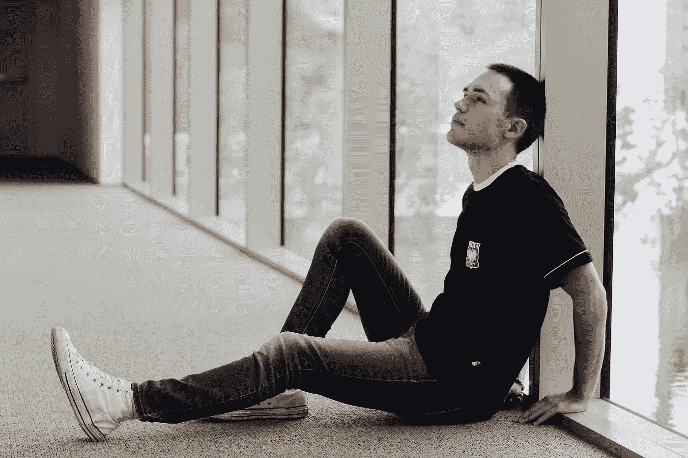

# 4 个迹象表明你对自己的成功不认真

> 原文：<https://medium.com/swlh/4-signs-that-reveal-you-are-not-serious-about-your-success-81543ea1a84f>

> 注意这四个标志:

# **你没有优化健康**

如果你没有锻炼，也没有真正注意你的健康，那么这就是开始的地方。优化你的健康是控制你身体和情绪感受的关键。

研究表明，每周进行 3-5 次至少 30 分钟*的适度锻炼会提升你的情绪，降低压力水平，让我们更专注于日常工作。*

如果我们一整天都感到疲倦、懒散或没有动力——锻炼会显著减少这些症状。经常锻炼会大大增强我们的整体能量，让我们更专注于每时每刻的决策。

不优化我们的健康会对我们的生活有害。体育活动大大降低了我们患慢性疾病的几率。预防慢性病应该是我们的首要任务。不要让自己冒那种风险。

T4 可能要花费数千美元来支付自付费用。治疗疾病比预防疾病要昂贵得多。

> 今天投资你的健康，为你自己做一件有价值的事情，在未来节省数千美元。

我们必须保护好我们仅有的一艘船。我们的身体是为了移动、奔跑、举起、跳跃、游泳、骑自行车、远足和体验我们周围的世界而生的。

为了提高我们的生活质量，我们可以简单地增加更多的体育活动，更注意吃什么，并管理我们的消极思想和情绪。

优化我们的健康不仅仅是保持健康和感觉良好。我们必须正确看待健康会大大增加我们的家人、朋友和关心我们的人长寿的机会。

生活是一次性的，我们可以选择让它变得更美好。

# 认为自己无法进步

感觉停滞不前是一个信号，表明我们在生活的重要领域没有进步或成长，比如健康、职业、人际关系和激情。

> 头脑是我们最大的局限。不要让消极的想法和情绪决定我们生活的结果。不一定非要那样。

我们下意识地养成了一种习惯，认为我们无法取得进步或改善我们的环境。我们必须扩展我们的知识，挑战自己，在生活的每个领域都有所建树。

我们大多数人习惯了每天做同样的工作，一旦我们离开了，我们就不会采取任何措施来提高自己。我们必须明智地利用我们的时间，专注于建立一个取得全面成功的框架。

我们不应该为了实现别人的梦想而生活。当你去上学或者实现梦想的时候，有一份工作是很棒的。如果你没有比工作更努力地工作，那么你会保持原样。

**问自己:**

你为你的梦想付出了多少努力？

下班后你都做些什么？

你能每天至少花 1 个小时来实现你的目标和提高你的技能吗？

学会有效地安排你的时间有助于我们确保把时间花在能给我们带来最大 T2 价值的事情上。

时间是我们最宝贵的资产，我们如何度过每一秒决定了我们的结果。

# **你没有目标**

对我们来说，开始改变我们生活的最具战略性的方法是为我们想要掌握的每一个领域制定一个计划。当我们不知道自己想去哪里时，未来可能会令人不安。

例如，如果你的职业是唱歌、写作、教学或创业，那么我们应该研究我们需要的技能，并找出该领域最成功的人来研究他们的工作。

我们生活在信息时代，我们决定开始采取行动，找到我们正在寻找的答案。

没有目标的生活就像试图建造一座房子却没有蓝图。在他们的手艺上是大师的人们遵循严格的原则和惯例，这允许他们显示他们的伟大。

成功要求我们遵循能带领我们走向成功的战略习惯。如果这种做法还没有被采用，那么尽快开始。

通过变得更有条理，我们的压力会大大减少，我们的生产力会提高。创造非凡的生活需要自律，但对我们的个人成长是必要的。

我们都面临挑战，经历失败，但我们如何应对这些情况才能度过难关。永远勇往直前，试着从生活的坎坷中学习一些东西。

不要迷失在噪音中，不要让世界上的消极因素阻碍你。生活是一次性的，我们不应该花时间去实现别人的梦想。我们必须控制我们的思想，并建立一个强大的框架，使我们回到正轨。

# 你缺乏自我意识

缺乏自我意识让我们很难理解自己的想法、情绪和行为。这可能与情绪不稳定有关，因为我们不确定自己为什么会处于人生的某个阶段。

通过发展这一关键特质，我们可以更加清楚我们想要采取的方向，并培养对我们所经历的情绪和想法的更强的自制力。

我们的情绪状态是由某人或某事给我们的感觉和我们的反应决定的。养成健康的习惯对我们更好地控制自己的情绪和更清晰地了解自己的目标至关重要。

增强自我意识的最好方法是通过调解和对我们内在智慧的更多信任。通过冥想，我已经能够找到解决我最困难的问题的方法。这是我用来脱离这个世界的喧嚣，重新关注真正重要的事情的一种做法。

> ***我们终有一天都会死去。***

我们不应该再浪费一天去关注消极的事情。需要考虑一个计划来改善给我们带来最大压力的情况。

避免过着*后悔的生活，现在就行动吧。我们必须拒绝停留在激烈的竞争中，做必要的事情来创造我们想要的生活。*

明天是无法许诺的，我们必须充分利用今天。每天朝着你的目标努力&我保证你会到达目的地。

不是每个人都有和你一样的机会，今天醒来*。我们不能让我们最大的梦想随着我们一起死去，因为这个世界永远不会看到它们。*

## 这个故事发表在 [The Startup](https://medium.com/swlh) 上，这是 Medium 最大的创业刊物，拥有 303，461+人关注。

## 在此订阅接收[我们的头条新闻](http://growthsupply.com/the-startup-newsletter/)。

