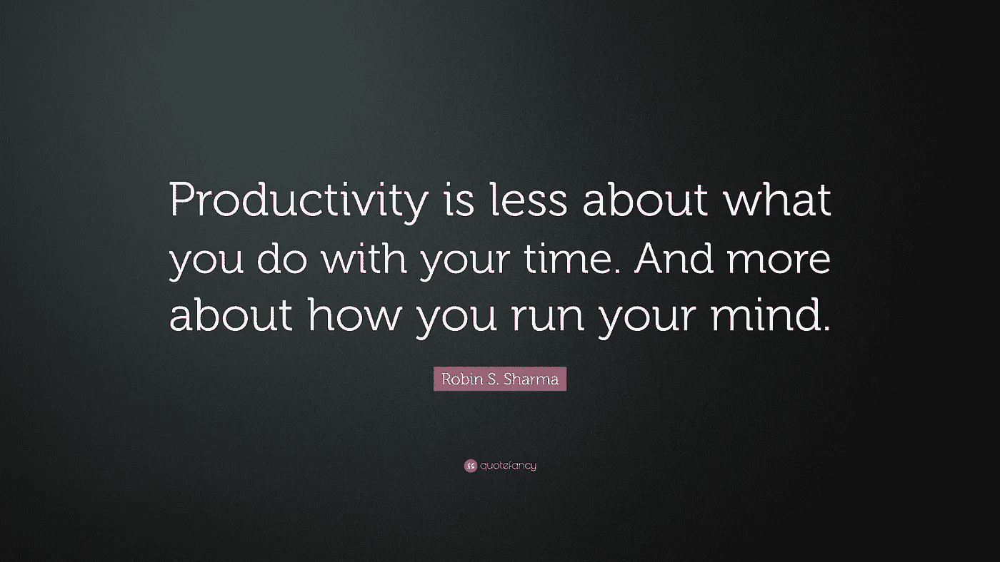

# 4 个小小的改变提高了我的生产力、创造力和精神状态

> 原文：<https://medium.com/swlh/4-small-changes-that-improved-my-productivity-creativity-and-mental-state-f3a815425595>

作为一名初创企业的创始人，你几乎总是在线。无论是搞清楚下一个产品动向，设计另一个 A/B 测试，还是消化前几天的工作面试，你的思维总是在飞速运转。

与此同时，你周围有太多分散注意力的事情:邮件、新闻更新、社交媒体、即时消息……都在占用你宝贵的时间。我们知道这些事情会降低我们的生产力，扼杀创造力，或者占用本可以更好地用于更有成就感的活动的时间。

最近，我发现越来越难找到高质量的时间来真正思考问题。然而，正如广泛记载的那样，当我们的大脑不积极寻找解决方案时，它经常会想出最好的主意。当大脑只是四处游荡，而不是积极地追求一个特定的目标时，突破性的见解往往就会出现。如果你想做到这一点，分心是你最大的敌人。

几个月前，我决定尝试做些什么。我想再次掌控一切，不再是我的桌面或手机上的小红点的奴隶，尖叫着寻求关注。我想让我的大脑休息一下，让它自由地漫游，着迷于琐碎的事情。

我做了一些改变，极大地提高了我的生产力、创造力和精神状态。

*   我把我的工作邮箱和私人邮箱分开了。

直到最近，我都是在一个邮件客户端接收所有与工作相关的邮件和私人邮件。巨大的干扰。我把私人邮件转移到一个单独的邮件客户端，我只在晚上或午休时打开它。

*   **我已经从智能手机上删除了脸书、推特和 LinkedIn。**

我只在晚上在我的桌面上查看我的订阅。

*   **我已经停止在智能手机上阅读/接收邮件。**
*   我已经将智能手机上的所有通知设为静音。

有人可能会说我对多巴胺戒断了瘾。

效果如何？

我在日常生活中看到了难以描述的贫困。我觉得我又一次控制了自己的时间和日程。

我感觉不那么焦虑了，我更放松了，而且我发现了我无法想象还存在的专注时间。更重要的是，出乎意料的是，我偶然发现了一些可以在 [Hyperlane](https://www.hyperlane.co) 实施的好主意。

我是一个更快乐的人。

你自己试试，看看会发生什么。

## 这篇文章发表在 [The Startup](https://medium.com/swlh) 上，这是 Medium 最大的创业刊物，拥有 285，454+人关注。

## 在此订阅接收[我们的头条新闻](http://growthsupply.com/the-startup-newsletter/)。

