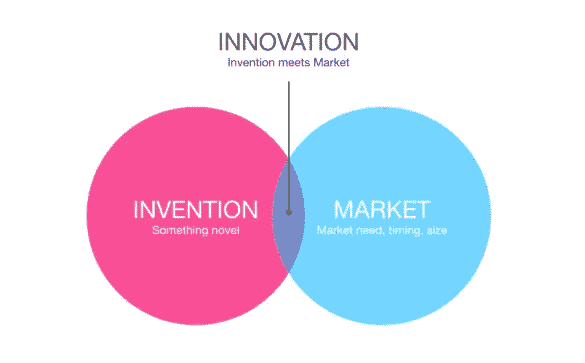
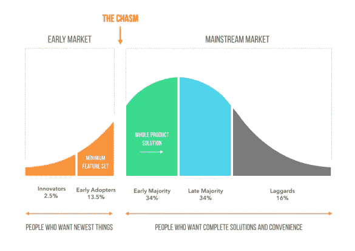
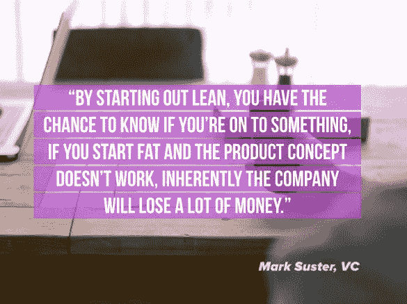

# 阻碍你的 4 个创业神话

> 原文：<https://medium.com/swlh/4-startup-myths-that-hold-you-back-a45b5fdc81eb>

Originally published on [http://www.appsterhq.com](http://www.appsterhq.com/?utm_source=CP&utm_medium=Medium)

初创企业的世界充满了神话——新闻媒体、娱乐行业和政治家们广为流传的不真实但持久的故事，创始人自己也常常不加批判地接受这些故事。

在许多情况下，这些错误的信念实际上阻碍了企业家发挥他们的真正潜力，或者更糟的是，导致他们走向失败。

基于我们在[建立 Appster](http://www.appsterhq.com/?utm_source=CP&utm_medium=Medium) 和帮助无数客户的经验，我想强调和分析今天流传最久的 4 个创业神话。

# 神话 1:成功=伟大的想法+决心

一个坚定的企业家致力于一个坚实的想法，意图开发一个有效的产品，解决一个真正的市场问题——这些对于一个初创企业的成功无疑是至关重要的。

然而，一家新公司需要 ***远远* *比***更多的承诺和聪明的想法，以产生收入，变得有利可图，并扩大规模。

有无数坚定的企业家追求看似聪明的想法，但最终放弃了他们的创业公司的故事。

事实上， [90%的初创企业最终都失败了](http://www.forbes.com/sites/brentgleeson/2016/11/02/7-reasons-why-90-of-start-ups-fail-and-how-to-be-the-10/)，如果你仔细观察剩下的 10%成功的企业，你会发现它们中很少是从“伟大”的想法开始的。

一些例子:

*   据报道，超人气应用 Snapchat 的创始人埃文·斯皮格尔最初提出这个程序时，遭到了嘲笑。
*   同样，Airbnb 的联合创始人(即 Brian Chesky、Joe Gebbia 和 Nathan Blecharczyk)据说当时被他们唯一的投资者告知，他认为他们的创新酒店服务是一个极其愚蠢的想法；尽管如此，他还是决定投资，因为他喜欢这两位联合创始人的个性。

这些公司——以及其他许多获得巨大成功的初创公司——拥有的不一定是改变游戏规则的想法，而是 a)渴望新解决方案的强大市场的存在，以及 b)执行良好的产品。

关于第一个神话的决心部分，也需要进行同样的现实检验。

*   Instagram 最初是一个名为 Burbn 的 Foursquare 山寨版；
*   Pinterest 被称为 Tote，开始是一家电子商务初创公司；
*   YouTube 一开始是视频交友网站；
*   Paypal 在选择目前的在线支付服务之前，曾经历了五次不同的转变。

如果这些庞大公司的创始人中有任何人仍然坚定不移地执行他们最初的愿景，那么他们很可能早就加入了令人恐惧的 90%俱乐部。

受欢迎的文本 *Nail It Then Scale It* 的作者内森·富尔(Nathan Furr)和保罗·阿赫斯特罗姆(Paul Schmidt)进行了研究，研究表明，在受欢迎的市场中，主要依靠自己的愿景和决心的企业家**比专注于创造针对特定问题的解决方案的企业家**更有可能在创业中失败**。**

Clay Christensen 在过去的 100 年里研究了各种颠覆性技术，他得出了类似的结论:“成功的创业公司都有足够的剩余资金来尝试他们的第二个想法”。

与“成功=伟大的想法+决心”的神话相反，你需要的不是革命性的想法[，而是开始](http://www.appsterhq.com/blog/early-stage-entrepreneurs-launch-profitable-startup)，投入市场，测试你的[最低可行产品](http://www.appsterhq.com/blog/mvp-app)，收集真实消费者的真实反馈，并根据需要调整你的产品和运营。

> 实际的市场反馈——而不是装扮成愿景的幻想——是新企业成功的关键。

# 神话 2:成功的初创企业总是发明新的东西

与神话#1 相联系的是一个相关的童话，它坚持认为所有成功的公司都是通过发明一些显著扰乱/改变市场和消费者行为的东西来实现盈利的。

许多人似乎认为“创新”是“发明”或创造“新事物”的同义词。然而，事实上，发明新东西通常是真正创新中最不重要的部分。

安娜贝企业家倾向于认为他们的成功之路在于想出下一个伟大的想法，别人从未做过的特别的事情，然后申请专利，看着收入滚滚而来。

尽管有这种流行的幻想，但如果你花一点时间考虑一下最成功的初创企业，你会发现很少有人能被准确地归类为植根于真正的发明。

正如我的同事马克·麦克唐纳所说:

> “当像谷歌、脸书、苹果和 Airbnb 这样的公司作为初创公司起步时，他们并没有公开痴迷于创造世界从未见过的东西。事实上，在谷歌出现之前，现有的搜索引擎有十几个；iPhone 出现之前就有 PDAs 沙发表面在 Airbnb 之前就存在了；等等”。

例子继续:

*   在脸书之前，Myspace 和 Friendster 已经建立，并拥有许多活跃用户；
*   早在 Groupon 出现的十年前，就有各种各样的团购网站在运营；
*   在特斯拉占据主导地位之前，美国道路上就有电动汽车了。

**真正的创新**在发明新奇的东西和现有市场的需求和机遇之间找到了平衡点:

很多时候，一项新发明根本不存在可行的市场。

S o，即使你是第一个创造一些有潜力帮助消费者的新设备或工艺的人，如果需要几年甚至几十年才能出现一个可以买卖这种发明的市场，那么你的发明基本上是无用的。

像谷歌和脸书这样的公司所做的正确的事情是带着卓越的产品进入现有市场，这些产品优于当时所有的产品。

当然，苹果在推出 ipad/iphone 时也做了同样的事情，说服消费者放弃他们熟悉的 PDA，转而购买更好的产品。苹果知道市场渴望更快、更可靠、更强大的便携式计算设备——苹果做到了。

# 误解 3:你需要制造一个吸引大众的产品

新的创始人通常会有一个错误的信念，即创业公司必须努力打造一款几乎适合所有人的产品，这样企业才能取得成功。

为此，缺乏经验的企业家可能会不断修改他们的产品概念，增加额外的功能，希望他们的产品能够进入越来越多的消费者手中。

T 他们试图通过创造比脸书更大更好的东西来打造下一个脸书，并试图将其投放到大众市场，同时忘记了马克·扎克伯格和他的同事们实际上从未将任何类型的大众市场放在首位。

相反，脸书试图赢得常春藤盟校学生的青睐——这是一个利基市场。

事实上，最好的产品往往是那些一开始就专注于赢得一小部分用户的心，然后才扩展到其他领域的产品。

苹果的 iPhone 瞄准了科技极客和“飞行爱好者”;特斯拉追逐高净值的科技爱好者；Pinterest 起步很小，以至于在早期它会与大多数用户进行面对面的交流。

与成功的初创公司总是设法打破主流的神话相反，现实是主流市场通常是初创公司的墓地(尤其是那些专注于技术的初创公司)。

主流客户面临的挑战是，他们不信任新技术:他们寻求安全、保障和品牌声誉，而大多数初创企业都是漏洞百出、不为人知、相对未经证实的。

作为一名初创企业的创始人，你的重点应该是瞄准**早期市场**——而不是主流市场:

大约从 20 世纪中期开始，美国传播理论家和社会学家 Everett Rogers 开始进行研究[证明](https://ondigitalmarketing.com/learn/odm/foundations/5-customer-segments-technology-adoption/)颠覆性技术产品往往被不同类型的人以不同的方式采用，即创新者、早期采用者、早期多数、后期多数和落后者。

作为一名企业家，你的注意力应该*而不是*在多数群体或落后者身上；相反，你需要瞄准创新者和早期采用者，即那些被新奇事物吸引、敢于冒险、财务清晰、经常与其他创新者互动的人。

这两类客户都很宽容，渴望接受新的想法和技术，因此代表了对你的产品反馈的巨大来源。

《跨越鸿沟》一书的作者杰弗里·摩尔对罗杰斯的理论进行了扩展:他认为，初创企业必须专注于成功地控制早期采用者市场——修复缺陷，回应客户的担忧，赢得用户的心，并稳步建立品牌声誉——然后才有可能希望“跨越鸿沟”，在主流市场寻求成功。

# 误解 4:创业只有在你筹集到大量资金的情况下才会成功

许多第一次创业的人都接受这句古老的格言:“你需要钱来赚钱。”

从某种意义上说，这当然是对的:在完全没有资金投入的情况下创办一家初创企业注定会失败。

另一方面，研究表明，初创企业不需要大笔资金就能成功。

营销专家、作家和风险投资家盖伊·川崎[很好地解释了这一点](http://ecorner.stanford.edu/videos/1925/The-Overfunded-Start-Up):

> “如果你选择花太多钱创业，你会有三个垃圾桶复印机，而一个垃圾桶就够了，或者甚至没有复印机。你会得到更高的愚蠢的职位和没有任何作用的副总裁…
> 
> 作为一名成功的企业家，你有责任拥有自己的内心声音，让你不要接受缺乏纪律的情况，这种情况经常会被那些想给你比你实际需要更多的钱的人强加给你。"

最近的一个例子是颜色实验室的失败。

Color 是一款照片分享应用，与 Instagram 几乎同时推出。

与 Instagram 不同，Color 的创始人筹集了 4100 万美元，花费 35 万美元购买了 URL 地址 Color，并从苹果和 LinkedIn 等热门公司雇佣了 38 名员工。

尽管花费巨大，但 Color 最终[关闭了商店，损失了大部分资金](http://mashable.com/2012/10/17/color-shuts-down/#7hPT0RzqkGqG)，而最初只有两个人的 insta gram[以 10 亿美元的价格被卖给了脸书](http://www.businessinsider.com/instagram-heres-why-we-just-sold-for-1-billion-2012-4)——这两件事都发生在同一年，即 2012 年。

基于他们对创业时资金不足 1000 美元的创业者和获得数百万美元投资资金的创业者进行的调查和比较，富尔和阿赫斯特罗姆认为，在错误的时间接受过多的资金实际上会毁掉你的公司。

一旦你筹集了大量资金，许多风投希望你“要么做大，要么回家”，因此你很难改变方向——即使这是市场的要求。

相反，如果你开始精益，将你的支出保持在合理的数量，并战略性地分配资金，那么你将保持更大的整体灵活性，以便随着时间的推移测试、调整和证明你的产品。

一旦你达到*那个*里程碑，也就是说，一旦你证明你手上有一个成功的产品，市场将会“吃掉”，那么获得更多的资金就可以说是“小菜一碟”。

> 最初发表于[http://www.appsterhq.com/](http://www.appsterhq.com/?utm_source=CP&utm_medium=Medium)

