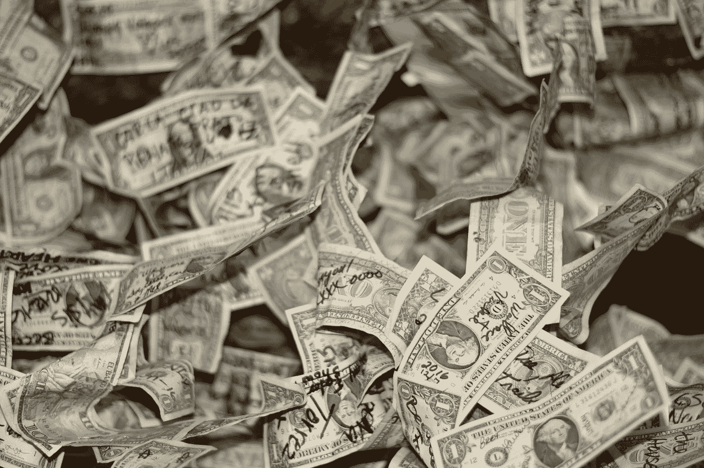
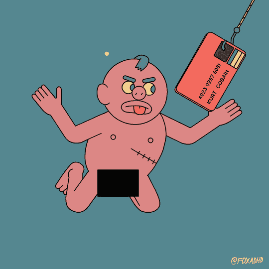
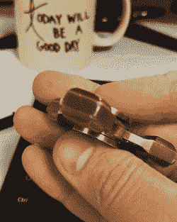

# 更理性地花钱的 4 个步骤

> 原文：<https://medium.com/swlh/4-steps-to-spend-your-money-more-rationally-3c8bcd7872ec>

## 为什么你不应该买一个坐立不安纺纱机！

钱钱钱。有时我们有，有时没有，有时我们实际上不知道我们有没有。
我们常犯的一个错误是，我们认为如果我们有更多的钱，我们的生活会更容易。
但事实并非总是如此。我们只需要学会如何合理地使用它。

# 1.意识到

> “改变的第一步是意识。第二步是接受。”~纳撒尼尔·布兰登

当你点击这个帖子的时候，你就开始引起关注。现在，当我们意识到这个问题时，我们会培养更多的意识。

我第一次意识到自己的开销是在我 16 岁找到第一份工作的时候。父母出钱，很难理解钱的价值。这几乎迫使你变得唯物主义，不理性地消费。
当**钱是用你的** [**自己的辛苦赚来的**](/swlh/why-hard-work-is-not-always-the-answer-dee67accde1a)——那就是另一回事了。开始工作一年后，我给自己买了一架新的电子琴。我的音乐事业需要它。那时我存了 1000 美元，全部花在了这台仪器上。回想起来我并不需要 ***那架*** 电钢琴。
我本可以花 200 美元买一个不同的型号，甚至是一个二手的。那我为什么要买这架昂贵的钢琴呢？它有什么吸引人的？

我们都发现自己在不需要的东西上花钱。
就是我在网上看到的那件夹克，刚买的。与同事共进午餐，我们无法拒绝。你的[大型婚礼](/@saaroron/my-dream-wedding-the-best-day-of-my-life-f9bbe2ba7705)。你孩子的坐立不安旋转器(认真的？)或者电钢琴。这笔钱可以花在一些有用的事情上。毕竟，我们为之付出的一切都是以其他东西为代价的。有时我们实际上并没有那笔钱——我们是借出去的。

回想一下你上周的开销。你能发现任何非理性的购买吗，那些你实际上不需要或不想要的东西？多少？
**下面是我们难以衡量的原因:**

*   我们大多数人都不记录我们的开销。
*   我们不擅长定义哪些购买是理性的，哪些不是。那些运动鞋真的是必须的吗？新款亚马逊 Echo 怎么样？

# 2.处于控制中

> "掌握你自己的命运，否则别人会。"~杰克·韦尔奇

我曾经认为跟踪我的开销是一件烦人的事情。但还有一件更令人恼火和沮丧的事情——发现买一架电钢琴用光了我所有的积蓄。
在过去的十年里，我每周都记录我的收入和支出。如果你还没有这样做，现在就开始吧。我怎么强调这一点都不为过。

每周或每月记录你的收入和支出(每一类)将有助于你控制自己的财务状况。是的，这增加了支付的痛苦，但这是一件积极的事情。不要逃避它。你的花费是你的责任。

在这个数字货币的时代，我们根本感受不到付费的痛苦。重新控制你的支出的一个好方法是用现金支付。
不能用智能手表，不能用手机，甚至不能用信用卡。用信用卡付款时，我们不知不觉地多花了将近 20%。另一方面，支付现金的实际行为极大地提醒了人们金钱的价值。

六年前，我决定只用现金购物。第一次用现金购物有些尴尬。我给自己设定了一个周津贴，当收银员扫描我的最后一个项目时，我注意到我已经超出了预算。我最终买了很多清单上没有的东西。我要么用信用卡支付，要么面对现实。虽然不容易，但我选择了后者。我要求把我单子上没有的五个项目去掉。“对不起，我不需要那些，”我说。多年来，我第一次意识到自己的购物习惯。这些东西被拿走后，我有足够的现金来买清单上的所有东西。那天晚上，我自信地走回家，感觉一切都在掌控之中。

# 3.找到一个意义，找到你的“足够”

> "仅仅活着是不够的……一个人必须拥有阳光、自由和一朵小花。"~汉斯·克里斯蒂安·安徒生

有时候，我们买东西是为了补偿自己没有成就感。出于同样的原因，我们经常旅行。我们被愚弄了，以为那些财产会给我们带来我们寻找的幸福。当我们没有意义时，我们会买得更多。就这么简单。

我们都有自己非常在乎的东西。追求这些激情给我们一种成就感。这是一种金钱买不到的感觉。这一步至关重要，但需要耐心。作为一个人成长需要时间。
**一旦你找到了人生的意义——你可以轻松地** [**定义你的‘够了’**](/swlh/what-happens-when-you-find-your-enough-in-this-lifetime-65fdc4844aa6)**。然后，你就再也不能无理性地消费了。**

这里是我做的另一个小技巧，在我买之前测试我有多想要某样东西——我计算我需要工作多少小时来为它创造金钱。
举个例子:如果你一个小时赚 10 美元，你会为小动作旋转器支付 20 美元吗？我希望不会。因为这意味着你必须为此工作两个小时。最后，无论如何不要只是为了买东西而贷款。如果你买不起，那就不应该买。

# 4.重复

> "忍耐是痛苦的，但它的果实是甜蜜的。"
> 
> ~让-雅克·卢梭

我知道这有点老生常谈了。但这是成功的关键。
**变化不会一蹴而就。这需要练习。我们必须意识到，控制自己，忠于自己。所以确保你遵循了前三个步骤。然后一次又一次地重复这个循环…**

> 如果你觉得那是你想做的，就一起鼓掌👏

# 感谢阅读！欢迎随时关注我:

 [## 萨尔·oron⁦⁦👈-中等

### 阅读萨尔·oron⁦⁦写的最新故事👈在介质上。我是萨尔。大多对音乐和人充满热情。在…

medium.com](http://medium.com/@saaroron/latest) 

**阅读更多:**

 [## 在这一生中找到你自己的足够的重要性

### 当你认为极简主义是一种饮食时会发生什么

medium.com](/swlh/what-happens-when-you-find-your-enough-in-this-lifetime-65fdc4844aa6) 

## 这篇文章发表在 [The Startup](https://medium.com/swlh) 上，这是 Medium 最大的创业刊物，有 319，283+人关注。

## 在这里订阅接收[我们的头条新闻](http://growthsupply.com/the-startup-newsletter/)。

