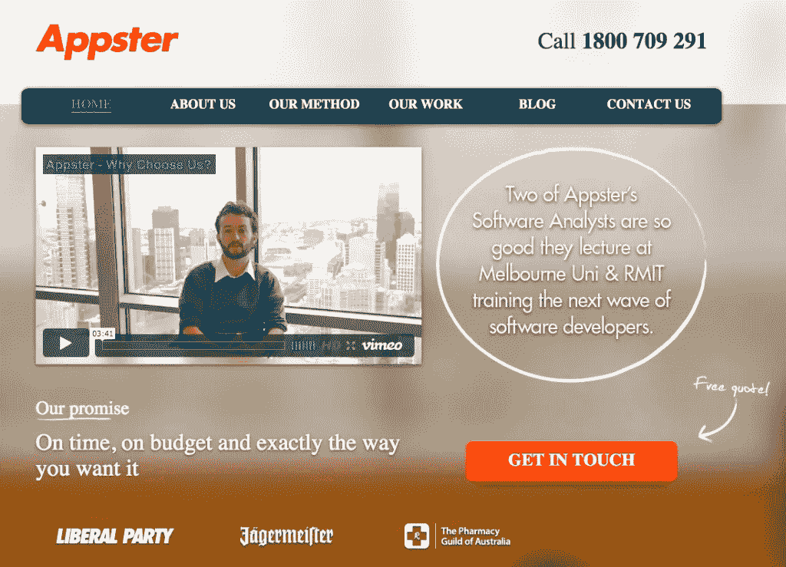

# 成功启动创业的 4 个策略

> 原文：<https://medium.com/swlh/4-strategies-for-successfully-bootstrapping-your-startup-484ab6fad6b5>

Photo by [Brian Chorski](https://www.brianxplores.com) | Originally published at [http://www.appsterhq.com](http://www.appsterhq.com/?utm_source=CP&utm_medium=Medium)

A 虽然许多初创公司的创始人梦想从风投或天使投资人那里获得巨额投资，推动他们的公司无止境地增长，但现实是[大多数初创公司从未获得任何形式的重大外部投资](https://www.entrepreneur.com/article/283253)。

幸运的是，完全有可能通过使用你自己的资源来建立一个非常成功的公司，这个过程被称为“自举”。

在这篇文章中，我将描绘出你可以用来创建下一个自举式高增长创业公司的 4 个关键策略。

# 什么是“自举”？

Bootstrapping 源于一句名言“靠自己的力量把自己拉起来”，指的是利用自己的财务、勇气和足智多谋建立和发展一家新公司的过程。

自举与通过接受来自[风险投资人](http://www.investopedia.com/terms/v/venturecapitalist.asp)和/或[天使投资人](http://www.investopedia.com/terms/a/angelinvestor.asp)的大量外部资金来创建企业相反。

Businessdictionary.com 为自举提供了一个更详细的定义:

> “创业指的是从很少或几乎没有任何东西开始创业。
> 
> 自力更生者依靠个人收入和储蓄、“血汗资产”、尽可能低的运营成本、快速的库存周转，有时还采取只收现金的销售方式。
> 
> 世界上大多数初创公司仍然沿着这条路成长，要么是因为没有其他选择，要么是因为与从外部投资者那里筹集资金相比，它提供了无与伦比的控制和独立性。"

20 世纪和 21 世纪许多最成功的科技公司最初都是由其创始人白手起家的，包括苹果、AppSumo、Craigslist、脸书、惠普、MailChimp、微软和甲骨文(来源: [1](https://www.cnbc.com/2017/06/06/5-famous-companies-that-bootstrapped-their-way-to-success.html) 、 [2](https://beatrixapp.com/blog/12-amazing-bootstrapped-companies.html) 、 [3](https://richtopia.com/effective-leadership/10-successful-companies-started-bootstrapping-case-studies) )。

# 自举的利弊

和几乎所有其他主要的商业策略和决策一样，自举也有很多潜在的优点和缺点。

自举的优势:

*   与接受外部资金相比，这通常更便宜、更有效:除了自己的资金(可能还有朋友、家人和/或同事提供的一些资金)之外，什么都不用来推动你的业务，这迫使你经营一家高效、敏捷和[“精益”的初创公司](http://www.appsterhq.com/blog/start-ups-business-plans-lean-canvases-pivots)，如果它要生存和发展，就不能容忍浪费和不必要的支出。
*   **它允许你保留对公司所有权的完全控制权**:风投、天使投资人和其他外部资金支持者几乎总是要求你授予他们一些你公司的股权[作为他们愿意投资你的创业公司的条件。通过自办公司而不接受外部资金，你不会让自己面临这样一种非常现实的可能性:仅仅为了吸引足够的资金来运营自己的企业，就必须稀释自己对自己公司的所有权。](http://www.appsterhq.com/blog/introduction-to-startup-equity)
*   **这可能会让未来的资金更容易获得**:在未来的某个时候，当你准备为你的创业公司寻求外部投资时，投资者可能会对你成功建立一家完全依靠自己的公司留下深刻印象，也就是说，没有外部来源的大量现金注入。反过来，这可能会让他们更有可能投资(并投入更多)，因为他们认识到你的技能和奉献的真实程度。
*   **它可以让你以你以前认为不可能的方式发展才能和执行:自举可以让优秀的企业家变得伟大，因为与外部投资的“缓冲”支持相比，自举可以迫使他们变得更加敏捷、投入、坚持不懈和专注于行动(来源: [1](http://www.investopedia.com/articles/investing/082814/companies-succeeded-bootstrapping.asp) 、 [2](https://smallbiztrends.com/2013/11/what-is-bootstrapping.html) 、 [3](https://hbr.org/2016/03/why-every-startup-should-bootstrap) 、 [4](http://www.businessdictionary.com/definition/bootstrapping.html) )。**

自举的缺点:

*   它可能会阻止创始人获得足够的资本:在某些情况下，如果不是不可能的话，创业公司仅使用自举方法来发展壮大可能会非常困难。像风投和天使投资者这样的外部投资者可以为一家新企业提供有时需要的巨额资本，以实现其主要目标。
*   **它可能会让创始人无法接触到更有经验的企业家的经验和专业知识**:许多(尽管肯定不是所有)投资者拒绝向初创公司提供资金，除非前者能够在利用他们的知识和经验帮助指导业务方面发挥积极作用。风险投资家和天使投资人通常都是非常成功的企业家，拥有多年的商业成功经验，这些品质肯定可以帮助初创企业。
*   **就财务损失(以及可能的法律后果)而言，风险要大得多**:仅仅因为创业者投资的是自己的钱(可能还有他/她的密友和亲戚的钱)，与投资他人的资本相比，损失大笔资金的危险和后果会大大增加。这通常会带来额外的紧张、压力和焦虑感。
*   **这可能会鼓励太多的规避风险的心态，阻止创业公司利用巨大的机会**:害怕失去自己(可能还有亲戚)的钱可能会阻碍成长的机会，尽管有风险，但可能会让创业公司获得巨大的成功(来源: [1](http://www.investopedia.com/articles/investing/082814/companies-succeeded-bootstrapping.asp) 、 [2](http://www.businessdictionary.com/definition/bootstrapping.html) 、 [3](https://smallbiztrends.com/2013/11/what-is-bootstrapping.html) )。

现在对这些利弊有了更好的理解，让我们来考虑一些你可以用来增加创业成功几率的关键策略。

# 1.验证你的想法

成功启动你的初创公司的第一个方面包括识别和验证[可货币化的客户痛苦](http://www.appsterhq.com/blog/early-stage-entrepreneurs-launch-profitable-startup)，计算你的[预计目标市场的规模和需求](http://www.appsterhq.com/blog/markets-fancy-ideas-create-successful-start-ups)，创建、测试和改进你的[最低可行产品](http://www.appsterhq.com/blog/mvp-app)，以及实现[产品-市场匹配](http://www.appsterhq.com/blog/i-have-an-app-idea)。

这些关键过程的一部分包括验证你的产品创意。

幸运的是，这样做完全不需要花很多钱。

正如我的合伙人兼联合创始人马克·麦克唐纳[最近解释的那样](http://www.appsterhq.com/blog/test-product-idea-real-world-feedback)，在向市场推出产品之前，初创公司创始人可以使用以下一种或多种有用的策略来验证他们的产品创意:

1.  **20 美元的星巴克测试**(即，给路人买一杯咖啡，以换取对你客观提出的想法的诚实反馈)；
2.  **“敲门式”方法**(例如，使用在线调查、投票和互联网论坛上的个性化信息来收集反馈)；
3.  **创建一个测试广告活动并衡量结果**(例如，创建一个便宜而有效的登录页面，展示独特的价值主张，并允许访问者注册(甚至预购)您未来的产品)；
4.  **利用类似 [betalist](https://betalist.com/) 的 beta 推广网站**，向测试人员/早期用户推广你的应用；
5.  参加聚会和面对面的活动,收集反馈，并向你所在行业的其他人寻求帮助/建议；和
6.  **赢得与成功企业家面对面的机会**(例如，利用你的社交和职业网络，让别人把你介绍给你所在市场领域的重要领导者)。

扩展上述第三点，在我 18 岁和 19 岁的时候，我和我的联合创始人马克·麦克唐纳设计了一个极简主义网站，以测试我们的假设，即我们可以建立一个帮助企业家执行他们的移动业务想法的企业。

我们完全不知道我们正在构建第一个版本的 Appster，它变成了一个拥有 400 名员工的公司，在三个大洲工作。

我们雇了一个演员，制作了一个介绍视频，上传到我们的主页。

我们在一些特定的 Google Adwords 上花费了大约 100 美元，从而为我们的网站带来了流量。

我们设法将部分流量从潜在客户转化为未来客户。

我们给未来的客户打电话，试图确定他们到底需要我们做什么。

我们发现，对马克和我计划提供的解决方案类型有着巨大的需求。

然后，我们很快意识到，我们必须找到并雇佣一些开发人员，这样我们才能向最早的客户交付成果。

Appster 主页最初版本的截图:

# 2.拥抱喧嚣

企业家喜欢背诵一句名言，“好东西是留给那些等待的人的，但只有那些忙碌的人留下的东西。”

创业可以让你作为企业家和创造者超越到新的高度。

[Anita Campbell](https://smallbiztrends.com/2013/11/what-is-bootstrapping.html) 很好地概述了创始人在采用自举方法时可以发展的创造力和才能:

> *“创业能让企业家和他们的同事展现出最好的一面。*
> 
> 他们热情、充满激情、不屈不挠。他们不会放弃自己的梦想，也不会停止学习。他们也最终在这个过程中更多地了解了自己，并最终完成了比他们原本认为可能的更多的事情。
> 
> 自举者醒得更早，工作时间更长，知道如何在压力下保持冷静，知道如何消除不必要的干扰，通常效率很高。”

Anita 在这里指出的一个关键问题是，在作为引导程序运行时，尽可能多地学习的重要性。

现实情况是，不接受外部投资的创始人通常无力雇佣销售或营销团队或公关公司。

相反，他们必须自己动手——至少在创业初期是这样。

**重点是你*需要*来催做一个自举启动工作**。

花时间学习销售、市场营销、公关、招聘、会计、一般商业惯例等等——这些都是你可以学习和应用的商业的重要方面。

请记住，真正的忙碌最终是做 99%的人不会做的事情，即尽一切可能创造一个不断增长的业务，无论你的道路上有多少障碍，都拒绝放弃。

打陌生电话，发陌生邮件，参加会议和聚会，亲自和你的客户交谈，和你的网上粉丝一起写博客，记录你的公司正在成长的过程——考验*和*磨难，等等。

# 3.关注利润；让现金为你工作

减少你的个人经历，像老鹰一样看着你的现金，实施快速产生现金的商业模式:这是《快公司》的[罗德里戈·桑蒂巴内斯](https://www.fastcompany.com/3038208/10-tips-for-bootstrapping-your-startup)提出的三条重要建议。

其他许多人也同样强调，通过利用短时间的现金转换周期来专注于创造利润是多么重要，也就是说，这种过程可以让你花费的每一美元尽快回到你的业务，以便你可以将这些收入进行再投资，实现增长。

坚持创造利润是“自举的第一法则”，[安妮塔·坎贝尔](https://smallbiztrends.com/2013/11/what-is-bootstrapping.html)强调将现金投入到自举业务中的必要性:

> 创业公司必须专注于利润才能继续发展。他们没有外部投资资金可以花——也没有现成的资金可以利用。
> 
> 因此，白手起家的公司浪费不起钱。如果他们要生存，就必须赚钱。他们赚取的利润是生意的资金来源。正因为如此，bootstrapper 需要发展付费客户。他或她必须能够制作工资单，支付账单，并仍然为公司的发展提供资金——所有这些都来自公司赚的钱。”

你如何让你的自举创业公司达到正现金流状态？

我们过去讨论过的两个关键策略是降低客户获取成本和提高客户保持率，每一个都需要不同的策略来成功执行—参见此处的、此处的和此处的。

更实际的是，如果你正在建立一家 [SaaS 公司](http://www.appsterhq.com/blog/app-monetization-models),那么给公司带来尽可能多现金的一个技巧是，如果用户一次购买一整年，提供月付款折扣。

举个例子，Slack 正是用这种策略来[推广](https://slack.com/pricing/slack-for-teams)的年度账单:

要想了解更多关于创业经济的详细信息，一定要看看 Appster 最近的帖子: [1](http://www.appsterhq.com/blog/introduction-to-startup-equity) 、 [2](http://www.appsterhq.com/blog/4-financial-metrics-startups-measure) 、 [3](http://www.appsterhq.com/blog/app-monetization-models) 。

# 4.足智多谋，勇敢无畏

安东尼·k·蒂扬(Anthony K. Tjan)认为创业者需要足智多谋，即“咬住他们的护齿套”，拒绝放弃，利用每一个角度和机会，他说:

> *“伟大的企业家有勇气追求伟大的想法。当大多数人担心“别人会怎么想”时，他们愿意把自己放在那里*
> 
> 哈佛商学院(Harvard Business School)教授比尔·萨尔曼(Bill Sahlman)对企业家精神下了丰富的定义——“不顾资源，不懈地追求机会”——这构成了企业家精神的核心。
> 
> 企业家不担心他们缺乏资源，而是担心实现伟大构想所需的足智多谋。

*足智多谋是一种必须培养的技能。*

*没有比从零开始创业更好的方式来训练自己变得斗志昂扬、灵巧和有创造力。*

*有哪些足智多谋的例子？*

*   *确保有足够的资金来资助你的创业即使你很难吸引投资者:有许多政府拨款可以帮助推动你的公司向前发展，从地方和国家到超国家，甚至是谷歌和微软等公司提供的私人支持。例如，看看企业家的谷歌。*
*   ***使用强大而免费(或接近免费)的工具**，如 Google Docs、Slack、MailChimp、Wave Accounting、Squarespace 和许多其他工具，这使得建立一个完全运营的早期创业公司变得非常容易。*
*   ***聪明(即“节俭”)用钱**:正如[罗德里戈·桑蒂巴内兹](https://www.fastcompany.com/3038208/10-tips-for-bootstrapping-your-startup)所强调的，“想入非非并不总是能完成工作。选择实用而非豪华的办公空间。从 QuickBooks 和 Dropbox 的免费版本开始。打印免费名片。考虑翻新的电脑，而不是最新的 MacBook Air。使用免费的银行服务。在小事情上省钱会有很大帮助。”*

*创业的最佳时机莫过于此。*

*你唯一的限制是你自己的创造力、激情和将梦想变为现实的意愿。*

*//*

## *感谢阅读！*

# *如果你喜欢这篇文章，请随意点击下面的按钮👏去帮助别人找到它！*

****

# *对应用程序有想法吗？[我们来谈谈](http://www.appsterhq.com/?utm_source=CP&utm_medium=Medium)。*

*在过去的几年里，我们已经帮助建立了超过 12 个数百万美元的创业公司。[查看我们如何帮助您](http://www.appsterhq.com/?utm_source=CP&utm_medium=Medium)。*

**

> *最初发表于[http://www.appsterhq.com](http://www.appsterhq.com/?utm_source=CP&utm_medium=Medium)*

**