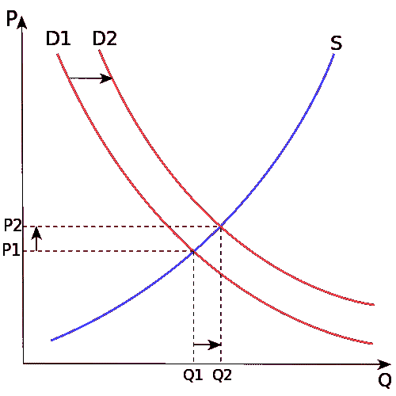

# 在创纪录的低失业率时期吸引人才的 4 个策略

> 原文：<https://medium.com/swlh/4-strategies-to-attract-talent-in-record-low-unemployment-times-de41944859b4>

Photo by [Clem Onojeghuo](https://unsplash.com/@clemono2?utm_source=medium&utm_medium=referral) on [Unsplash](https://unsplash.com?utm_source=medium&utm_medium=referral)

## 策略 1:这不仅仅是💰

美国劳工统计局 2018 年 9 月宣布，美国失业率降至 j [ust 3.7%](https://www.bls.gov) ，为美国自 1969 年以来的最低失业率。

## 尽管这是一个健康、繁荣的经济的征兆，但许多公司现在都在努力寻找能帮助他们扩大规模和增长的员工。

求职者占了上风，机会正四处向他们涌来。为了击败竞争对手，企业向潜在客户提供更高的工资和额外的福利，但是…

> 为什么在低失业率时期工资会增加？

就业市场是由供求关系决定的**。**美国的经济扩张增加了对劳动力的需求(*D1 转移到 D2* )，供应出现短缺。

企业争夺员工，工资不断提高，直到找到新的平衡点。

> 无力支付极高工资的公司如何才能吸引人才？

# **1。这不全是关于**💰💰💰

除了提高工资，还有其他方法来激励和招募员工。事实上，是的，赚更多的钱会让你更快乐，但只是在一定程度上——大约每年 75，000 美元。除此之外，其他因素也会起作用。

公司文化和价值观、工作与生活的平衡、领导力和成长机会是职场幸福的最大驱动力。

[permanent Guardian](https://www.theguardian.com/world/2018/jul/19/work-less-get-more-new-zealand-firms-four-day-week-an-unmitigated-success)**，**新西兰的一家金融公司在 2018 年建立了四天工作周，他们报告说生产力和产出水平都有所提高。其他公司现在也提供在家工作一天的选择。

想要吸引最优秀的人才并与其他雇主区分开来的组织应该关注这些非货币价值，而不是盲目地提供更高的工资。

# **2。投资自动化**

企业必须审核是否需要更多员工，或者是否可以通过自动化和数字化进步来管理增长。

随着新软件和技术工具的引入，许多公司发现他们不需要雇佣更多的人，因为自动化，他们可以用更少的资源做更多的事情。

**美国银行**，例如，[在 2018 年](https://www.theguardian.com/world/2018/jul/19/work-less-get-more-new-zealand-firms-four-day-week-an-unmitigated-success)宣布，由于网上银行的使用增加以及对物理位置的需求减少，他们将解雇一万名员工。

像他们一样，企业将不得不密切关注颠覆性技术，使他们更有生产力，并减少额外招聘的需求。

Photo by [Franck V.](https://unsplash.com/@franckinjapan?utm_source=medium&utm_medium=referral) on [Unsplash](https://unsplash.com?utm_source=medium&utm_medium=referral)

# **3。从发展中国家吸引人才**

随着美国失业率打破低记录，公司应该转向具有合格前景的国际就业市场。

大多数第三世界地区现在教育了高达 95%的人口，再加上新改进的技术机会，可以与世界各地的人们交流和工作，发展中国家提供了大量未开发的优质前景，企业应该加以利用。

Upwork、Freelancer.com 和 Fiverr 等工作匹配平台将发展中国家的远程工作者与美国企业联系起来，它们涵盖了社交媒体管理、会计、市场营销、设计、网站开发等所有虚拟角色。

# **4。培养您的员工担任领导角色**

最后，公司需要雇佣和培养内部员工。在当前的就业市场，即使竞争比以往任何时候都激烈，入门级的工作仍然拥有最大的劳动力供应。

另一方面，高管和领导的职位确实供应很少，需求很大——所以他们非常昂贵。

因此，由于当前的宏观经济环境，无力从外部招聘高层职位的企业应该招聘初级职位，并从内部晋升。

通过培训对员工进行投资并为他们提供成长机会不仅会降低外部招聘的成本，还会降低员工流动率并建立积极的公司文化。

# **外卖员，又名 TLDR:**

随着美国经历创纪录的低失业率，许多组织找不到足够的人来发展。

然而，那些无法支付过高薪水的人不应该辞职去雇佣没有天赋的人。相反，他们应该 **1)** 投资于非货币福利， **2)** 自动化流程， **3)** 从发展中国家招聘，以及 **4)** 内部招聘。

## 感谢阅读！你可以在媒体上关注我的[来获取更多类似的东西。](/@martisanchezwork)

马蒂是首席执行官、企业家和投资者的代笔人。他也喜欢用第三人称写自己。你可以在这里 *了解更多关于他做* [*的事情。*](http://www.martinacus.com)

## 这篇文章发表在 [The Startup](https://medium.com/swlh) 上，这是 Medium 最大的创业刊物，有+391，714 人关注。

## 在这里订阅接收[我们的头条新闻](http://growthsupply.com/the-startup-newsletter/)。

