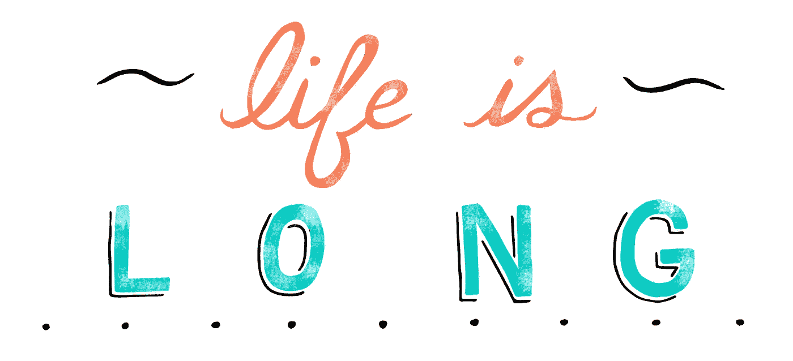

# 为了长寿和成功，每个人每周都应该做的 4 件事

> 原文：<https://medium.com/swlh/4-things-every-person-should-do-every-week-to-live-a-long-and-successful-life-85eb6538ab9f>

Art by Emily May Rose

## 你能做些什么来确保在剩下的几周里收获最大？

平均寿命大约是 4056 周。

如果你 20 岁，你已经活了 1040 周。

如果你 30 岁，你已经活了 1560 周。

如果你 40 岁，你已经活了 2080 周。

**你还剩几周时间？**

你能做些什么来确保你在剩下的几周里收获最大？

我坚持不懈地踏上旅程，保持清醒，尽我所能充分利用剩下的几周时间。

也许我比其他人更害怕死亡。

也许是因为我和千禧一代混在一起，他们做一些事情，比如策划自己的葬礼，让他们的朋友和家人知道如果他们死了会是什么感觉。

我认识的最聪明的 23 岁的年轻人就是这样做的。

不管是什么，这一直是[对我的一种折磨](/swlh/discover-your-sacred-idea-that-will-create-a-lifelong-fortune-with-entrepreneurship-8f9507b19e47)，我想，对我这一代人来说，这也是一种折磨。

组成我们一周的七天框架值得注意，因为 ***我们根据星期几做出选择，这些选择决定了我们在有限的时间***——我们拥有的最有限和最宝贵的资源——中做什么。

我优化了七天框架，以实现以下美好生活的支柱。就像，我发现如果我做了这四件事，下面列出的事情会自然而然地发生。

*   关系和社区是长期幸福最重要的支柱(根据哈佛 75 年的研究，这是同类研究中最长的)
*   有意义的工作本质上推动你朝着目标前进
*   健康和长寿
*   自理和休闲
*   对你的社区和社会有益的基本习惯
*   精力和精神状态

**那么，我们如何充分利用我们的七天工作周，让我们能够充分利用剩下的几周时间呢？**

从连续几个月在凌晨 4:30 醒来，到保持 18 个月的生酮饮食，一次都没有作弊，**我发现了 4 个导致高表现周的关键例程和习惯**，有大量启发我的研究支持。

# **1。** **一周工作四天，或者尽可能多地想象和计划**

“我认为在未来的 30 年里，人们每天只工作 4 个小时，可能一周工作 4 天。我的祖父一天在农田里工作 16 个小时，非常忙。我们一周工作五天八小时，觉得自己很忙。”阿里巴巴首席执行官马云

随着技术变得越来越好，我们将越来越多地用我们的头脑来工作。我们越是把心思用在工作上，就越需要休息和恢复。

[研究表明](https://www.inc.com/tom-popomaronis/science-says-you-shouldnt-work-more-than-this-number-of-hours-a-day.html)我们每天无法集中精力做超过 3-5 个小时的深度工作。

**很明显，我不会建议那些一周工作五天的人停止工作**，但是我要说的是(无论如何你可能会这么做一点),把你的想象力投入到工作和计划中，尽可能利用周五的轻松气氛。

作为*心理控制论的传奇作者，*该书销量超过 3000 万册，*麦克斯韦·马尔茨博士，*谈到想象力和我们的思想:

“你的神经系统无法区分想象的体验和‘真实’的体验。无论哪种情况，它都会自动对你从前脑给它的信息做出反应。你的神经系统对你认为或想象的“真实”做出适当的反应

此外，我们已经知道周五我们会有多累。

尽可能经常做这件事。

# **2。** **起得很早，但只在周二、周三和周四起床**

*“四十年来，早上五点和七点起床的差别，假设一个人晚上在同一时间睡觉，几乎相当于一个人多活了十年。”—菲利普·多德里奇*

我们不仅感觉更好，做得更多，我们这样做是因为我们是最好的自己。

我们希望在最关键的工作日取得进展并进攻，但希望在周五和周一等完成日有充足的休息和恢复时间，这样我们可以赶上和/或保持。

此外，睡眠平衡是必须的，如果你晚上 8:30-9:30 还没有起床，并且习惯了一天一周的标准时间，那么在 4:30、5:00 或 6:00 醒来是要付出睡眠代价的。

在哈佛大学的这项研究中，生物学家 Christoph Randler 得出结论，在朝九晚五的工作环境中，早起的人会花更多的时间为自己确定长期目标，并感觉他们对事情的发生有更多的控制。

为了充分利用一周的时间，提前完成三个核心工作日会推动你前进，而这要从早起开始。

为什么只有三天？我注意到在一个不舒服的早些时候醒来，你可能没有得到所有的七到九个小时，这只能连续三天完成，假设你在周末有社交活动(我周四和周六出去)。

因此，我得出结论，这是构成我们一周的七天框架的正确平衡。

**周一是过渡，规划和维护，不要抗拒它。这只会导致不知所措和沮丧。**

**周二、周三和周四是你最重要工作的进攻日，因此是清晨。**

周五补觉，因为它们是用来结束循环和完成前三天的工作的。

# **3。在你的日历上安排你的深度工作，周二、周三和周四**

> “有效性是做正确的事情，效率是做正确的事情。”传奇管理顾问彼得·德鲁克

星期二、星期三和星期四是进攻日，你希望既有效又高效。

为了提高效率，按照重要性的顺序挑选出 3 个最重要的活动(通常是你最难的)，并且知道你会用你大部分的精力去做其中的一个。尽你所能不停顿地努力走得更远更远。往往是在巅峰时刻的最后几个小时，伟大的事情发生了，我们换了一个不同的方式，导致了突破性的工作。

例如，周一我维护客户和员工。星期二，我写文章。周三我开发我的产品，周四我做对外业务开发。

请记住，目前我基本上是一个“独立创业者”。如果你在一家公司工作，你想为你的思维发展和为你的公司提供价值而创新，所以深入的工作是推动前进的必要条件——你的老板会感激的。

如果你是企业家或艺术家，这绝对是必须的。正如杰克·马特森博士所说，你必须“创新或死亡”。

这是真的，做深入的工作会把这个原则灌输给你。

**选择一件大事，每天深入工作 2-4 个小时或更长时间，将会带来有效的产出和随着时间的推移成功工作所需的创新。**

# **4。周一至周四，不吃早餐，在 8 小时的时间段内吃饭**

> “每个人都可以表演魔术，每个人都可以达到他的目标，如果他能够思考，如果他能够等待，如果他能够禁食。”——赫尔曼·黑塞，悉达多

根据 YouTube 上间歇禁食和生酮饮食的主要来源 Eric Berg 博士(130 万粉丝)的说法，我们在禁食状态下燃烧脂肪，当我们醒来时，我们处于禁食状态，因为我们睡了大约 8 个小时。

当你不吃早餐，只在一个 8 小时的进食窗口进食时，你会感觉精神和身体都很敏锐。

你的禁食状态让你的能量不被消化消耗，并让你的能量直接进入大脑。

当谈到工作日时，禁食状态让你保持敏锐，这是有道理的。当我们是狩猎采集者时，我们会在寻找食物来生存的时候挨饿(本质上是禁食，但在主动练习时没有那么极端)。自然地，我们的能量直接进入我们的大脑，这样我们就可以专注于狩猎。

在那种状态下，你会感到敏锐。

在亚马逊 Prime 上名为[禁食科学](https://www.amazon.com/Science-Fasting-Sylvie-Gilman/dp/B07586WBDK)的免费纪录片中，医生证明了禁食能让身体恢复活力。

发生这种情况的一种方式是通过一种叫做“[自噬](https://www.youtube.com/watch?v=10jNZleNH9w)”的过程——在禁食阶段，你的白细胞本质上是自我吞噬。

虚弱的细胞死亡，当你重新进食时，存活下来的强壮的细胞就剩下来了。如果你长时间[禁食](https://www.youtube.com/watch?v=Ojt9PmqAfhA)，你实际上会再造出全新的白血球！

禁食感觉很好，让你的身体有呼吸的空间，这已经被证明对长寿有很大的好处。

**如果你从周一到周四间歇性禁食，在 6-8 小时的进食时间内进食，你的一周将会延长你的寿命，这是一个从我们剩下的有限周中获得更多周的伟大系统。**

# **结论**

> “问题是，你认为你有时间。”—杰克·康菲尔德

如果你 20 岁，你还有大约 3000 周的时间。

如果你 30 岁，你还有 2500 周的时间

如果你 40 岁，大约 2000。

如果你实践了这四件事，你的工作和生活就会平衡。

如果你实践了这四件事，你的工作和生活就会健康。

如果你练习这四件事，你的 ***生活将会更长更快乐*** ，这是长寿和成功生活的关键——从尽可能多的时刻获得尽可能多的能量的巅峰状态。

剩下的几周你打算做什么？

# 准备好迈出下一步了吗？

发现我学到的 36 条原则，帮助你掌控自己的思维，轻松优雅地做好自己的工作。

## [> > >精通终极指南< < <](https://betreatedhowyouwanttobetreated.com/optin-main)

如果你做到了这一步，请帮我一个忙，鼓掌 50 次，这样其他人就可以看到这个作品，我的作品就可以传播了。如果你在我的评论里发表一篇文章，我会跟着你并回报你。

## 这篇文章发表在《初创企业》杂志上，这是 Medium 最大的创业刊物，有 322，555 人关注。

## 订阅接收[我们的头条](http://growthsupply.com/the-startup-newsletter/)。

