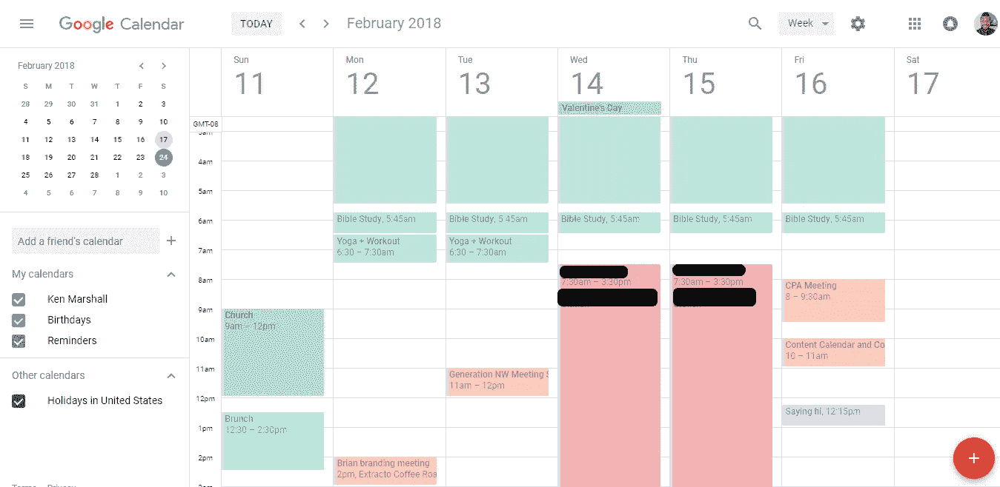

# 帮助您解决生产力问题的 4 种工具

> 原文：<https://medium.com/swlh/4-tools-to-help-solve-your-productivity-issues-89c2668b3bea>

## 我使用的机器是生产机器。

老实说，我做了很多工作。

经常。

从我还是个小男孩的时候起，我就对组织和流程着迷。我总是强调理解事物是如何工作的，以及从 A 地到 b 地的最有效的方法。

这就是我。

只要有可能，我努力摆脱不必要的任务或生活的一部分，我经常外包或委托我不想做的事情。这不仅是我如何在我所做的事情上获得成功，更重要的是，**这是我如何保持理智的**。

随着[我的公司发展壮大，我也随之发展壮大，我必须开发流程并建立可重复的系统来引导稳定的发展。](/swlh/my-company-isnt-a-unicorn-i-m-perfectly-fine-with-it-4c46679af51b)

如果你的生活或工作环境感觉混乱无序，但你却尽了 110%的努力，那是因为你没有正确利用系统之类的东西。或者你可能一开始就没有。

> 如果你想继续提高生产率，你必须想办法将你的任务、具体目标系统化，并更有效地授权。

有许多方法可以做到这一点，但它们都不适合本文。但是我将分享我用来使我的生活轻松 150 倍(完全随意的数字)并允许我尽可能少摩擦地工作的 4 大工具。

# 谷歌日历

如果这对于你来说是显而易见的，或者你在阅读这篇文章时嗤之以鼻，那么我确信你没有正确地使用这个天赐的软件。

下面是我两周前的日历截图:

你可能会注意到的第一件事，是我把重复出现的时间划分出来了。这些都是我生活中不可或缺的东西。

这样做就像一个故障保险，确保我做了我知道我需要做的事情，但也确保我不会被卷入“为做而做”的漩涡，并且也能完成其他事情。

你应该计划好你一天或一周的活动，并为每项活动划分出时间段，这样只有你认为生活中最重要的事情才会被列入你的日程表。

在你一周工作开始的前一天或前一天做这件事，看看你的效率提高了多少。

我使用谷歌日历的第二大帮助是安排约会。

“咄，肯，这就是它的用途，每个人都这样做…”

继续看，很可能不是你想的那样。

想象一下，在你生意繁忙的一个月里，你试图与一个忙得不可开交的潜在客户计划一次发现会议。通过电子邮件记下一个固定的时间和日期(我怀疑你们中的许多人仍然这样做)，是一场来回切换屏幕的噩梦。

**见不得人。**

相反，我使用一种叫做 Calendly 的服务。Calendly 是一个完全免费的约会设置软件，允许您在您的日程安排中划出日期和时间，并让其他人从这些时间中选择何时进行约会。

最精彩的部分？它与你的谷歌日历整合在一起，并在每次安排新的会议时进行更新。

因此，现在每当我必须预约时，我只需将我的日历链接发送给其他人，然后忘记这种互动，直到我必须为会议做准备的那一天到来。

嘣。

# 阿萨纳

也就是我所知道的最好的项目管理软件。

如果你努力制定项目时间表，交付成果，管理你的团队，或者让你自己和你的企业对截止日期负责，那么你的生活中需要这些。

Asana 允许你为个人客户创建项目，你需要完成的新任务，在每个项目中创建子任务作为完成它们的行动步骤，并为每个项目设置截止日期。

您还可以添加团队成员，将他们分配到单独的项目和任务中，并在他们取得进展时收到电子邮件更新。

**这是一个为了组织目的而实现的血腥梦想。**

然而，这个工具最好的部分是它允许您的过程是可预测的和可重复的。一旦您有了一个项目或任务大纲，您就可以为每个新客户或类似的项目复制该系统。

# 提议

如果你还在用微软的 word 或 paint 发送提议，你可能会吓跑更多的潜在客户。

有许多方法来起草或创建一个工作提案，所有这些方法都可以完成工作。但是你不想要的，是创造一些不炫耀你的能力的东西(如果你是一个设计师或者有某种创造力的人)或者显示出缺乏专业精神的东西。

**这些都是对你信誉的巨大危险信号。**

此外，如果你每次得到一个新客户都必须亲自去做个性化的文档，如果你定期向很多人推销(你们大多数人都应该这样)，这可能会很乏味和低效。

Proposify 解决了所有这些问题以及更多问题。

这是一个提案创建软件，允许您使用或创建美观且结构良好的提案模板，并带有预先格式化的定价、交付内容、时间表等选项。**您也可以通过该服务让客户签名并付款。**

时髦吧。

最棒的是，一旦你制作了一个标准模板，当你有一个新客户时，你只需添加他们的信息和提案的名称，它就会在文档中动态更新他们的所有特定信息。

这项服务甚至可以让你看到你的提案的哪个部分已经被浏览了，以及浏览了多长时间。太不可思议了。

由于我经营着一家[潜在客户代理](http://doorbelldm.com/)，我提供 3 项核心服务。每项服务都有一份建议书，其中包含具体的时间表、成本和交付内容。当我向潜在客户发送建议书时，我只需添加他们的名字，并调整服务范围以满足他们的个人需求。

但与手动更新不同的是，每次我想发出新的提议时，我不必手动更新大部分文档。或者更糟，见面让他们签名！

宝石。宝石。宝石。

# 向上工作

最后但同样重要的是，我最喜欢的服务。

向上工作。

如果你一直生活在地下，为世界末日或其他事情做准备，并且不熟悉这个革命性的平台，让我花一点时间来教育你。

Upwork 是一项在一个市场中连接自由职业者和需要他们才能的用户的服务。它提供从网站开发到会计、配音等各种服务。但与 Fiverr 等竞争对手不同，如果你知道去哪里找，人才的平均质量会高得多。

Upwork 的美妙之处在于你有如此多的控制权。你可以发布任何工作，项目会持续多长时间，你愿意付多少钱，甚至什么类型的承包商有资格为你工作。

我将它用于博客推广、电子邮件管理、内容营销、关键词研究、文案撰写等等。

目标是去掉所有你不应该做的小活动或乏味的任务，让自己专注于你的职业或业务中的重要职能。

**如果你正在做一项不能让你或你的企业赚更多钱、更好或更快乐的任务，那么它需要被外包和/或委派。**

就现在。

你对这些工具有什么看法？你用更好的吗？请在下面留下评论，帮助这个世界变得更美好。

# 如果你喜欢这个，一定要给它 40 次左右的掌声，帮助别人变得更好，获取我的[免费生活改变生产力指南](http://eepurl.com/cxxt7D)，和[关注我的 medium](/@Ken_Marshall) 以获得更多的宝石。

## 这篇文章发表在 [The Startup](https://medium.com/swlh) 上，这是 Medium 最大的创业刊物，有 301，336+人关注。

## 在这里订阅接收[我们的头条新闻](http://growthsupply.com/the-startup-newsletter/)。

