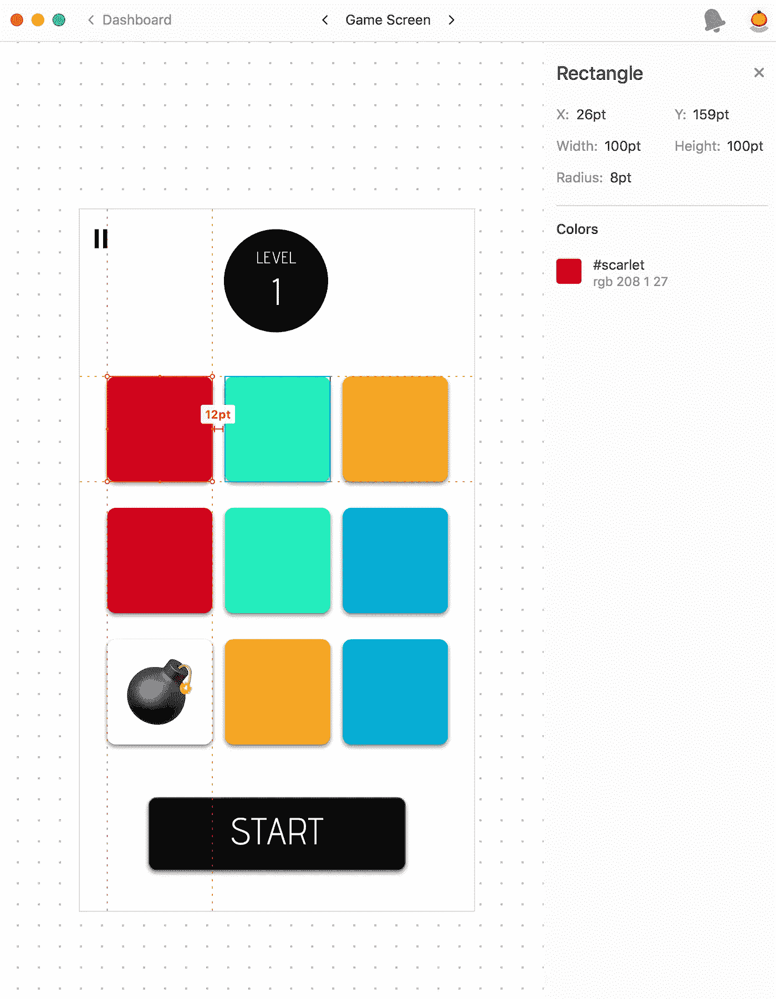
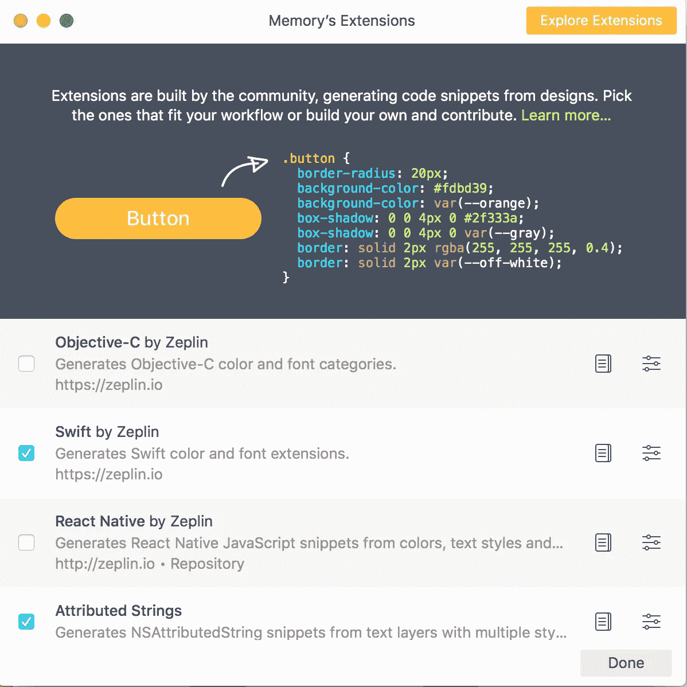
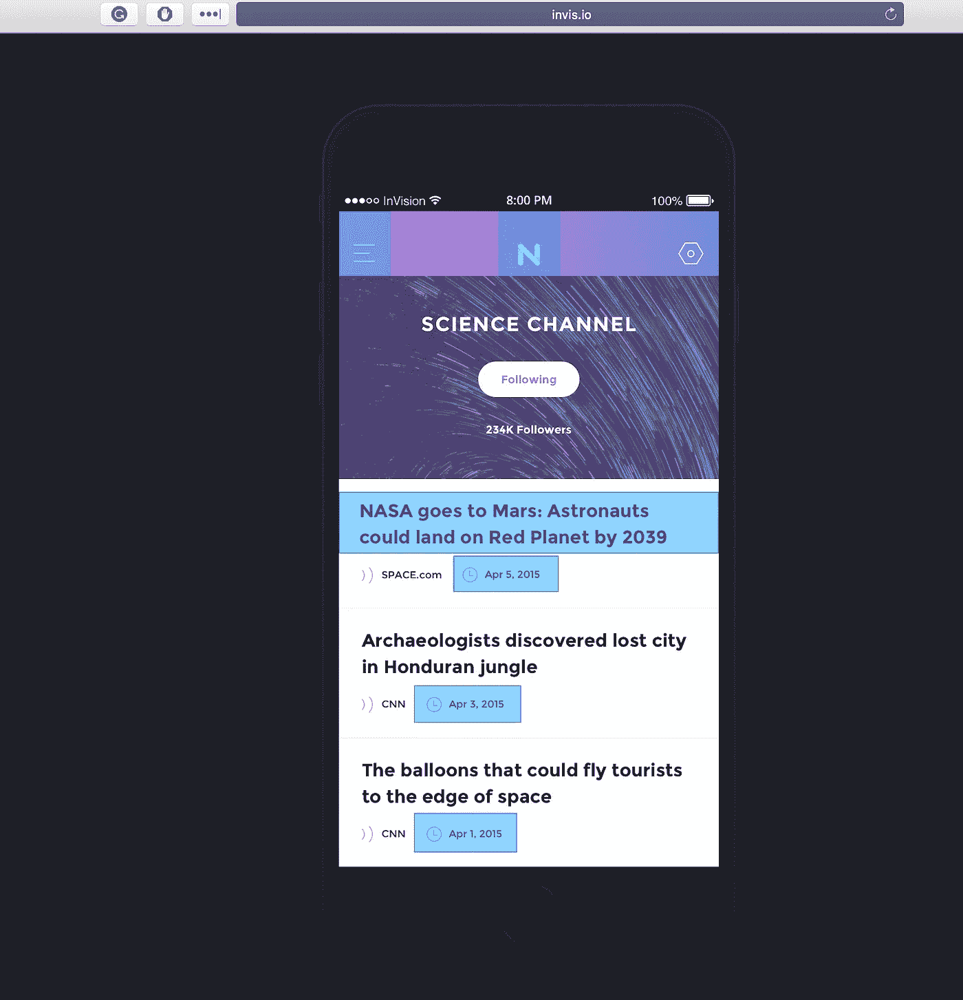
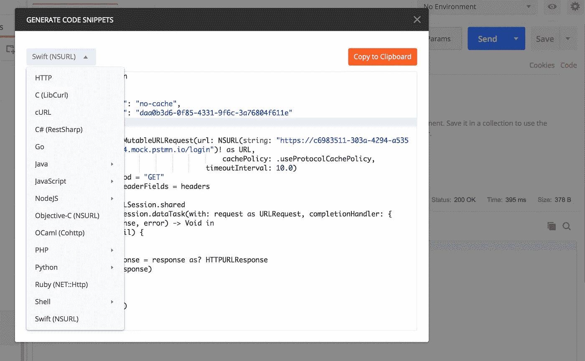

# 加速应用程序开发的 4 种工具

> 原文：<https://medium.com/swlh/4-tools-to-spend-up-app-development-93b8514f3e03>

Photo by Jefferson Santos on Unsplash

经营一家早期创业公司是艰难的，作为创始人，你是设计师、工程师和创造者。学习这些 *4 工具一定会加速应用开发！*

每个人都知道经营一家创业公司是艰难的。作为一个早期创业公司的创始人，你需要亲自处理所有事情。至少在你筹到足够的钱雇佣或找到一个联合创始人来帮助你之前，你是工程师、开发者和创造者。

> 开公司就像吃玻璃，凝视深渊。-埃隆·马斯克

# 需要掌握的重要工具

好消息是事情已经改变了。随着技术的进步和更好的工具和产品的出现，你实际上可以加快应用程序的开发，并在更短的时间内建立一个 MVP。

# 1.草图—用于设计

现在使用 Mac 的设计师最常用的工具当然是[草图](https://sketchapp.com/)！**草图**利用完全基于矢量的工作流程。这意味着所有被创造的东西都可以以最好的质量放大或缩小。您不再需要担心所需的精确分辨率。

using symbols in Sketch

**草图符号**是退而求其次的东西。它允许在不同的**画板**和**页面**中轻松重用这些元素。你不再需要复制和粘贴相似的设计，也不再需要一个接一个地修改它。对于**符号**，在**符号画板**处对其进行更改也会更新所有其他地方使用的**符号**。

**草图**还有许多其他有用的功能，但是首先，了解**画板**、**页面**和**符号**会比以后修复它节省很多时间。关于 **Sketch** 的伟大之处包括[学习文档](https://sketchapp.com/docs/)和[免费视频](https://www.youtube.com/channel/UC-1eTnnUmKJ8yEa1nCnAGpw/videos)，帮助你加快学习进程。那里的社区和帮助也很棒，我在谷歌上搜索的时候从来没有解决不了的问题。

# 2.Zeplin —用于样式向导和生成代码片段

Zeplin provide style guide that aid developers

Zeplin 为 T2 提供开发者在创建应用时需要的所有细节。它提供了所使用的颜色、所需的尺寸、项目之间的间距，以及在正确完成时下载资产的能力。今年年初，它还增加了[链接](https://blog.zeplin.io/flows-in-zeplin-round-one-c56550f23f0f)支持，允许在 **Zeplin** 上导航到不同的屏幕。

使用 [Zeplin 扩展](https://extensions.zeplin.io/)，您可以轻松生成并下载代码片段，这些代码片段可以直接导入 Xcode。大多数人不知道的是，您实际上可以[将这些颜色添加到 assert 目录](https://blog.zeplin.io/asset-catalog-colors-on-xcode-9-c4fdccc0381a)中，该目录可以在 **Xcode 故事板**中使用。

Zeplin extensions that could generate styling code snippets

令人惊奇的是，你不需要很多额外的工作。有了 [Zeplin Sketch 插件](https://sketchapphub.com/resource/zeplin/)，你可以轻松的自动生成所有这些。从设计开始>导出到 Zeplin >导出代码片段>导入到 Xcode/Android Studio。

# 3.视觉—用于原型制作和演示

在开始编码之前，大多数时候你喜欢看看应用程序的感觉。四处逛逛，感受一下这种体验是什么样的，以及所有的事情合在一起是否有意义。有了[视觉](http://invisionapp.com/)，你就可以做到这一点。

creating prototype with InVision

你可以使用 [Craft，一个草图插件](https://www.invisionapp.com/craft)将屏幕同步到 Vision，或者导出图像并通过网络上传。一旦进入**视觉原型**，你就可以划出一个可以导航到另一个屏幕的矩形。如果你和其他人一起工作，他们也可以标出屏幕的不同部分来留下评论。

当一切都完成后，你就可以向朋友或潜在用户发送短信来试用最新的设计了。他们可以像真正的应用程序一样点击和浏览原型。唯一不同的是，它都是预定义的数据，没有连接到任何后端来获取或更新数据。

试试这个[草图演示原型](https://invis.io/YJNH9AZSXVB)你就明白了！

# 4.Postman —用于 API 集成和模拟服务器

最后，您已经验证了设计，并准备开始开发应用程序。一个应用程序通常需要将 **API 集成到后端服务**。如果你自己构建所有的东西，在后台服务准备好之前，这需要一段时间。即使你雇了人来同时工作，讨论和文档也需要作为一个契约被抽出来，以便集成以后无缝地工作。

有了 [Postman](https://www.getpostman.com/) ，你实际上可以先开始创建一个模拟服务器。它的行为就像一个后端服务，当一个 API 端点被请求时，它会向您返回准确的响应。前端可以开始将所有设计的端点与 [Postman 模拟服务器](https://www.getpostman.com/docs/v6/postman/mock_servers/mocking_with_examples)集成。一旦后端准备就绪，我们所要做的就是将`URL`更新为我们的后端服务所提供的。

generate api code snippets with Postman

除此之外，你还可以利用**生成代码片段**功能来加速应用程序的开发。它提供了许多不同的编程语言，其中的代码片段直接与在 Postman 上创建的 API 端点一起工作。

# 结论

将它们掌握到专业水平并让它们按照你的意愿做事可能很难。但是只掌握 20%实际上可以提高你 80%的生产力。

这些工具也是设计人员和开发人员经常使用的。对它有足够的了解将有助于你与未来的设计师和开发者沟通。

# 感谢阅读！如果你喜欢，请点击👏👏👏

白天，我是技术产品主管。晚上，我是一个制造者、工程师和设计师。我喜欢学习和创造关于技术、产品和创业的新事物。你可以在 [Twitter](https://twitter.com/Zaccc123) 或[我的博客](https://zackwan.app)上找到我。

## 这个故事发表在 [The Startup](https://medium.com/swlh) 上，这是 Medium 最大的企业家出版物，拥有 358，974+人。

## 在这里订阅接收[我们的头条新闻](http://growthsupply.com/the-startup-newsletter/)。

