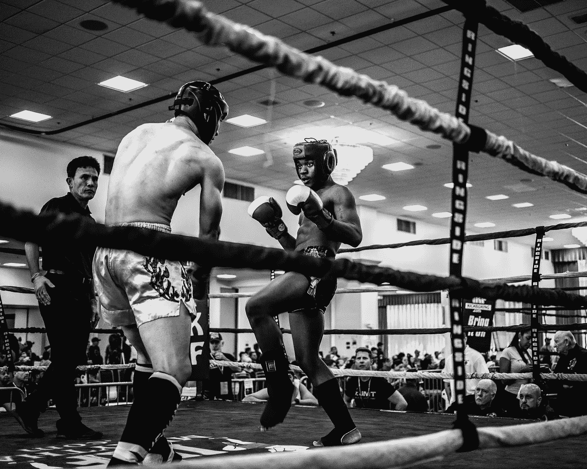
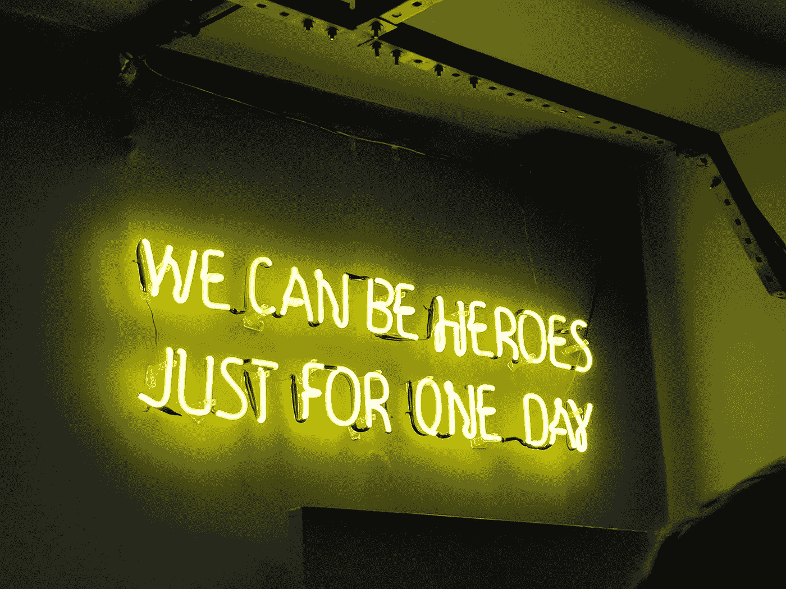

# 4 个不太可能的理由，为什么业余爱好者是你作为一个创意者的最大好处

> 原文：<https://medium.com/swlh/4-unlikely-reasons-why-being-an-amateur-is-your-greatest-benefit-as-a-creative-2fbc5fc72f4e>

## 我们现在都想成为职业选手。如果我们剥开这些层，然后…

Credit: [Wade Austin Ellis](https://unsplash.com/photos/wAVE9A97YC4?utm_source=unsplash&utm_medium=referral&utm_content=creditCopyText)

看起来这些天业余选手真的很受打击，你不觉得吗？

随着现代技术的兴起——更具体地说，是通过社交媒体构建完美和“专业”叙事的能力——如果你刚刚起步，你将被抛弃和遗忘。你被抛弃是因为你[看起来]没有专业人士的专业知识。谁会愿意接受一个*业余爱好者*的建议？

我认为，在当今的经济形势下，业余爱好者有一些优势没有被考虑到。

# 业余爱好者是无情的

在法语中，*业余爱好者*一词的意思是“爱”

业余爱好者是以热爱的精神追求工作的热情者。

这允许业余爱好者通过好奇、兴奋和快乐的视角打开他们认为合适的许多门。缺乏一个适合业余爱好者的过滤器。他们的兴奋被他们不断学习手头工作的需要所压倒。

作家戴维·福斯特·华莱士说，他认为好的非虚构作品是一个机会，

> “看着一些相当聪明但也相当普通的人比我们大多数人在日常生活中有机会更密切地关注和思考各种不同的事情。”

业余爱好者在这个意义上是相似的(尤其是非小说写作的业余爱好者):他们被一些东西所吸引，花大量的时间去思考它，并与周围的人分享它——即使最终的产品可能并不那么棒。

# 业余爱好者是失败者(每个人都喜欢失败者)

Photo by [Gabriel Bassino](https://unsplash.com/photos/zEawlLdVloo?utm_source=unsplash&utm_medium=referral&utm_content=creditCopyText)

从大卫*歌利亚&到洛奇*巴尔博亚*，每个人都喜欢失败者的故事。*

如果你是一个美国人，我们建国的故事是建立在一个由武装不良、准备不足的革命者组成的团队与世界上庞大的超级大国对抗的理念之上的。

这也是业余爱好者的叙述。

*   这个业余爱好者还不具备所有的技能。
*   业余爱好者没有庞大的网络和观众(还没有)。
*   业余爱好者还没有掌握所有的资源。

[*弱者效应:通过品牌传记营销劣势和决心*](https://www.theglobeandmail.com/report-on-business/industry-news/marketing/everybody-loves-an-underdog/article4327304/) 概述了一系列研究，说明了人们与弱者的联系。想一想所有的大公司和实体，它们一开始都是不被看好的，现在却受到大众的喜爱:

*   苹果和谷歌都是由市场上条件不如其他公司的人在车库里创立的。
*   马特·达蒙和本·阿弗莱克在推出他们的突破性剧本之前是默默无闻的，*心灵捕手*使他们家喻户晓。
*   没人想到美国曲棍球队会在 1980 年冬季奥运会上击败四次卫冕金牌的苏联队。

业余选手的坚韧和*无所畏惧*的心态导致了上述例子中的失败者的胜利(当然，从各方面考虑，我知道美国队是一支由*专业人士组成的队伍——*不过，你明白我的意思)。

这就引出了下一个原因。

# 业余爱好者损失更少

每隔几年，我们都会在新闻中看到一个不幸的场景:

一个老百万富翁——仍然是他的商业帝国的监督者，被带上法庭。股东和家庭成员相互争论，声称这个人精神太不健全，不能自己做决定。这个企业的老板抓住一切不放太久了，从不放松，现在正处于失去一切的边缘——包括他的尊严。

当然，对于业余爱好者来说，这种阴郁压抑的故事永远不需要上演。

业余爱好者不会有任何损失——但会赢得一切。到目前为止，业余爱好者的追求是因为爱和好奇。假设他们沿着这条路走下去，开始真正发现这个兔子洞的新奇之处，他们可以干净利落地离开(尽管这种不安和困惑的感觉通常出现在突破之前，暂时不建议离开)。

业余爱好者在低风险、高回报的竞技场上玩这个游戏是有好处的。

# 业余爱好者通常能以更快的速度学习新事物

到现在为止，我已经接受了一年多的拳击训练。

我的拳击教练是这项运动 18 年的老手。他曾与各行各业的职业拳击手合作并训练他们。

Photo by [Markus Spiske](https://unsplash.com/photos/nvKQ1kxheRc?utm_source=unsplash&utm_medium=referral&utm_content=creditCopyText)

当我第一次和他一起训练时，他问我，“你以前和其他教练一起训练过拳击吗？”我摇摇头，没有。他接着说，“好。我讨厌训练已经训练了一段时间的人。他们总是学习坏习惯。即使他们已经接受了 3 年的培训，我也可以保证总会有我需要解决的问题，解决这个问题比让一个毫无经验的人达到足够的能力水平需要更长的时间。”

对于业余作家、演员或程序员来说也是如此，[填写业余贸易/工艺]。

当然，考虑到这个论点，如果你刚刚开始，如果你找到一个导师并参与到[刻意练习](https://jamesclear.com/deliberate-practice-theory)中，你会大大减少你落入“能力缺陷”陷阱的可能性。

刻意的练习是把你从笨拙的业余选手变成杰出的职业选手的催化剂:

> 区分天才和普通成功者的关键因素并不是一个神圣的火花。这不是智商，智商通常不是成功的预测指标，即使是在国际象棋这样的领域。反而是刻意的练习。顶尖的表演者花更多的时间(更多的时间)严格练习他们的技艺。
> 
> —大卫·布鲁克斯

没有人会对有机会开始从业余爱好者到职业选手的漫长而艰难的旅程垂涎三尺。

然而，当我们揭开这些层，发现一些与业余爱好者相关的优势时，我们会看到一个不同的故事。

这种叙事是成熟的机会和各种工具，由业余爱好者和业余爱好者单独支配。

正如古老的故事所说，大卫当然打败了强大的歌利亚。没有人真的预见到这一点。

然而，我敢打赌，如果我们能让大卫上现代播客，或者让他坐在拉里·金对面的座位上，我们就能从他那里得到一些采访金，即使在故事中处于劣势，他也知道他会一直成为胜利者。

# 👋🏻你好，我是乔恩

我是一个思考者，自由撰稿人和葡萄酒爱好者，写关于个人成长和心理优化的文章。加入 1，200 多名读者的行列，获得我的免费个人 6 天“**创业博客**”课程和我的时事通讯:

## 🚨 [> >世卫组织还想自己当老板吗？< <](https://mailchi.mp/4b982beed325/free-6-step-course) 🚨

## 这篇文章发表在 [The Startup](https://medium.com/swlh) 上，这是 Medium 最大的创业刊物，有 355，974 人关注。

## 在这里订阅接收[我们的头条新闻](http://growthsupply.com/the-startup-newsletter/)。

