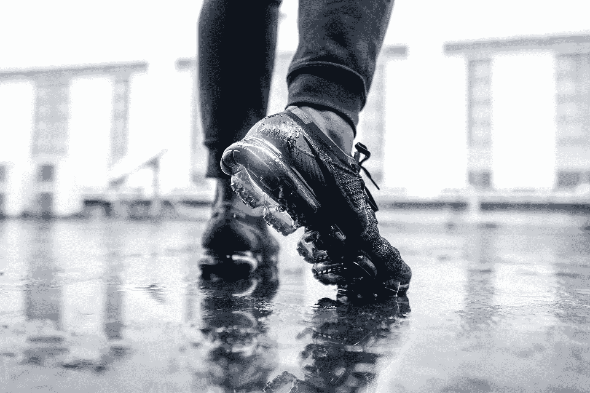
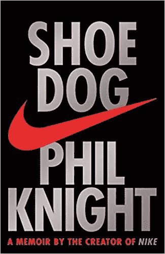

# 阅读《鞋狗》给创业公司的 4 条宝贵经验

> 原文：<https://medium.com/swlh/4-valuable-lessons-for-startups-from-reading-shoe-dog-by-phil-knight-the-founder-of-nike-33e07eaf0a1>

These are Nike shoes on a photo by [Fachry Zella Devandra](https://unsplash.com/photos/lXuyEh7DeC8?utm_source=unsplash&utm_medium=referral&utm_content=creditCopyText) on [Unsplash](https://unsplash.com/search/photos/runner?utm_source=unsplash&utm_medium=referral&utm_content=creditCopyText)

## 耐克的创始人菲尔·奈特

耐克确实是世界上最著名的品牌之一。标志性的“swoosh”标志，加上鞋类技术的创新以及创造性的营销和品牌战略，使该公司的形象至今仍备受推崇。

“鞋狗”讲述了该公司的起源，讲述者不是别人，正是其创始人菲尔·巴克·奈特。这本书从 20 世纪 60 年代开始，那时奈特 24 岁，决定环游世界。他有一个他称之为“疯狂的想法”——将日本跑鞋进口到美国。奈特本人不仅是一名跑步爱好者，他还将这一想法作为自己在斯坦福大学 MBA 课程的一部分。

在与日本供应商 Onitsuka(今天 Asics 的一部分)成功建立业务关系后，Knight 开始销售自己公司的设计。这使他们与供应商的关系紧张，最终导致分离。尽管遇到了许多挫折和问题，公司还是成长了。

回忆录以 1980 年的首次公开募股结束，然后加入了一些当代骑士的想法。

这是一段有趣的旅程，充满了斗争和问题，但也充满了希望和胜利。奈特在整个章节中散布了一些小智慧。我想让你看看你能从他和他的回忆录中学到什么。

> "懦夫从未开始，弱者死于途中——那就剩下我们了."

## 第一课:建造需要时间

这本书开始于 1962 年，当时奈特第一次借钱从日本进口鞋子。他试图向体育用品商店兜售它们，但是它们的货架上已经有足够多的了。然后，他开始参加当地的田径运动会(这在下一课中很重要)。但这都需要时间。旅行两年后，他和他的老田径教练比尔·鲍维尔曼一起正式创办了这家公司。又过了三年，公司第一次需要租办公室，他们只得到一个酒吧旁边的小房间。他们持续增长，但仍是一家小公司，少数人分散在美国各地。**直到 1972 年，这个品牌才得到了更广泛的认可，距离骑士品牌诞生已经整整十年了。**

当然，20 世纪 60 年代是一个更慢的时代。当时没有互联网，全球化刚刚开始，中国还在高墙之内，铁幕牢牢地分隔着世界。

建立一家销售实物商品的稳定公司需要时间。不仅仅是销售，尤其是创新、发展和建立信任。

正如奈特所说，没有必要急功近利，公司没有致富然后提前退休的方法。他正在推动增长，并为此承担了巨大的风险。然而，我得到的印象是，他这样做并不是为了发财，而是因为他的“疯狂想法”:**也许市场上的东西并不是这条线的终点。也许有人可以开发出更好的东西，不仅可以卖得更多，还可以支持别人。这需要时间。**

## 第二课:充满热情，与热心者交谈

奈特自己一生都是跑步者，他是现场的一部分，了解教练、跑步者和他们的团队。对他的一些熟人来说，从大学跑步到开始参加奥运会似乎是一条短而陡峭的路——该公司的联合创始人鲍维尔曼在 1968 年和 1972 年担任球队教练。奈特开车去赛道比赛、会议和学校，*和车迷们聊天。教练在家里制造或改进他们的跑鞋并不是闻所未闻的，奈特和他的新制鞋公司就在他们旁边，了解他们的问题。今天，我们称之为用户研究，但它更自然地出现在奈特身上:**去找那些关心和了解的人。与他们交谈，向他们学习。**第一位员工杰夫·约翰逊不仅开设了一家商店，还为跑步者创造了一种体验；*

> ”然后，他开始把这家店变成跑步者的圣地。[……]他创造了一个美丽的空间，供跑步者闲逛和交谈。他建了书架，在上面放满了每一个跑步者都应该阅读的书籍[……]在这个世界上，从来没有一个跑步者的避难所，一个不仅向他们出售鞋子，还向他们和他们的鞋子致敬的地方。”

这也让他们更接近创新:在 60 年代末，跑道/草皮从灰烬或泥土变成了一种新的合成材料:格子呢或橡胶。新草皮意味着在抓地力、阻尼等方面的新物理特性。**因为耐克(在这里是鲍维尔曼)在测试新表面时就在那里，他们可以迅速做出反应，开发适合这种表面的新鞋和鞋底。**

这里重要的一课是热情和真实。这是一个通过值得信任来建立信任的问题:这是一个跑步爱好者，他也有一家公司很重视这项运动。一家致力于通过关注人类而非数字来改善每个人的处境的公司。

## 第三课:做经理和做领导

顺便说一句，耐克核心团队的一部分人是运动型的反面:一个在事故后被绑在轮椅上，两个病态地超重，他们中的一些人一天抽两包烟。奈特蔑视一些现代管理观点。他很少回复问题、信件或其他信件。他看起来不像是一个“管理者”，更像是一个领导者。

他们做的工作充满了目的——有时是由怨恨和宿怨驱动的，但第一批人在律师事务所或会计事务所寻找朝九晚五工作之外的东西。

奈特经常引用麦克阿瑟将军的话:

> “不要告诉人们如何做事，告诉他们做什么，让他们用他们的结果给你惊喜。”

后来，他承认

> “我的管理风格对那些希望每一步都受到指导的人来说都不起作用，但这个团队发现这种风格解放了他们，赋予了他们力量。”

他们都致力于一个目的:让跑步变得更好，并想方设法做出贡献。此外，他们都参与重要的决策，定期召开团队会议来解决更大的问题。

奈特不管理他们，而是让他们有能力。

## 第四课:他们不知道他们要去哪里

故事发生后再讲总是很容易的。这是我们头脑中的一个大谬误:因为我们知道它发生了，这是它*可能发生的唯一方式*。奈特并不打算建立一个帝国，也不想扰乱或颠覆鞋类市场。

他想通过改善工具(鞋子)和跑步者的健康来让跑步变得更好。他说，他努力奋斗，奋斗，最后，甚至在销售额突破 1.4 亿美元之后

> “但我没有珍惜我们已经走了多远，我只看到了我们还有多远要走。”

他承认自己是一个缺席的父亲，勉强避免倦怠，做出轻率和糟糕的决定。当然，这家公司繁荣发展并幸存了下来，但其中也有运气的成分:它本可以走上不同的道路，但今天我们就不会读到这个故事了。

对于企业家来说，教训应该是这样的:**专注于做好今天的工作，专注于你能控制的事情。抓住机会，大胆尝试。倾听并欣赏每个人正在做的事情。不要试图预测未来。**

《鞋狗》是一本了不起的书:通过讲述公司的故事，它从不摆出“你必须这么做”的权威。它突出了每个公司的方式的个性，以及它在多大程度上取决于环境和运气，但它也可以在多大程度上与正确的人和他们的奉献精神一起成长。

*感谢阅读！*

## 这篇文章发表在 [The Startup](https://medium.com/swlh) 上，这是 Medium 最大的创业刊物，拥有 294，522+读者。

## 在这里订阅接收[我们的头条新闻](http://growthsupply.com/the-startup-newsletter/)。

