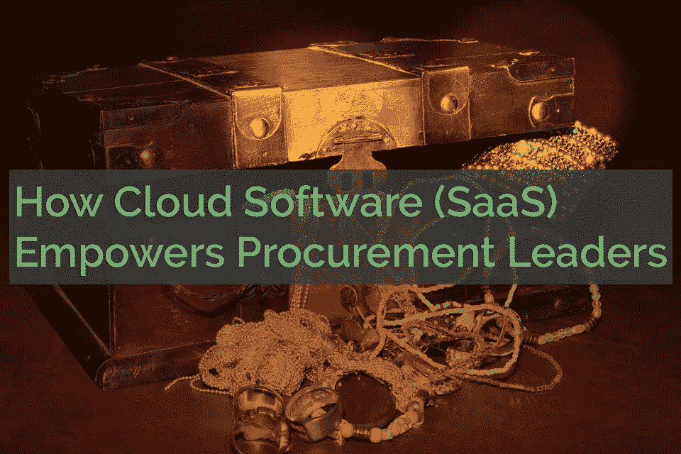
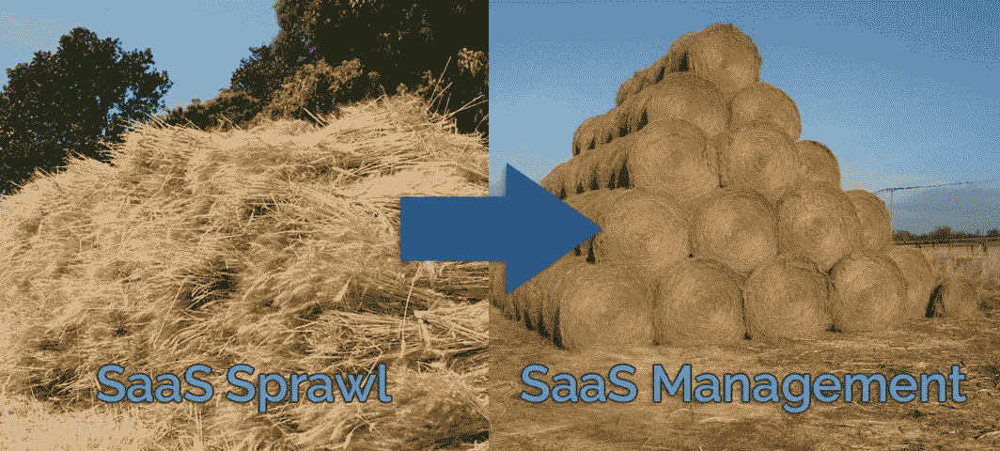

# 云软件(SaaS)为采购领导者赋能的 4 种方式

> 原文：<https://medium.com/swlh/4-ways-cloud-software-saas-can-empower-procurement-leaders-b69d982559fb>

许多采购负责人对云软件感到矛盾；这当然有用，但毕竟，在 2010 年，注册云应用是绕过采购的非常有效的方式。

但现在，我们看到了对 SaaS 全面扩张的反应。不管是讽刺还是诗意的正义，专门的 SaaS 应用程序现在可以用来发现、组织和控制其他 SaaS 应用程序的猖獗传播。

通过使用这些专门的 SaaS 应用程序，有点像把一个杂乱的干草堆整理成你可以真正使用的东西。

为什么不呢？云采购系统提供了许多吸引用户涌向其他 SaaS 产品的优势:

*   快速实施
*   免费或短期试用
*   可量测性
*   通常比本地软件费用更低

然而，SaaS 采购系统可能有一个真正大的优势:检测和管理**其他**云应用的能力。在这方面，**信息确实是采购主管的力量**。

# 1.SaaS 采购管理给你一个 30，000 英尺的视角

如果您比公司中的任何人都更了解您的组织中使用了什么软件，会怎么样？如果您可以在一个地方看到这些，而不是在多个系统或电子表格之间转换，会怎么样？

这就是有效的 SaaS 管理平台的优势。

可见性与分类、标记和搜索工具相结合，为采购人员提供了一种了解员工实际使用什么、什么受欢迎以及采购可以在哪些方面发挥作用的方式。

# 2.云采购软件使您能够增加价值，而不仅仅是降低成本

成功的采购领导者通过寻找战略性地增加整个企业价值的方法，使他们的部门摆脱单纯的成本节约。

SaaS 管理平台提供了实现这一点的方法，因此您知道:

*   **通过查看正在使用的实际应用程序以及有多少人在使用它们，来寻找哪些产品类别**
*   **通过观察哪些应用程序正在崛起，哪些正在衰落，哪些应用程序应该在**上标准化
*   **员工重视的功能**通过搜索和过滤应用程序中的活动
*   **根据当前许可证成本和用户数量估算成本节约，可以实现多少节约**

有了这些数字，采购主管可以向高层领导证明他们的计划。通过使用软件来观察采用和行为，可以测量和评估结果。

# 3.合适的云采购应用为您带来谈判优势

信息就是谈判的力量，SaaS 采购软件将为您提供出色的财务工具，例如:

*   许可证和合同续订跟踪。
*   从企业合同到单个员工的支出都是云支出。
*   按应用支出，以及应用类别内和类别间的比较。
*   发现冗余应用、多个实例或未充分利用的应用或许可证。

你知道，当你掌握的信息和供应商的首席谈判代表一样多甚至更多时，感觉会很好。

# 4.SaaS 采购软件让采购更有效率，让你不浪费时间

想象一下您可以通过以下方式节省多少时间:

*   在一个地方就能看到你需要的所有信息，而不是通过搜寻和询问部门领导。
*   从一个来源提取报告，而不是将许多电子表格、数据库和人员的报告拼凑在一起。
*   从一个平台向供应商发送调查问卷，而不是一个接一个地追踪联系方式和发送电子邮件。
*   在一个地方查看所有即将到来的续订，而不是试图维护一个不适合此类活动的日历。

这种时间节约使采购主管能够采取更主动的行动和计划。这种人更有可能加薪或升职，因为他们以积极的方式改变了部门的性质。

我们提到过云中可以节省很多成本吗？我们还概述了 Alpin 如何帮助削减这些成本。

有兴趣通过迁移到云来转变您的采购部门吗？Alpin 有许多工具可以帮助您发现和管理您的云应用程序和供应商。请通过 info@alpin.io 联系我们。

## 这篇文章发表在《初创企业》杂志上，这是 Medium 最大的创业刊物，拥有 358，974 名读者。

## 订阅接收[我们的头条](http://growthsupply.com/the-startup-newsletter/)。

