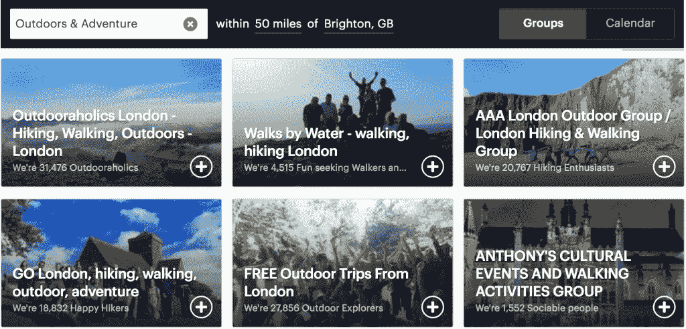
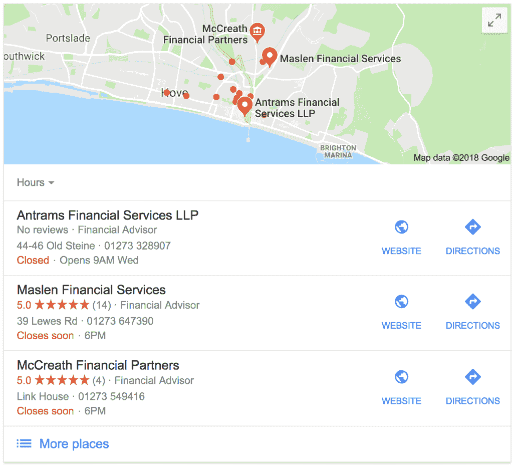
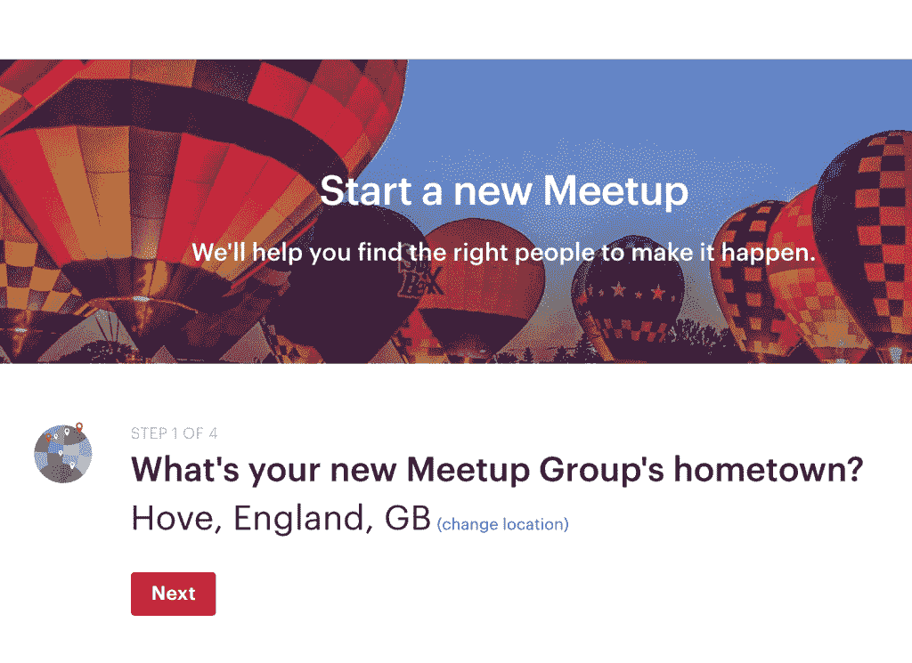

# 在当地吸引优质自由职业者的 4 种方法

> 原文：<https://medium.com/swlh/4-ways-to-attract-quality-freelance-leads-in-your-local-area-4a8b30ea93e7>

作为自由职业者，我们对这个世界了如指掌——无论是比喻上还是实际上。

网络的互联性意味着我们可以从全球各个角落找到客户。可能性是无限的。

虽然这看起来令人欣慰(世界上有 70 亿人，但肯定至少有一个人需要我的服务，对吗？！)，也可以是巨大的压倒性。

不仅地球上所有四个角落的前景似乎是无限的(你甚至从哪里开始？！)，我们也要记住，不同的地方不同的人需要不同的东西。

电子商务网站为不同大陆的人们改变他们的设计、文案和信息是有原因的。

当你牢记这一点时，它可能会显得相当令人生畏。

理想情况下，你不希望为了吸引不同地方的客户而把你的网站搞混，尤其是在早期，时间是你最大的资产。

***那么答案是什么？***

# 从本地开始。

我作为自由职业者的第一份工作是在我离开的公司。他们雇用我继续为他们做一些营销工作，他们还将我的详细信息传递给了同一城市的另一家类似的公司，这家公司在我的第一个月雇用了我做一些小工作。

这些人是我真正的、亲身接触过的人，在这个没有面孔、没有名字的人的时代，这是无价的。

# 为什么你应该去当地吸引高质量的自由职业者

在我与你分享一些你可以在当地开始营销你的服务的方法之前，我会给你一些关于你为什么应该这样做的弹药。

# 1.你创造了真实的生活关系

让我告诉你今年年初我得到的一个大客户。

他们在我使用的共同工作空间的网站上找到了我的详细信息，并联系了一次会面。我真的去了他们家，和他们一起坐在厨房的桌子旁，喝着茶，谈论着他们的项目。

最后，我们热切地谈论着如何让这个项目变得更好，获得更令人难以置信的结果(这基本上意味着我被录用了)。

在他们的后续电子邮件中，客户提到他们曾试图在我之前雇佣另外两个人来做同样的项目，但是那些人在其他城市。

他们强调，由于他们是一家相对较小的家族式初创企业，因此与他们雇佣的自由职业者建立个人联系非常重要。

人们很容易低估现实生活中人际关系的力量。

人们很容易认为，通过电子邮件交流，甚至视频通话就足以与客户建立联系，但你不会在其他关系中这样做，你会吗？

像肢体语言、面部表情和[仅仅是和另一个人靠得很近就能立刻加深联系](https://neilpatel.com/blog/how-to-strengthen-and-deepen-the-relationship-between-you-and-your-customers/)。

而且，当你与客户建立了稳固的、真实的(非数字化的)关系时，他们更有可能一次又一次地回来。

## 准备好吸引和打动你的下一个客户了吗？[点击此处](http://wanderfulworldffcf.com/findfreelanceclients)，将为期 6 天的课程直接发送到您的收件箱。

# 2.你很突出

在我自由职业生涯的最开始，我通过一个离我住处很近的工作网站申请了一份工作。我在求职信中提到了我的位置，并开了一个关于这个地区的内部玩笑。

这一定引起了客户的注意，因为他们很快回复了我，并从数百名自由职业者中雇佣了我。

与客户有共同点是让你的品牌脱颖而出的好方法，而位置是一个很好的起点。

# 3.你变成了小池塘里的一条大鱼

没有人会成为“世界上最好的设计师”或“世界上最好的内容作家”。有太多的人提供同样的服务，他们都在各自的领域表现出色。

然而，你可以成为“奥斯汀最知名的设计师”或“牛津最受欢迎的文案”。

当你开始在你的地区获得客户，他们会开始向你推荐你所在地区的其他企业，这将产生连锁效应。一旦一家企业看到你在同一地点为他们的竞争对手做了出色的工作，他们就会想参与进来。

而且，不知不觉中，你已经是你所在领域最忙碌的设计师/文案/营销人员之一了。当这种情况发生时，你知道你的服务是有需求的，你可以开始扩展到其他地方。

# 如何在你所在的地区吸引高质量的自由职业者

我很乐意告诉你，当你想吸引高质量的自由职业者时，从本地开始很重要，但如果你不知道从哪里开始，这就像面对整个世界一样令人生畏。

如果你准备好走出去，开始建立真正的本地联系，以下是你可以做的。

# 1.网络活动和聚会

这是一个绝对不用动脑筋就能让自己轻松融入当地场景的方法。大多数城镇和城市都有一个庞大的聚会菜单，从热衷的漫步者和单身到创业和创意，所以你一定会找到符合要求的东西。

以下是如何充分利用你所在地区的社交活动:

*   **找一个面向你的目标受众的活动** *(所以，如果你在为美发师设计网站，那就去参加任何美发师聚会或当地商业聚会)*
*   跟着**走，但不打算出售**你的服务
*   通过**以人性化的方式与其他与会者**开始对话来建立联系
*   **打印一些名片**，这样你就可以分发给那些想更多了解你工作的人
*   不要指望马上就能得到合同，这种事情很难做
*   通过一封简短的电子邮件，对你 3-5 天后遇到的任何人进行跟进

# 2.为当地一家公司开办车间

如果你有策略地做，免费工作是好的。向你的理想客户展示你的价值的最好方法之一就是让你自己站在他们面前，展示你的专业知识。

最好的方法之一是提供一个免费的短期研讨会，讨论你的服务可以为你感兴趣的公司、办公室或一群人解决的问题。

你可以这样做:

*   **为一个真正的短期培训想出一个主意** ( *例如，如果你想为金融公司网站写文案，试试类似“你的网站如何为你赢得更多客户”)*

*   **给你所在地区的相关公司发几封电子邮件**向他们的团队提供你的免费研讨会
*   如果你得到“是”，安排一天，记得**在研讨会上补充一些关于你和你的业务的内容**
*   **之后请提问者提问&作为**，并给每个人留下你的电子邮件地址，这样如果他们想多聊一会儿，他们就可以与你联系
*   向雇佣你与他们一起工作的公司提供一点折扣或奖金

# 3.创建您自己的本地活动

最后两个想法是基于其他人的活动——但是开始你自己的活动呢？这不是一个一夜之间的把戏，但它可以用其他营销方式无法做到的方式来建立你的业务。

举办活动的人很快就在行业内出名，并经常成为该服务或产品的关键人物。

以下是你如何创建一个当地活动来结识可靠的自由职业者的方法:

*   **想出一个活动创意**，吸引你想与之合作的各类客户(例如，如果你为面包店提供摄影服务，就组织一个聚会小组，拍摄精彩的照片，以便更好地销售你的产品或建立品牌)
*   把你的活动发布在像 Meetup.com 这样的网站上，如果你愿意，还可以制作一些传单，张贴在镇上的相关地方
*   在活动中，确保每个人都知道你是谁，你能为他们提供什么服务

请记住，人们更有可能去参加免费活动，但这是你如何利用免费活动来建立你的业务，并在你所在的地区建立更深层次的联系。

一旦你举办了一段时间的活动，参与者开始了解你，他们就更有可能接触你并雇佣你。

# 4.加入一个合作空间

我对此有偏见，因为我喜欢我使用的共同工作空间。

在我开始在那里工作之前，我在家里都快发疯了。我可以轻松地几天不和任何人说话，很难保持工作和家庭生活之间的界限。

我最初加入共同工作空间是为了走出我那该死的房子，但很快我就明白了还有很多其他的好处。

会见来自不同背景和学科的不同的人对创造力来说是很棒的，但是这些人也有客户名单和时间表。

**如果他们没有空间接纳新客户，他们更有可能把客户介绍给每天坐在他们旁边或在咖啡机旁聊天的人，而不是网上的陌生人。**

# 建立联系是你能为你的企业做的第一件事

是的，我们大多数人都是网络自由职业者；我们通过自己的网站经营业务，日复一日地处理电子邮件。

但是，在你的企业中加入人的因素会有很大的不同，尤其是在你刚刚起步的时候。作为人类，我们渴望与他人建立现实生活中的联系，这也适用于商业。

能与你面对面交流的客户雇用你的可能性是从未见过面的人的十倍。

## 现在你的任务是:从我列出的四个选项中选择一个，并开始计划如何执行它。在评论中写下你决定追求什么以及你将如何去做，这样我们就可以为你加油了！

*用* [*这个 6 天行动计划*](http://wanderfulworldffcf.com/findfreelanceclients) *在下周吸引你的梦想客户。本帖原载于* [*浪迹天涯*](http://wanderful-world.com) *。*

## 这个故事发表在 [The Startup](https://medium.com/swlh) 上，这是 Medium 最大的企业家出版物，拥有 356，974+人。

## 在这里订阅接收[我们的头条新闻](http://growthsupply.com/the-startup-newsletter/)。

