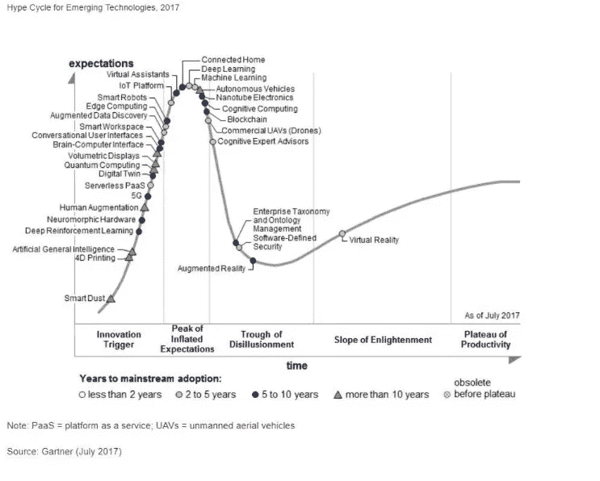

# 将你的未来带到现在的 4 种方法

> 原文：<https://medium.com/swlh/4-ways-to-bring-your-future-to-the-present-8bbe0653beb2>

credit: [https://unsplash.com/photos/LqKhnDzSF-8](https://unsplash.com/photos/LqKhnDzSF-8)

企业家的目标之一是将他们的未来版本带到现在，并带来一个关键的结果。

例如一个目标:

> 一个人应该能够在自己舒适的家中使用智能手机看医生

关键结果:

> 通过使用智能手机上的传感器和数据，自动对三种常见的初级保健就诊情况进行分类

我将探讨的四种方法包括:

*   OKRs ( **目标和主要结果**
*   电影和媒体放映
*   历史周期(计时)
*   祖父母

## OKRs

[衡量什么是重要的](https://www.amazon.com/Measure-What-Matters-Google-Foundation/dp/0525536221/ref=sr_1_2?ie=UTF8&qid=1529764330&sr=8-2&keywords=measure+what+matters)——约翰·杜尔登探索者的新书《okr 如何帮助塑造了许多关键技术公司的基础，包括英特尔、谷歌和……你的公司？

OKR 在公司中的应用允许从上到下进行数据驱动的透明决策。

> 为什么它有助于把你的未来带到现在？

这种方法可以为你的长期愿景设定清晰的结果——这对一个企业家来说是一件困难的事情。

# 电影和媒体放映

未来主义者和幻想家帮助我们潜意识地塑造长期的思维模式——我们回忆起童年与朋友一起看《星球大战》或《星际迷航》的记忆，并希望在某种程度上这是我们创造的未来。

这些电影中的思想和概念拓展了科学和艺术的边界。

作为一名企业家，我发现从这些电影中寻找指导的种子有助于为长期技术路线图(5-10 年)奠定基础。

以增强现实为例:

使用手势控制和平视显示器来改善我们如何更无缝地与计算机交互，这在《少数派报告》等电影中有所体现——我们可以使用这些艺术肖像来框定我们如何利用今天的技术实现这一愿景，以及我们希望在未来实现什么。

# 炒作周期(时机)

这是一个简单的大约 20-25 年的模式，存在于被称为炒作周期的技术中——利用它成为你的优势，毫无疑问它存在于每一种技术中。这是一个 Gartner 炒作周期示例，它将技术置于曲线的当前状态，并预测它们何时会被大规模采用，例如 2-5 年。

每个周期的关键是可用技术的时机和从大公司、小公司和展望未来的人的努力中获得的洞察力。

这一时机可用于几个潜在的结果:

1.融资——有时最好是在**创新触发和期望达到顶峰的时候进行**(一项新技术的潜力会激发人们想要成为其中的一部分)

> 在通往巅峰的路上，错过的恐惧是强烈的

2.**幻灭的低谷**——在这里你可以从一开始向市场展示的所有产品中了解什么是可能的，什么是不可能的——利用这些信息，可以组装出强大的 2.0 或 3.0 版本——苹果在历史上就做得很好——他们从市场中吸取所有的经验教训，组装出一款产品，并在转折点向市场发布——最近的一款是 2015 年的 Apple Watch([现在是该类别的市场领导者](http://fortune.com/2018/03/01/apple-watch-fitbit-wearable-ranking/))。

3.在**期间，启蒙的斜坡和生产力的平台**是真正的企业诞生的地方，这些企业能够持续下去——因为技术给市场带来了真正的好处。这里通常被误判的是整个市场的潜力和经验教训——例如，在可穿戴设备中，人们需要的不仅仅是一个通知中心和一个计数器，他们真的想购买一个产品，这样就可以达到 1 亿或 10 亿用户大关——更不用说你的手机可以作为一个很好的传感器来捕捉关于你健康的相当多的洞察力。

> 你能准确把握产品和愿景的时机吗？

# 祖父母

企业家经常忽视的是他们祖父母的洞察力和知识——他们在生活中已经看到并经历了大约 5-10 个重叠的技术周期——有了这些，他们可以**分享对真正改善生活的东西的洞察力，而不是仅仅是一种时尚。**

总之，我发现 OKRs 是将你的未来版本加速带到现在的最有效的方法——时间是第二位的！

如果你喜欢这篇文章，请鼓掌，谢谢👍

阅读我的上一篇文章:你的管理风格是什么？

## 这篇文章发表在 [The Startup](https://medium.com/swlh) 上，这是 Medium 最大的创业刊物，拥有 338，320 多名读者。

## 在此订阅接收[我们的头条新闻](http://growthsupply.com/the-startup-newsletter/)。

