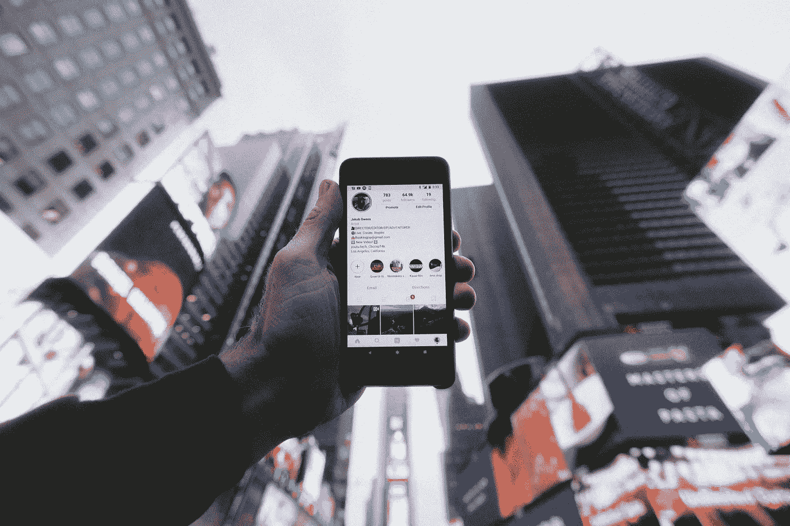

# 在 Instagram 上赚钱的 4 种方法

> 原文：<https://medium.com/swlh/4-ways-to-make-money-on-instagram-d5768fa50a5c>

*在健身等小众领域，受欢迎的有影响力的人每篇帖子可以赚几千美元，最高可达***每场活动 2 万美元。**

**

*Photo by [Jakob Owens](https://unsplash.com/photos/WUmb_eBrpjs?utm_source=unsplash&utm_medium=referral&utm_content=creditCopyText) on [Unsplash](https://unsplash.com/search/photos/instagram?utm_source=unsplash&utm_medium=referral&utm_content=creditCopyText)*

*个人获得的 Instagram 人气开启了广告的新时代。看起来很有美感，设置舞台，在网上代表一个角色是利润丰厚的职业选择，看起来不合理，但实际上非常稳定。以下是你如何驾驭这种力量…*