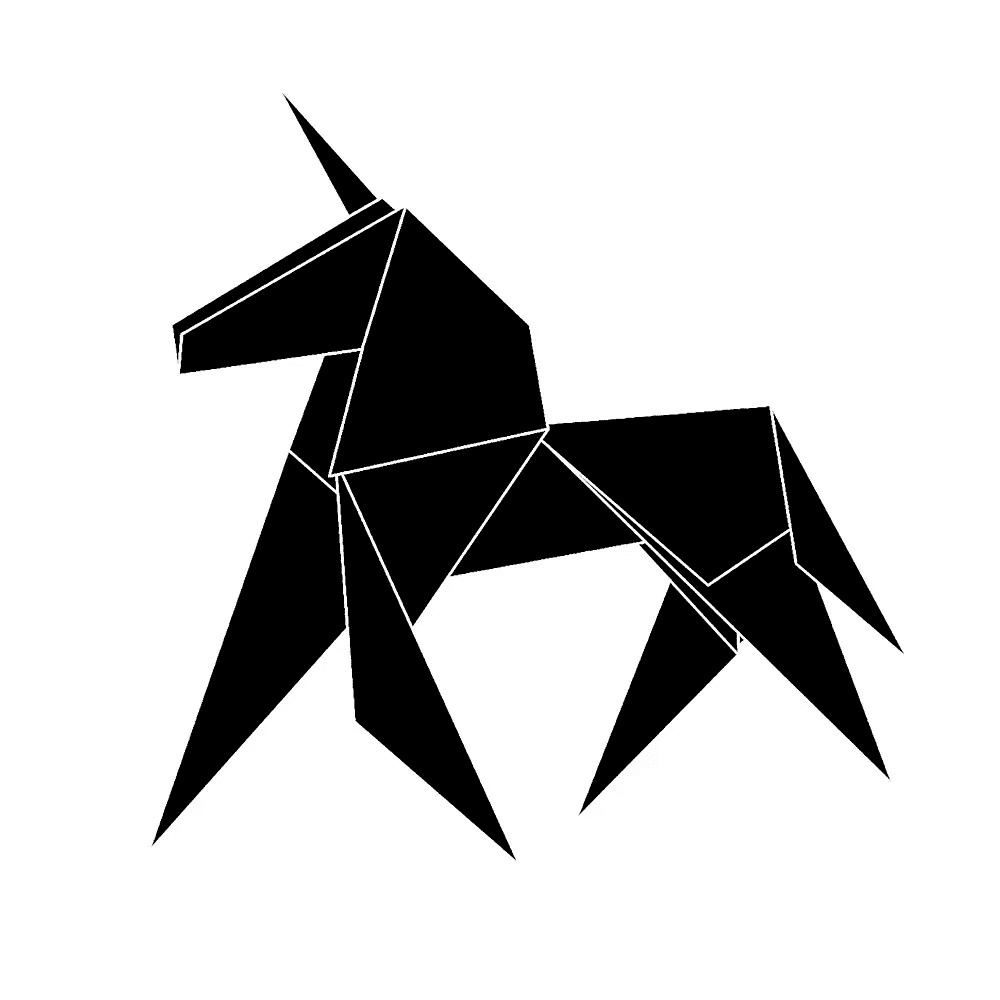

# 每天学习新事物的 40 个神奇地方

> 原文：<https://medium.com/swlh/40-amazing-places-to-learn-something-new-every-day-d90b29225e47>

通过这些很棒的网站和课程，学习新的东西，变得更聪明。

几十年前，当你想学习新东西时，通常意味着每周花几个晚上在当地学校，上无聊的夜校老师的摄影或簿记课。

今天，[学习和个人或职业发展的世界触手可及。开放学习运动使得任何一个有网络连接的人都有机会在业余时间变得更聪明，并且在最近几年得到了迅猛发展。在一个更受欢迎的在线学习网站 Udemy 上，有超过 30，000 门课程可供选择…而这仅仅是一个网站而已！](https://www.inc.com/larry-kim/8-skills-your-child-needs-to-be-the-next-great-entrepreneur.html)

所以我想让你做的是:每天挑战自己学习新的东西。这对你的职业生涯、个人生活和心理健康都有好处，让你总体上变得更快乐、更有效率(T2)。

为了帮助你开始，这里有 40 个学习新事物的好地方:

1.Lynda.com[:那里已经有超过 400 万人参加了课程。](http://www.lynda.com/)

2.你最喜欢的出版物:每天花时间阅读和学习你最喜欢的博客和在线杂志。

3.CreativeLive.com:通过免费的在线课程变得更聪明，激发你的创造力。

4. [Hackaday](http://hackaday.com/) :通过每天提供的小工具学习新的技能和知识。

5.MindTools.com:一个学习领导技能的地方(参见[更多在线学习领导技能的好地方](https://www.inc.com/larry-kim/9-places-to-learn-leadership-skills-for-free.html))。

6. [Codecademy](http://www.codecademy.com/) :从这个著名的在线编码学校学习 Java、PHP、Python 等。

7. [EdX](https://www.edx.org/) :找到大量 MOOCs，包括编程课程。

8.[普拉茨](https://courses.platzi.com/):在营销、编码、应用开发和设计方面变得更聪明。

9.[大思考](http://bigthink.com/):阅读文章，观看由专家“大思考者”主持的视频

10. [Craftsy](http://www.craftsy.com/classes) :从烹饪、编织、缝纫、蛋糕装饰等方面的专家导师那里学习有趣的新技能。

11.Guides.co[:一个大规模的在线指南集合，涵盖了几乎所有你能想到的话题。](http://guides.co/)

12.用免费的在线文学课程实践你对文学的热爱。

13. [Lifehacker](http://lifehacker.com/) :我个人的最爱之一！

14. [Udacity](https://www.udacity.com/) :在 Sebastien Thrun 开发的免费在线大学学习编程。

15.订阅这一大堆有趣的事实、奇怪的新闻和各种主题的文章。

16. [TED Ed](http://ed.ted.com/) :标志性的 TED 品牌带给你值得分享的教训。

17.自学遗传学和进化研究。

18.耶鲁、哈佛和其他顶尖大学分享演讲播客。

19.Livemocha :与 190 多个国家的其他学习者联系，练习一门新语言。

20.麻省理工学院开放式课程:学习入门的编码技巧；另外，[看看这些免费学习编码的地方](https://www.inc.com/larry-kim/9-places-you-can-learn-how-to-code-for-free.html)。

21.每日新视频教你如何做许多不同的事情。

22.加入 300 多万人的行列，学习从健康、历史到自然等各种课程。

23.一个月:用一个月的时间在日常工作中学习一项新技能。

24.[可汗学院](https://www.khanacademy.org/):最大最知名的游戏化在线学习平台之一。

25.[油漆工](http://get.yousician.com/):谁说当你学习新的东西时，它必须与工作相关？

26.Duolingo:一个完全免费、游戏化的语言学习网站([点击此处](https://www.inc.com/larry-kim/9-places-to-learn-a-new-language-online-for-fre.html)查看更多语言学习网站)。

27.与其他创意者一起获得创意。

28.一种订阅服务，每天向你的邮箱发送五分钟的课程。

29.能够快速阅读该有多酷？

30.变得更聪明，扩大你的词汇量。

31. [HTML5 Rocks](http://www.html5rocks.com/en/) : Google pro 贡献者为你带来 HTML5 的最新更新、资源指南和幻灯片。

32.[维基百科的每日文章列表](http://lists.wikimedia.org/mailman/listinfo/daily-article-l):让维基百科的每日特色文章直接发送到你的收件箱。

33. [DataMonkey](http://datamonkey.pro/) :处理数据的能力不可或缺。学习 SQL 和 Excel。

34.塞勒学院:提供一个很棒的公共演讲课程，你可以在网上学习，点击这里查看更多免费的公共演讲课程。

35.烹饪技巧:学习基本到高级的食物准备和烹饪技术。

36.快乐计划:为什么不学习如何变得快乐？我愿意每天花五分钟来做这件事！

37.Learni.st :专业策划课程，提供优质内容选项。

38.表面语言:如果你只是需要学习一些旅行用语，这是个不错的选择。

39.[学术地球](http://academicearth.org/):自 2009 年开始提供高质量的大学水平的课程。

40.[制作](http://makezine.com/):学习如何做你一直想做 DIY 项目。

没有理由你不能每天学习新的东西，无论是工作技能还是有趣的新爱好，甚至是一门语言！你有最喜欢的学习新事物的地方吗？在评论中分享你的。

# 做驴海里的独角兽

获取我的最佳独角兽营销和创业成长秘诀:

1. [**报名直接发到你邮箱**](https://mobilemonkey.com/blog-subscription)

**2。** [**通过 Facebook Messenger 注册偶尔的 Facebook Messenger 营销新闻&提示。**](http://m.me/447438332063924?ref=e58448cdd16367419b279793544e132f5388067506f92c92e6)

**关于作者**

拉里·金是全球最好的 Facebook Messenger 营销平台提供商 MobileMonkey 的首席执行官。他也是 WordStream 的创始人。

你可以在 [Facebook Messenger](http://m.me/447438332063924?ref=e58448cdd16367419b279793544e132f5388067506f92c92e6) 、 [Twitter](https://twitter.com/larrykim) 、 [LinkedIn](https://www.linkedin.com/in/larrykim) 、 [Instagram](https://www.instagram.com/kim_larry/) 上和他联系。

最初发表于[Inc.com](https://www.inc.com/larry-kim/40-amazing-places-to-learn-something-new-every-day.html)