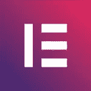

# 41 个将改变你生活、工作和学习方式的伟大工具

> 原文：<https://medium.com/swlh/41-great-tools-that-will-change-the-way-you-live-work-and-learn-aacd38e9ee8b>

## 生活设计师的工具包

“A displayed content of a toolkit displayed showing tools like hammer, axe, box cutter, iron and flashlight” by [Todd Quackenbush](https://unsplash.com/@toddquackenbush?utm_source=medium&utm_medium=referral) on [Unsplash](https://unsplash.com?utm_source=medium&utm_medium=referral)

*注意:在你开始之前，我想告诉你，下面的一些链接是附属链接。这意味着如果你通过我的链接购买物品，我将赚取佣金。你不会被收取任何额外的钱。事实上，你甚至可以通过我的链接获得折扣优惠。所以，如果你相信我的工作并想支持我，我会很感激你使用我的链接。我只推广我信任的产品。尽情享受吧！*

我将工具列表分为以下四个部分:

*   工作优化
*   健康优化
*   写作、博客和品牌
*   学问

# 工作优化

# 1. [Evernote](https://designepiclife.com/evernote)

[Evernote](https://designepiclife.com/evernote) 是我的随身笔记应用。我用它来捕捉我稍纵即逝的想法，保存个人文档，写下书本或课程的笔记。最棒的是，即使我在纸上写笔记，我也可以从 Evernote 移动应用程序扫描页面，文本神奇地变得可以搜索了！这意味着当我搜索 Evernote 时，它也会检测和搜索我写的笔记。Evernote 是救星。

# 2.特雷罗

无论你是在团队工作还是有个人项目(或目标)，Trello[都是组织、管理和完成事情的最佳工具之一。它不需要任何技能就可以开始使用，而且非常容易使用。](https://designepiclife.com/trello)

我通过 Trello 管理我所有的 [*设计史诗人生*](http://designepiclife.com/) 相关工作。

# 3.诺兹贝

组织项目或生活的另一个选择(这也是我喜欢的)是 [Nozbe](https://designepiclife.com/nozbe) 。它有不同的风格，所以它真的取决于你的喜好。我建议你免费试用，并坚持使用你理解和喜欢的应用程序。

# 4.[神童排行榜](https://designepiclife.com/wunderlist)

Wunderlist 是一款令人惊叹的、易于使用的任务列表应用。当我用[特雷罗](https://designepiclife.com/trello)来管理‘设计史诗般的生活’的大画面时，我用神童列表来管理手头的任务。如果我想的话，我可以只使用一个应用程序，但是两个独立的应用程序可以让任务保持清晰和整洁(而且它可以让我保持理智)。

# 5.[懈怠](https://designepiclife.com/slack)

Slack 是团队协作和聊天的终极工具。有团队项目吗？请使用 slack(不要使用 Facebook Messenger 或任何休闲聊天应用程序！).它保持对话有组织，并提供简单的文件共享功能。它随着应用程序和机器人不断发展，所以快来吧！

# 6.[工作流程](https://designepiclife.com/workflowy)

[Workflowy](https://designepiclife.com/workflowy) 让你整理思路。最好是把大想法分解成小块，这样你就可以一次专注于一个，而不是感到不知所措。在写博客之前，我用它来组织我的博文。你可以用它来做几乎任何需要思考的事情。

# 7.[收件箱](https://designepiclife.com/inbox)

如果你有谷歌邮箱，你可能会用 Gmail 来查看邮件。收件箱是谷歌的一款应用程序，它让查看和处理电子邮件变得更加方便。最棒的是，它把电子邮件变成了任务，你可以在瞬间检查、锁定或删除，这对于感受完成事情的回报是非常棒的。

# 8.[聚焦我](https://designepiclife.com/focusme)

你知道当你被网络上的各种干扰搅得心烦意乱时，集中精力工作有多难。幸运的是，你不必依靠意志力来集中注意力。您可以使用 [FocusMe](https://designepiclife.com/focusme) 简单地屏蔽令人分心的网站，直到您完成工作。它可以在 Windows、Mac 和 Android 上运行。

# 9.[自由](https://designepiclife.com/freedom)

自由是 T2 焦点的替代物。值得注意的区别是，它可以在 Windows、Mac 和 iOS 上运行。因此，如果你有 iPhone，这是一个很好的选择，但如果你有 android，FocusMe 是一个更明智的选择。如果你想要一个免费的屏蔽网站的选择(Mac 版)，你可以使用[自控](https://designepiclife.com/selfcontrol)。

# 10.[救援时间](https://designepiclife.com/rescuetime)

免费版的[拯救时间](https://designepiclife.com/rescuetime)可以让你追踪你在互联网上是如何度过时间的，并给你详细的报告，你可以用它来进行自我评估。在升级时，你也可以设置“聚焦时间”来阻止令人分心的网站。它可以在除 iOS 之外的任何设备上运行。

# 11.[托米蒂](https://designepiclife.com/tomighty)

如果你很难集中注意力，试试用[to minghty](https://designepiclife.com/tomighty)应用程序玩番茄工作法。番茄工作法的要点是:当你有一个大任务或一系列任务时，把工作分成短时间的间隔(称为“番茄工作法”)，用短暂的休息来隔开。

# 12.[焦点@意志](https://designepiclife.com/focusatwill)

如果你是学生、企业家、程序员或有创造力的人；你必须试一试。他们有最好的声音和音乐来帮助你变得富有成效，并根据你的意愿进行激光聚焦。随时随地收听并完成工作。

# 健康优化

# 13.[虹膜](https://designepiclife.com/iris)

如果你在电脑上工作，你需要这个。屏幕发出的蓝光不仅会损害你的视力，还会扰乱你的生理节奏，从而导致睡眠问题。然后，睡眠问题会引发你想远离的慢性病。所以相信我，买 [IRIS](https://designepiclife.com/iris) 或者 [f.lux](https://designepiclife.com/flux) 和 [Twilight](https://designepiclife.com/twilight) (安卓)。

# 14.[洞察力](https://designepiclife.com/insight)

[Insight](https://designepiclife.com/insight) 是一款超级简单的冥想 app。你可以做定时冥想或引导冥想，与人交流——都是免费的。我已经尝试了很多冥想应用，但是没有灵丹妙药。只是呼吸，观察或者引导你的思维。

# 15. [Cronometer](https://designepiclife.com/cronometer)

虽然有很多卡路里追踪应用程序，但迄今为止， [Cronometer](https://designepiclife.com/cronometer) 是我最喜欢的一个。除了跟踪你的宏量营养素概况，它还提供了微量营养素的详细信息，这样你就可以知道你是否在吃营养丰富的食物。你可能会惊讶地发现你可以修复的缺陷。

# 16.[强](https://designepiclife.com/strong)

如果你进行力量训练(因为它的巨大好处，你应该这样做)，使用[强大的应用](https://designepiclife.com/strong)跟踪你的训练。它可以让您轻松查看进度，并记录您可以轻松访问的锻炼日志。

# 17.[睡眠周期](https://designepiclife.com/sleepcycle)

如果有一个“生活帮”是你正在寻找的，那么它就是更好的睡眠。你的身体会在睡眠中恢复，良好的睡眠对于高效工作和集中注意力至关重要。使用[睡眠周期](https://designepiclife.com/sleepcycle)来跟踪你的睡眠，这样你就可以改善它。我注意到，在过去的几个月里，我的深度睡眠(这对恢复至关重要)有所改善。

# 18.[白噪声](https://designepiclife.com/whitenoise)

你有没有想过为什么风扇的噪音会让你睡得更快更好？白噪音应用程序让你播放有助于睡眠的音乐。它有很多选项，包括雨声、风扇声、自然声、白噪音、粉红噪音等等。

# 19.[睡眠面膜](https://designepiclife.com/sleepmask)

正如睡觉时阻挡外界噪音很重要一样，阻挡光线也同样重要。理想情况下，你想睡在漆黑的黑暗中获得最佳睡眠。高质量的睡眠面膜可以帮你做到这一点。

# 写作、博客和品牌

# 20. [Wordpress](https://designepiclife.com/wordpress)

如果你想完全控制你的网站，WordPress.org 是最好的平台。你不需要学习如何编程。这个平台有大量的插件，可以帮助你定制你想要的博客或网站。

# 21.[场地](https://designepiclife.com/siteground)

如果你选择 WordPress 作为你的平台，你需要一个可靠的主机。当我开始我的网站，我深入研究了不同的主机。最后还是用了 [SiteGround](https://designepiclife.com/siteground) 一点都不后悔。它便宜、快捷、安全。他们的客户支持非常出色。我从来没有给他们的客服评分低于 5 星。

# 22.[元素或](https://designepiclife.com/elementor)

通常，你需要技术知识来进一步定制你的 WordPress 站点，或者你会满足于你的主题创建者设置的规则。但是现在，你可以用[elements 或](https://designepiclife.com/elementor) page builder 自由定制你的网站。你只需要拖放就可以为你的网站设计出独特的风格。

# 23.[邮件地址](https://designepiclife.com/mailerlite)

接下来，你需要一种方法来建立你的电子邮件列表。如果你只是刚刚起步，你不需要花巨资购买更先进的电子邮件营销软件。像我一样，你可以从 [MailerLite](https://designepiclife.com/mailerlite) 开始，这是一款价格合理的产品，并且拥有你一开始可能需要的所有功能。

# 24.[首页](http://leadpages.pxf.io/c/1255678/466534/5673)

如果你正在创业，并且有预算投资一个易于使用且高质量的登录页面生成器，那么 [LeadPages](http://leadpages.pxf.io/c/1255678/466534/5673) 就是你需要的工具。它使用起来非常简单，并且可以很好地与其他服务集成。

# 25.[点击漏斗](https://designepiclife.com/clickfunnels)

[点击渠道](https://designepiclife.com/clickfunnels)是轻松建立销售渠道的最佳选择。有了点击漏斗，你甚至可以创建自己的网站和课程。因此，如果您有预算，请选择这款一体式解决方案。

# 26. [Wix](https://designepiclife.com/wix)

[Wix](https://designepiclife.com/wix) 是一个简单的网站构建器，专门为那些想在网上建立自己的作品集的人使用。因此，如果你是一个专业人士或创意者，不想处理托管的麻烦，那么使用 Wix 来拖放或使用人工智能来立即建立你的网站。

# 27.[语法上](https://designepiclife.com/grammarly)

当我写作时，我会犯可怕的语法错误，因为我不想因为同时关心语法而打断我的写作。谢天谢地，在你读我的文章之前，我用[语法上的](https://designepiclife.com/grammarly)来编辑我的文章。每次都救了我。

# 28.[编程助手](https://designepiclife.com/prowritingaid)

如果你写东西，ProWritingAid 是另一个救命稻草。无论你写的是休闲博客还是专业学术论文，ProWritingAid 都会给你定制的建议来提高你的写作水平。

# 29. [Snappa](https://designepiclife.com/snappa)

如果你想像专业人士一样设计图像或演示文稿，而不需要购买或学习 Photoshop， [Snappa](https://designepiclife.com/snappa) 将助你一臂之力。与网络上的其他图形工具相比，Snappa 给了我迄今为止最好的体验。

# 学问

# 30.[技能分享](https://designepiclife.com/skillshare)

Skillshare 是一个在线课程平台，在这里你可以找到几乎任何技能的课程。它涵盖了创造力、商业、生活方式和技术方面的课程，所以无论你想学习什么新技能，Skillshare 都能满足你。通过我的链接，您可以免费获得 2 个月的 Skillshare premium。

# 31.[可听](https://designepiclife.com/audible)

你知道读书有多重要。但问题是你在忙碌的生活中可能没有时间看书。这就是 audible 的用武之地，你可以在通勤、打扫卫生、吃饭、做饭、散步或做任何被动活动时听有声读物。在 [Audible](https://designepiclife.com/audible) 获得免费一个月和两本您选择的免费有声读物。

# 32. [Kindle](https://designepiclife.com/kindle)

实体书占据了很大的空间和重量。我喜欢阅读实体书，但我并不总是买它们，因为那里有太多的书了。解决办法是买一个 [Kindle Paperwhite](https://designepiclife.com/kindle) ，它就像你的个人图书馆，没有拥有实体书的麻烦。我喜欢 Kindle 的屏幕没有眩光，所以它像纸一样。

# 33.[口袋](https://designepiclife.com/pocket)

我又爱又恨[口袋](https://designepiclife.com/pocket)。我喜欢它，因为它让我保存文章，以便以后阅读。我讨厌它，因为它让我很容易拖延阅读文章(我可能永远不会回来)。所以，我试着留意这一点。

# 34.[视频速度控制器](https://designepiclife.com/videospeedcontroller)

虽然你可以控制 YouTube 视频的速度，但你不能总是加快网络上所有视频的速度。这很烦人，因为你的时间少了，你想更快地观看视频。有了[视频速度控制器 Chrome 扩展](https://designepiclife.com/videospeedcontroller)，就不再是问题了。

# 35. [TTS 阅读器](https://designepiclife.com/ttsreader)

如果你像我一样，你会花很多时间在电脑前。虽然我喜欢阅读文章，但有时，我的眼睛盯着屏幕实在是太累了。然后，我用 [TTS 阅读器](https://designepiclife.com/ttsreader)听文章。你也可以用它来“快速阅读”文章，因为两种输入(阅读和听力)可以提高你的注意力和阅读速度。

# 36.[卡米](https://designepiclife.com/kami)

如果你使用 read PDF 文件，那么 [Kami Chrome 扩展](https://designepiclife.com/kami)就是为你准备的。它可以让您高亮显示并在 PDF 上写笔记，以便您可以阅读文档、做笔记并保存它们。此外，它与 Google Drive 配合使用效果很好。

# 37.[饲料地](https://designepiclife.com/feedly)

你喜欢阅读博客，但是你如何在不订阅所有博客的情况下与如此多的博客保持联系呢？ [Feedly](https://designepiclife.com/feedly) 是你可以订阅博客订阅源的答案，所以每次你打开应用程序，你都会看到你最喜欢的博客的最新更新。

# 38. [Blinkist](https://designepiclife.com/blinkist)

Blinkist 是我阅读或聆听书籍摘要的最佳资源。不可能读完每一本好书。所以，加速你学习的最好方法是在深入的书籍摘要中吸取书中最重要的观点。

# 39.[12 分钟](https://designepiclife.com/12min)

12min 是另一个阅读和听书摘要的 app。我推荐 Blinkist[和](https://designepiclife.com/blinkist)[12 分钟](https://designepiclife.com/12min)的原因是，从不同的摘要中重新学习是你从书中获取更多信息的最好方法之一。*注意:当你进入网站时，向下滚动并选择英语来改变语言。*

# 40.[获取摘要](https://designepiclife.com/getabstract)

Getabstract 是终身学习的另一个重要资源。主要的区别在于它不仅提供书籍摘要，还提供其他信息材料的摘要，如文章、报告和视频。

# 41. [Optimize.me](https://designepiclife.com/optimize)

如果你想超越书籍总结，从最好的书籍中获得最好的学习体验，那么只需看看 [Optimize.me](https://designepiclife.com/optimize) 。Brian(创始人)在为你提供材料方面做得最好，比如大师班、智慧包、哲学家笔记(来自书本的笔记)、+1s(每日短视频)，这样你就可以达到精通并优化自己。

就是这样，伙计们！

> 请在评论中告诉我你喜欢什么工具。

我会通过下面的链接不断更新这个列表:

 [## 生活设计师的工具包|设计史诗般的生活

### 生活设计师设计他们史诗般的生活所需的工具和资源列表。它包括以下工具…

designepiclife.com](https://designepiclife.com/tools) 

**如果您想获得更新通知，您可以前往 DesignEpicLife.com****注册我的简讯**

****

## **这篇文章发表在 [The Startup](https://medium.com/swlh) 上，这是 Medium 最大的创业刊物，有 348，974 人关注。**

## **订阅接收[我们的头条新闻](http://growthsupply.com/the-startup-newsletter/)。**

****