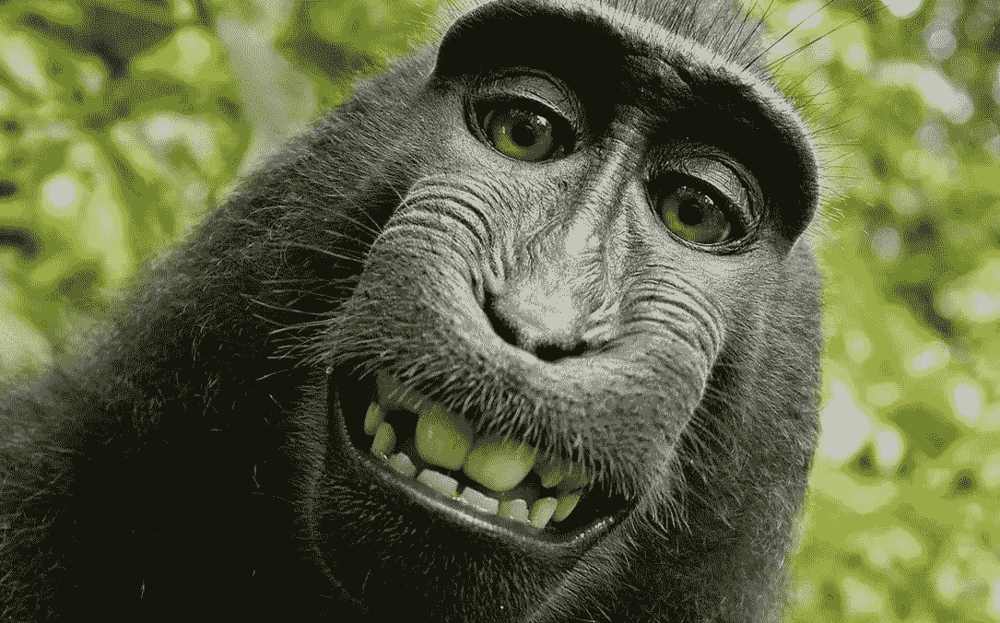

# 为了更快乐的 2020 年，你应该说“不”的 41 件事

> 原文：<https://medium.com/swlh/41-things-you-should-say-no-to-for-a-happier-2019-1b972e2448f9>

很多人认为幸福就是对正确的事情说“是”。这是硬币的一面。有许多我们说“是”的事情，我们真的应该说“不”。

为了更快乐的 2020 年，试着对以下事情说“不”:

# 个性

## 1.平常