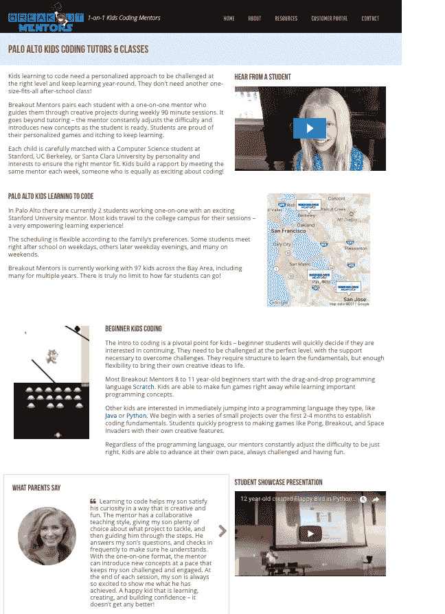

# 21 天内 486 个独特的登录页面

> 原文：<https://medium.com/swlh/486-unique-landing-pages-in-21-days-aa1a085fd132>


在我高中的最后一年，我大量使用了我在谷歌文档中关于 command-option-M 热键的知识——花了几个小时坐在 Coupa 咖啡馆为校报编辑文章。现在，在使用 Google Apps 脚本以编程方式创建了数百个登录页面之后，我可以很舒服地说，我比如何在文档上添加注释知道得多一点。

2017 年初，我作为一名 10 岁的 [Nueva](http://www.nuevaschool.org/) 学生的 Java 导师加入了 [Breakout Mentors](https://breakoutmentors.com/) 。创业后不久，Breakout Mentors 的创始人布莱恩问我暑期实习的前景。我有两个主要关注点:领导家庭编码阵营和以编程方式创建定制的登录页面。第一个，虽然对我这个编码导师和以前的夏令营辅导员来说很有趣，但却是另外一个故事。第二，是本文的主题。

我希望为任何希望获得高度个性化服务的企业提供一个案例研究。

## 独特的挑战

突破导师为 8 至 15 岁学习编程的孩子提供长期一对一的指导。以适当的难度挑战每个学生并允许他们发挥创造力是高度个性化的。从营销的角度来看，这证明了代表我们提供的所有独特服务(任何编码语言、年龄、湾区城市)具有挑战性。

这个问题在今年夏天之前的一些测试搜索中非常明显。与我们提供的内容非常匹配的搜索词(例如“儿童 java 编码导师”或“伯克利儿童编码”)排名很差，导致一个通用页面。

面临的挑战是创建独特的页面，更准确地描述突破导师许多个性化服务。

## 选择策略

为了寻找一点灵感，我们向[的凯西·温特斯](http://caseyaccidental.com/)和他为 Grubhub 所做的开拓性成功营销寻求帮助。

Grubhub 的送餐服务提供了一个绝佳的机会，可以汇总数千个城市的餐厅数据。在创业之初，Grubhub 有一个基本的主页，有一个基本的搜索工具。因此，我对“帕洛阿尔托中餐外卖”和“旧金山汉堡”的搜索将被发送到一个通用页面。Grubhub 能够以编程方式为几乎任何独特的食物和位置搜索创建一组看似无限的登录页面。现在我被发送到一个高度聚焦的页面，是关于帕洛阿尔托华人和旧金山汉堡的。

让我们将 Grubhub 登录页面模型应用于突破导师。如果我在这个项目实施之前搜索了“10 岁的 python 编码营”(在搜索结果中挖掘了很多之后)，我会被引导到我们的主页。

按照 Winters 的想法，我们将创建一个独特的页面，包含关于 10 岁学生、Python 编程语言和 camp 格式的相关信息。

## 个性化服务变量的确定

首先，考虑一下你的定制业务的所有变量。

我们首先创建一个电子表格，其中包含“谁”、“描述”和“格式”列。然后，我们用一些基本的谷歌脚本尝试了各种组合，删除了很多基本关键词(我们一开始有 10，000 多个)，又添加了几个，最终有了一个包含 486 个搜索词的综合列表。


Selections of our finalized base keywords and complete search term combinations.

需要澄清的是:这些关键词并没有被用作简单的文本插入，目的是“欺骗”谷歌提高我们的排名。相反，它们允许自动选择范围广泛的内容，从而为潜在客户提供最相关的页面。然而结果是一样的——搜索排名大幅提高！



## 创建内容

一旦我们看到所有关键字的组合，我们就对可直接应用的内容和数据类型有了更好的了解:

*   段落和 gif 来概述学生对给定语言的典型项目顺序
*   我们辅导的孩子的人口统计数据(年龄、性别、语言和城市)
*   与年龄、语言和地点相匹配的证明和视频
*   位置页面的相关地图
*   解释学习编程的女孩如何在突破导师的帮助下茁壮成长的文本

我们首先从客户管理系统 [Close.io](https://close.io/) 收集数据。我们创建了一个 Google 脚本来进行 API 调用，并用我们需要的数据填充电子表格。

接下来是耗时但非常重要的任务，为页面上每个可能的组件编写文本。我们有 11 个独特的段落，每一页包括 2 或 3 个相关的段落。自始至终，我们确保为年龄、性别或城市数据上的相关短语插入留出位置，以使每个搜索词的页面尽可能独特。

其他两个主要的内容来源，证明和视频，通过相关的关键字进行分类，这样我们的脚本就可以确定最相关的媒体。

This video was categorized as Python, 12 Year-Old, 13 Year-Old, 7th grader, Middle school.

## 导出 HTML

一旦我们有了独立的部分，我们只需将它们组合成完整的 HTML 页面。对于每个页面，我们用标题、HTML 内容和元描述(也是唯一自动生成的)填充了一个电子表格。这段代码真的不难完成，尽管 Google Scripts 有一点繁琐，最多运行 5 分钟。我们必须利用谷歌定时触发器来真正实现登陆页面创建的自动化:

```
function runProcessDialog(){
  var value = Browser.msgBox(‘Run process?’, ‘Would you like to  update data?’, Browser.Buttons.YES_NO);
  if (value == “yes”){
    startTrigger();
  }
}function startTrigger() {
  if (ScriptApp.getProjectTriggers()[0] == “FUNC_NAME”)
    ScriptApp.deleteTrigger(ScriptApp.getProjectTriggers()[0]);

  var trig = ScriptApp.newTrigger(“FUNC_NAME”);
  trig.timeBased().everyMinutes(5).create();
}
```

我们在电子表格中指定了某些单元格来跟踪我们正在处理的数据的索引。在运行时，索引从该单元格中取出，不断更新，然后在完成后重置。

在我们有了完整的电子表格之后，我们能够非常容易地用下面的代码片段为每个页面生成 JSON 文件:

```
var jsonResult = ‘{“title”: “‘ + TITLE +’”, “page_data”: “‘+HTML+’”, “meta_desc”: “‘+META+ ‘“}’;var blobJson = Utilities.newBlob(jsonResult).getDataAsString();DIRECTORY.createFile(TITLE + “.json”, blobJson);
```

## 在 Wordpress 网站上线

Wordpress 占据了互联网 28.7%的份额，突破导师网站就是其中之一。Wordpress 不是提供静态的 HTML 文件，而是一个内容管理系统，它从数据库中提取信息来动态创建每个页面。这让项目变得有点复杂，因为我们必须将我们的内容放入 Wordpress 数据库。

我们环顾四周，发现了几个类似项目的优秀例子。一小段来自[的代码从 CSV 数据](https://www.sitepoint.com/programmatically-creating-wordpress-posts-from-csv-data/)编程创建 WordPress 帖子，一小段来自[的代码从 Wordpress 插件](http://jafty.com/blog/tag/programmatically-adding-pages-to-wordpress/)编程添加页面，一些我们自己的调整，很快我们就创建了一个 Wordpress 插件。

这个插件在一个特定的文件夹中查找 486 个 JSON 文件(我们通过 FTP 发送到服务器)，并将它们添加到 Wordpress 数据库中。你想在你的网站上测试一个从未使用过的插件吗？见鬼不！

幸运的是, [WP 引擎](http://www.shareasale.com/r.cfm?b=394686&u=1616344&m=41388&urllink=&afftrack=)使得对一个在线 Wordpress 网站做出令人害怕的改变变得非常容易。有一个按钮可以将实时网站复制到临时安装中。在 staging 上进行更改和测试，然后有一个按钮可以让 staging 成为 live 网站。考虑到有一次一些混乱的代码破坏了我们的安装，我们很高兴我们使用了这个特性。

一旦一切都确定下来，只需按一下按钮就可以创建数百个独特的页面！

## 结果呢

突破导师现在有 486 页的每个方面，我们的个性化服务。谷歌更好地理解了我们提供的内容，提升了我们对大量相关术语的搜索地位。看看之前和之后的几个关键搜索:


Nine search terms to represent a sampling of our various types of pages.

通过这个项目，我学到了很多关于 Google Apps 脚本的知识，并且相信它对于任何营销人员来说都是一个重要的工具。突破导师现在能够有效地向潜在客户传达我们独特的服务。营销不就是这样吗？

## Wordpress 插件代码

```
<?php
/*
  Plugin Name: Breakout Mentors JSON Page Importer
  Description: A custom Breakout Mentors plugin to import JSON files  into pages
  Version: 1.0
  Author: Brian Skinner
  License: GPL2
*/
/**
 * Create and insert page from JSON files
 */
function import_json_data() {
  // Get the data from all those JSON files!
  $posts = function() {
  $data = array();
  $errors = array();
  // Get array of JSON files (/json_data should be inside uploads folder)
  $files = glob( wp_upload_dir()[“basedir”] . “/json_data/*.json” );foreach ( $files as $file ) {
    // Attempt to change permissions if not readable
    if ( ! is_readable( $file ) ) {
      chmod( $file, 0744 );
    }
    if ( is_readable( $file ) ) {
      $post = array();$string = file_get_contents( $file );
      $json_a = json_decode(prepareJSON($string), true);$post[“title”] = $json_a[“title”];
      $post[“page_data”] = $json_a[“page_data”];
      $post[“meta_desc”] = $json_a[“meta_desc”];$data[] = $post;
    } else {
      $errors[] = “File ‘$file’ could not be opened. Check the file’s permissions to make sure it’s readable by your server.”;
    }
  }
  if ( ! empty( $errors ) ) {
    error_log( print_r($errors, true) );
  }
  return $data;
};foreach ( $posts() as $post ) {
  $page_check = get_page_by_title($post[“title”]);

  if(isset($page_check->ID)){
    //Update the post in the database
    wp_update_post( array (
      “ID” => $page_check->ID,
      “post_title” => $post[“title”],
      “post_content” => $post[“page_data”],
      “post_type” => “page”,
      “post_status” => “publish”
    ));//update the meta description
    update_post_meta($page_check->ID, “_yoast_wpseo_metadesc”, $post[“meta_desc”]);
  } else {
    // Insert the post into the database
    $post[“id”] = wp_insert_post( array(
      “post_title” => $post[“title”],
      “post_content” => $post[“page_data”],
      “post_type” => “page”,
      “post_status” => “publish”
    ));

    //set the meta description
    add_post_meta($post[“id”], “_yoast_wpseo_metadesc”, $post[“meta_desc”]);
  }
}
}
register_activation_hook(__FILE__, ‘import_json_data’);
?>
```


## 这篇文章发表在《T8 创业》(The Startup)杂志上，这是 Medium 针对企业家和创业公司的领先出版物。

# 加入+12，417 名[在此](http://growthsupply.com/the-startup-newsletter/)获得头条新闻的人。

