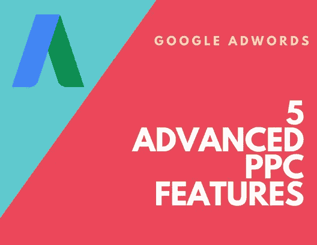

# 5 个先进的 Google AdWords 功能来提高你的点击付费

> 原文：<https://medium.com/swlh/5-advanced-google-adwords-features-to-enhance-your-ppc-89acfdfd3fc4>

## 在这篇文章中，我们总结了五个可以帮助你获得重要竞争优势的高级特性。

**Google AdWords 是品牌与客户互动的高效营销渠道。**

**基于拍卖的点击付费(PPC)模式彻底改变了广告业，但在这种诱人的简单投入产出关系之下，隐藏着一项高度复杂的技术。**

在过去的 12 个月里，Google AdWords 经历了一系列的变化，有些是表面上的，有些是功能上的。谷歌的主要收入驱动因素有一个新的直观的外观和感觉，使营销人员更容易评估业绩和发现新的机会。

New AdWords user interface

在引擎盖下，AdWords 是一些越来越复杂的机器学习技术的家园。从出价调整到受众行为，甚至搜索意图，现在都由机器学习算法进行分析，以提高广告针对性和性能。

所有这些都在改变我们开展搜索活动的方式，很大程度上是朝着更好的方向。

与此同时，有一些大的趋势继续向搜索靠拢。声控数字助理、视觉搜索和持续增长的电子商务都围绕着谷歌的搜索引擎。

在谷歌和这些新兴趋势的交汇点上，[付费搜索将会发展](https://searchenginewatch.com/2018/02/05/automation-adwords-and-amazon-ashley-fletcher-on-the-future-of-ppc/)，接触受众的新方式将会出现。

虽然这种对未来的展望揭示了这个行业是多么令人兴奋，但营销人员也需要牢牢地盯着现在。

目前，AdWords 提供了大量的功能，所有这些功能都会影响竞选活动的效果。尽管自动化正在接管账户日常运营的更多方面，但可以说，现在比以往任何时候都更需要经验丰富的付费搜索专家，他们知道如何充分利用这个平台。

以下是五个先进的 AdWords 功能，可以促进任何点击付费活动。

# 人口统计目标

尽管 AdWords 有诸多优点，但就人口统计目标选择的数量而言，它还无法与脸书匹敌。

作为谷歌正在进行的从关键词聚焦到以客户为中心的方法转变的一部分，人口统计目标已经有了非常显著的改善。

这一功能现在允许广告商根据收入和父母身份以及性别和年龄来锁定客户。按收入定位仅适用于视频广告，目前仅限于美国、日本、澳大利亚和新西兰。

尽管如此，这是一个值得注意的更新，并提供了许多品牌都会欢迎的高级功能。

现在可用的选项包括:

> **针对搜索、展示或视频活动的人口统计目标:**
> 
> **年龄:**“18-24 岁”、“25-34 岁”、“35-44 岁”、“45-54 岁”、“55-64 岁”、“65 岁或以上”以及“未知”
> 
> **性别:**“女”、“男”、“未知”
> 
> 展示或视频活动的人口统计目标包括:
> 
> **父母状态:**“父母”、“不是父母”和“未知”
> 
> 视频活动的人口统计目标包括:
> 
> **家庭收入(目前仅适用于美国、日本、澳大利亚和新西兰):**“前 10%”、“11-20%”、“21-30%”、“31-40%”、“41-50%”、“后 50%”和“未知”

与改进的用户界面相结合，这可以产生一些有启发性的报告，这些报告突出了我们在这个平台上从未见过的关于受众的更多细节。

它还不完美，在实践中还有一些缺点，因为在组合不同的过滤器时，创建观众可能是相当劳动密集型的。尽管如此，人口统计目标正在改善，并将成为谷歌今年的重点领域。

这篇关于[人口统计目标](https://searchenginewatch.com/2017/04/20/how-to-use-googles-new-demographic-targeting-for-search-ads/)的文章更详细地介绍了如何设置这一功能。

# 点击呼叫

移动搜索增长的一个非常自然的副产品是付费搜索呼叫数量的激增。

事实上，BIA/凯尔西预测，到 2019 年，智能手机给企业打电话的次数将达到 1620 亿次。

搜索是这种品牌-消费者关系的基本组成部分，因此可以理解的是，企业渴望确保它们能够利用这种提高的需求。

点击通话可能是一个被忽视的机会，因为它确实需要一点设置。如果广告客户希望添加呼叫分机，专门报告这一活动，甚至安排这些分机何时出现，就必须在 AdWords 内手动进行。

有益的是，现在可以在一个账户中启用电话分机，简化了曾经繁琐的工作。

在某些方面，这正在成为一个自动化的过程，谷歌将识别包含电话号码的登录页面，并使用这些信息生成呼叫分机。但是，需要一些手动输入才能充分利用该功能。

这份[逐步指南](https://searchenginewatch.com/sew/how-to/2424558/is-it-time-to-add-click-to-call-campaigns-to-your-adwords-arsenal)包含了一系列方便的提示，适用于希望开展点击呼叫营销活动的营销人员。

# 优化的广告轮换

谷歌在 2017 年下半年对其广告轮换设置进行了一些非常显著的改变。

实质上，广告轮换不断测试不同的广告变体，以找到最适合您的受众和活动 KPI 的版本。

谷歌的机器学习技术是完成这一任务的天然选择，因此谷歌希望将广告轮换过程从广告商手中夺走，并将其转变为一项巧妙的自动化功能也就不足为奇了。

也许这种对机器学习方面的关注让广告商认为这个过程现在不需要他们的输入。

Marin Software 最近对其庞大的客户群进行的一项研究发现，许多广告组包含的创意少于三个:

Marin Software research shows low adoption of 3+ creatives per ad group

这非常重要，因为谷歌建议在每个广告组中至少提供三个广告。他们的官方立场是，“我们的系统可以选择的广告越多，预期的广告效果就越好。”

创建一系列广告为谷歌提供了进行统计显著性测试所需的资源。无论机器学习算法有多复杂，在每组只有一两个广告的情况下，它们几乎无法提高性能。

除了最大限度地利用 AdWords 功能之外，这里还有一个更广泛的教训。

即使是最先进的技术也需要投入的正确数量和质量。虽然越来越多的 AdWords 管理元素可以实现自动化，但这并不意味着我们可以让机器自行其是。

我们仍然需要遵循大量的最佳实践。通过在每组中包含至少 3 个广告来优化你的广告轮换，当然也算其中之一。

# 自定义目标受众

谷歌显然正在尝试更多传统的“漏斗顶端”营销方式。

通过谷歌展示网络推出更精细的定制意图受众，是通过对目标受众提供更大控制来应对脸书等公司的更广泛战略的一部分。

谷歌的指导方针对最近推出的这项功能的工作方式给出了明确的定义:

“对于展示活动，您可以使用市场内关键词创建自定义意向受众，只需输入与您的理想受众在网站和应用中搜索的产品和服务相关的关键词和 URL。

## 市场关键词(展示活动)

输入关键词、网址、应用程序或 YouTube 内容，就能接触到正在积极搜索相关产品或服务的在线受众。

最佳做法是添加符合共同主题的关键字和 URL(最好总共 15 个),以帮助 AdWords 了解您的理想受众。

避免输入需要人们登录的 URL，如社交媒体或电子邮件服务。

包括与该受众正在研究的产品和服务相关的关键字；这些将被用作建立客户意向受众的焦点。

## 自定义意向受众:自动创建(显示活动)

为了更容易找到合适的人，谷歌使用机器学习技术来分析你现有的活动，并自动创建定制的意向受众。这些受众基于人们在研究给定产品或服务时浏览的内容中最常见的关键字和 URL。

例如，来自现有活动的见解可能显示，访问过体育用品网站的人也积极研究全天候跑鞋。然后，AdWords 可能会自动创建一个新的“防水跑鞋”定制目标受众，以简化接触这一细分市场客户的过程。"

我们再一次看到机器学习加入到谷歌的核心产品中。

这些自动化的受众列表是基于所有谷歌营销渠道的活动生成的，包括 YouTube 和通用应用活动，以及搜索和谷歌展示网络。

虽然这还不能提供脸书所能提供的目标定位水平，但客户意向受众确实极大地改善了产品，他们使谷歌更接近真正以客户为中心的方法。

老练的广告客户会发现，这一先进的功能提高了潜在客户和再销售的表现。

# 智能投标

智能竞价与我们列表中的其他 AdWords 功能有一些交叉。简而言之，智能竞价使用机器学习来评估一系列变量之间的关系，并通过 AdWords 拍卖来提高性能。

它能够优化出价，以确保根据广告商的目标 KPI 获得最佳投资回报。智能投标通过观察围绕投标的环境并隔离历史上导致特定结果的因素来实现这一点。基于这一知识，它可以自动以正确的水平出价，以达到广告客户的活动目标。

这些目标可以基于目标 CPA(每次获取成本)、ROAS(广告支出回报)或 CPC(每次点击成本)来设置。

品牌可用的最新选项名为“最大化转化”，这将寻求在既定预算下获得最佳转化数量(无论该品牌的转化数量是多少)。

正如我们已经注意到的，这些算法需要大量的数据，因此这是一个最好的功能，它可以累积 AdWords 的历史性能数据。

智能投标也不完全是“一劳永逸”的投标策略。一些营销人员仍然喜欢手动竞价的控制，公平地说，智能竞价在某种程度上为所有广告商提供了公平的竞争环境。

尽管如此，这是一个非常强大的 AdWords 功能，可以创造多个帐户的性能效率。

谷歌在谷歌支持博客上提供了一些关于智能竞价的详细信息。

## 这个故事发表在[的创业](https://medium.com/swlh)上，这是 Medium 最大的创业刊物，有 306，472+人关注。

## 订阅接收[我们的头条新闻](http://growthsupply.com/the-startup-newsletter/)。

