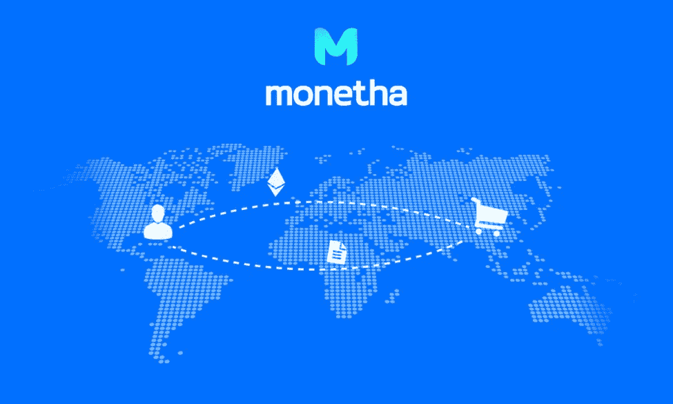
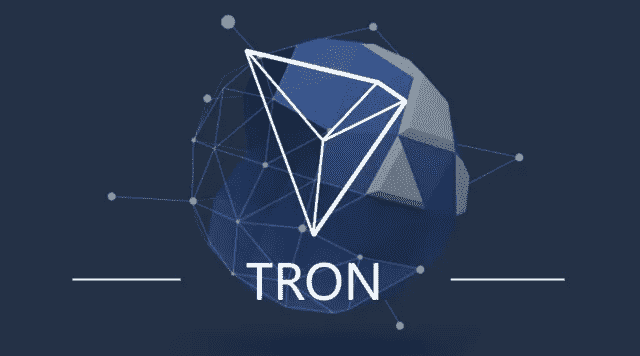

# 本周 5 场 Altcoin 比赛(周中选秀权:斯诺夫、MTH、纳斯、TRX 和 SC)

> 原文：<https://medium.com/swlh/5-altcoin-plays-for-the-week-midweek-picks-snov-mth-nas-trx-and-sc-f32589e02000>

根据即将到来的事件，本周的硬币可能会有显著的回报，包括:斯诺夫(Snovio)，MTH (Monetha)，NAS (Nebulas)，TRX (Tron)和 SC (Siacoin)。

随着主要平台更新、硬币燃烧和重要公告的发布，与 BTC 未来几周的价格走势相比，上述加密货币应能提供高于平均水平的回报。

为上述加密货币概述的每个事件都应该提供宣传，并增加底层加密的效用。加密空间中的效用等同于价值。SNOV、MTH、NAS、TRX 和 SC 在接下来的一周都在增加他们的效用和宣传，使他们成为合适的收购目标。

SNOV 和 MTH 是最有可能增加价值的两家加密公司，因为它们即将推出市场和首批产品里程碑。

# SNOVIO — SNOV(市场发布)

接下来的五天将为 SNOV 令牌提供前所未有的额外功能。SNOV 即将发布的平台是一个分散的线索生成服务，奖励参与其生态系统的可交易 SNOV 令牌的贡献者。

在过去的两个月里，SNOV 的用户总数已经超过了 1，000，000。接下来的一周对于 SNOV 来说更加令人兴奋，因为他们推出了专有的邮件模块。最重要的事件计划在第一季度结束前发生:区块链市场发布。这个平台将连接企业和数据研究分析师。这整个生态系统将由智能合约驱动，使用 SNOV 令牌作为交换手段。

# 莫内萨— MTH(第一个产品里程碑)

2018 年 3 月 31 日，MTH 迎来了第一个产品里程碑。这样一个重要的里程碑加上周围的宣传应该会在短期内提高 MTH 的价值，同时从长期来看巩固 MTH 代币的效用。如果 MTH 支付系统被采用，本周即将推出的附加功能只会放大 MTH 硬币的价值。

MTH 独一无二地将标准加密支付系统向前推进了一步。他们开发了一个基于区块链的算法排名系统，分析每笔交易中买方和卖方的信誉。这个排名系统将缓解销售中常见的问题，如欺诈和发送有缺陷的货物。

MTH 有一个伟大的产品，但他们也有一个非常令人印象深刻的团队。

期待 MTH 在 2018 年 3 月 31 日实现其产品里程碑之前迅速升值。如果第一个产品里程碑没有任何问题或延迟推出，预计 MTH 将进一步增加价值。

# 锡亚金-SC

三个特性将使 SC 在未来一周内更有可能成为当前云存储设施和产品的竞争对手:加快合同签订速度、私钥文件恢复和文件共享。通过提高合同形成的速度，用户将在使用 SC 平台时获得更加无缝的体验。

目前，用于恢复丢失文件的方法是广泛的，但是通过结合类似于加密钱包如何工作的私钥特征，它允许用户恢复他们丢失的文件。文件共享是许多云存储用户体验的重要部分，现在用户将能够与 SC 云存储平台的其他成员共享他们的文件。

这三个相关的升级都增加了 SC 的效用和他们的云存储系统的吸引力。

# 创-TRX(测试版发布和硬币燃烧)

TRX 的第一个测试版(Exodus)将于 2018 年 3 月 31 日推出。对于 TRX 来说，这是一个非常重要的时期，因为一个成功的测试版可能会导致一个成功的 Testnet 和最终的 Mainnet 在第二季度晚些时候推出。TRX 也在本周进行象征性的焚烧，以减少 TRX 总量的供应。本周不仅会看到 TRX 密码增加其效用，但总供应量也将减少杰出的 TRX。

通过减少供应，同时增加效用；TRX 正在为自己的价值快速上升做准备。随着公用事业的增加，需求应该会增加，而供应的减少，价格应该会迅速向北攀升，除非出现任何挫折。

# NEBULAS — NAS (MAINNET 发布)

NAS (Nebulas)将于 2018 年 3 月 29 日发布其 mainnet，并计划在不久后从其 ERC-20 格式更换为区块链 Nebulas。NAS 令牌的可转让性在短期内将会降低，因为它将无法由 ERC-20 友好钱包持有，但如果市场采用，NAS 将有能力大幅增值。

Nebulas 的主要功能包括 Nebulas 排名、Nebulas Force、开发者激励协议/奉献证明、搜索引擎和闪电网络钱包。星云等级建立了一个通用的区块链价值标准。Nebulas Force 是一个支持智能合约的开发人员友好的解决方案。开发人员激励协议和投入证明是奖励开发人员对 NAS 平台所做贡献的系统。搜索引擎功能将允许用户在一个巨大的分散市场中找到想要的数据。闪电网络钱包将允许原子交换。这将允许方便的“交换”你的网络连接到任何支持闪电网络的硬币。

## 由于短期内发生的事件而需要立即关注的硬币包括 SNOV(斯诺维奥)、MTH(莫内萨)、NAS(星云)、TRX(创)和 SC(西亚科恩)。

# 要阅读未经编辑的文章，请确保在此处查看(包括对每枚硬币的进一步分析):[http://bitcoinist . com/5-alt coins-exper me-bit coin-March-28/](http://bitcoinist.com/5-altcoins-outperform-bitcoin-march-28/)

***阅读国王之前的文章，了解他目前推荐哪些 ICO，或者直接与国王取得联系，可以在 Twitter (@JbtheCryptoKing)或者***[***Reddit***](https://redd.it/81hj5q)***(ICO 更新和每日报道)。***

## 这个故事发表在 [The Startup](https://medium.com/swlh) 上，这是 Medium 最大的创业刊物，拥有 310，538+人关注。

## 在这里订阅接收[我们的头条新闻](http://growthsupply.com/the-startup-newsletter/)。

