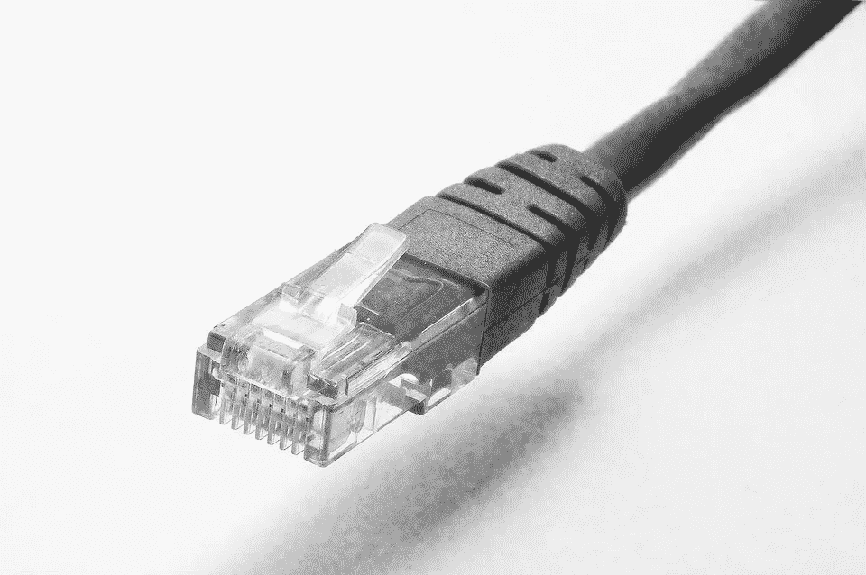

# ADI 领先的 5 大优势

> 原文：<https://medium.com/swlh/5-beautiful-benefits-of-analog-leadership-3a66bbf3e553>

## 从数字盒子里挣脱出来。

强大的生产力应用程序改变了我们的工作体验，这没有错。

有些领导人如何运用这些权力，这是完全错误的。

或者我应该说，虐待他们？

即时消息对话。

电子邮件管理。

数字协作。

决策自动化。

在线反馈。

大数据。

这些工具确实加快了工作流程。或者至少应该如此。这可能是件好事。

但这里有个主题。你看到了吗？

这些新技术旨在取代以往那种必须与他人实时面对面甚至通过电话进行交流并最终解决问题的缓慢而繁琐的过程。

开车经过的信息被深思熟虑的对话所取代。我们鼓励多任务处理。数字噪音会扭曲意义。情绪被表情符号所取代。故事会被图表和数据净化。

借助专为保持我们的工作效率并在尽可能短的时间内创建结果而设计的工具，我们的交互会缩减为字节大小的消息。但这些结果的质量如何？

我们可以用比以往更多的人来覆盖更多的领域。但这块土地的价值是多少呢？

有哪些权衡？我们知道什么时候停止吗？何时断开与设备的连接并与人重新连接？

模拟领导会感觉更慢，(但实际上可能会让事情进展得更快)。这需要我们的注意力、时间和创造力。这需要一定的技巧和品质。这是一出长期戏，更多的是短期作品。但它确实提供了一些优势。

1.  我们观察身体语言，听到其他人的语气，形成一个完整的图片，他们正在发送的信息。
2.  我们充分关注与我们互动的人或我们推动的过程。
3.  我们会实时澄清误解和意图，而不是希望我们的信息得到正确解读。
4.  我们表达的是与话语紧密相关的情感，尤其是在表达谢意或提供反馈时。
5.  我们分享经验，讲故事，给我们的想法增添色彩，并与他人建立联系。

在它的背后隐藏着一个简单的真理:领导力是一种人类的经验。考虑到这一点，这份名单会变得更长。

我认为，我们可能会在不知情的情况下陷入一种模糊而疯狂的数字互动模式，同时忘记这些工具的背后是人类。

很难通过电子邮件建立信任，也很难知道一个人是否需要我们的鼓励。有些事情数据无法告诉我们。有些独特的个性、经历、历史和故事很容易通过即时消息错过。

在真实的人际互动中，有一种内在的回报，我在永无止境的团队管理打字和点击版本中找不到。事实上，我觉得它有趣得多。其他人可能不同意，没关系。这就是我的神经。

我注意到的另一件事。有时候你需要放慢速度来加快速度。这通常涉及模拟方法。

我们的数字世界正在彻底改变工作场所。领导者聪明地利用了这些工具的优势。我知道我有。只要考虑到这不是一个一刀切的解决方案。它们并不打算也不能完全取代必要的人际互动，这种互动让领导力变得有效。如果我们运用正确的平衡，我们可以提高我们的效率，而不会失去我们的效力。

*原载于 2018 年 3 月 14 日*[*【soul2work.com】*](https://soul2work.com/2018/03/5-beautiful-benefits-of-analog-leadership/)*。*

## 这篇文章发表在 [The Startup](https://medium.com/swlh) 上，这是 Medium 最大的创业刊物，有 306，065+人关注。

## 在这里订阅接收[我们的头条新闻](http://growthsupply.com/the-startup-newsletter/)。

