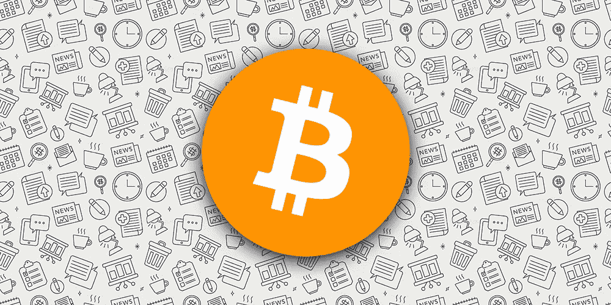
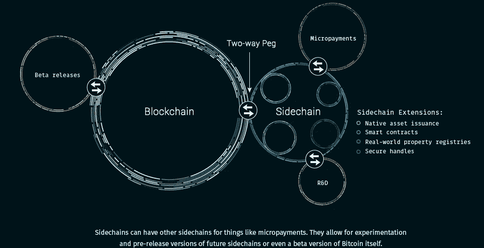
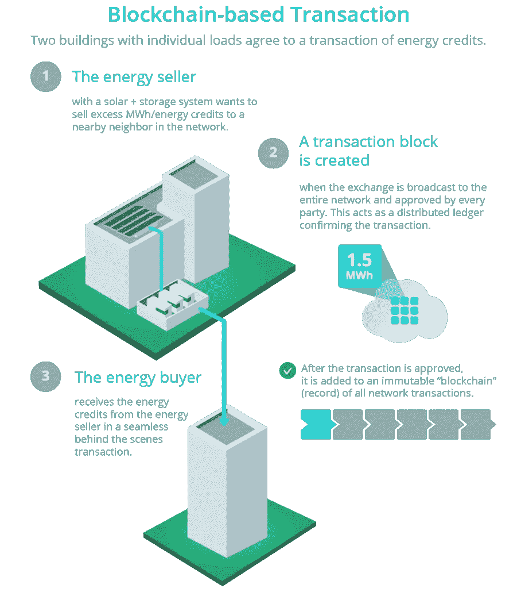
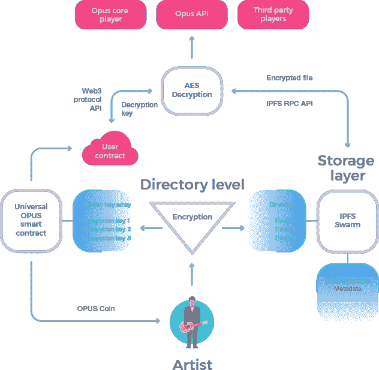
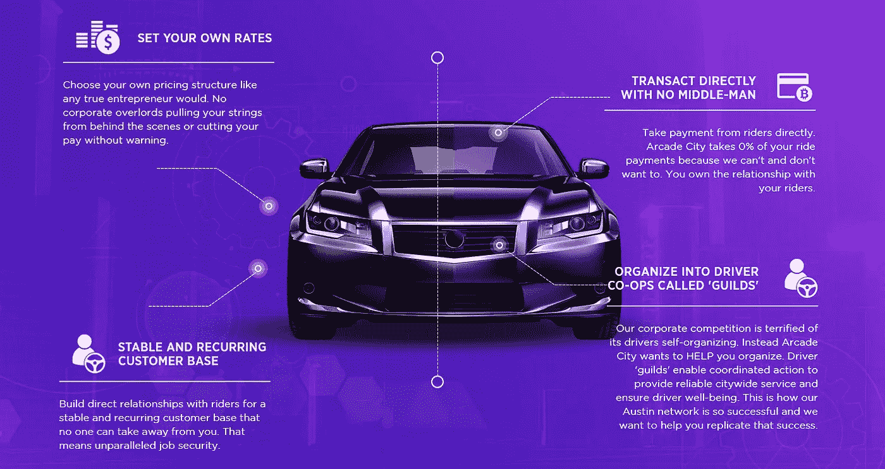
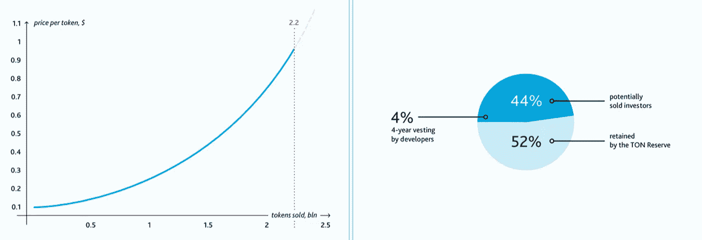

# 区块链可能改变 5 大行业

> 原文：<https://medium.com/swlh/5-big-industries-blockchain-could-transform-eef763343ff0>

[区块链技术](https://dashbouquet.com/blog/blockchain/blog/blockchain/blockchain-solutions-the-way-to-transform-your-business-processes)无疑已经存在，考虑到它提供的众多好处，从完全集中的系统到分散的系统的范式转变只是一个时间问题。Gartner 进行的一项研究显示，区块链公司在去年带来了超过 40 亿美元的业务增值。据估计，这一价值到 2020 年将增长到 210 亿美元，到 2030 年将超过 3 万亿美元。

比特币和以太坊等加密货币在金融业的广泛接受，也预示着这场革命即将到来。现在，随着五分之三的银行积极支持区块链平台，我们可以有把握地推测，我们将在 2018 年见证扩展应用。这里讨论了区块链可以改造的其他一些大型产业。

# 保险

继金融部门之后，这是另一个获得大量投资的行业。2016 年，安盛战略风险投资公司(AXA Strategic Ventures)向一家区块链初创公司投资了超过 5500 万美元。初创公司 [Blockstream](https://blockstream.com/) 提供了一个分类账，用于创建、管理公司记录，并将其安全地存储在一个安全且可访问的“金库”中。

随着区块链系统在这一部门的应用，有需要的各方可以实时获得单一的信息来源，而不是将多个文件保存在一个中心。这使得在需要时更新和认证细节变得容易。

虽然简单和方便是这个应用程序的主要特点，但它也大大提高了效率，并有助于节省成本。它有助于注意到，分散平台也有助于发现和最大限度地减少欺诈。这将特别有用，因为麦肯锡公司估计，几乎 10%的保险索赔是欺诈性的。

这也许就是为什么[劳埃德保险社](https://www.lloydsbank.com/)伦敦市场宣布他们的运营模式计划现代化迫在眉睫，区块链技术是一个重要的组成部分。为此，他们提出了区块链保险行业倡议(B3i)，这是一个拥有 Achmea、Aegon、Swiss Re、Tokio Marine 和苏黎世保险集团等成员的财团。

# 活力

在采用新技术方面，能源行业始终处于领先地位，采用区块链技术也不例外。像荷兰的[光谱能源](https://spectral.energy/)和澳大利亚的[电力分类账](https://powerledger.io/)这样的公司已经分别筹集了超过 6000 万美元来测试区块链在这一领域的实际应用。

这项技术将被证明是非常宝贵的，特别是在可再生能源整合领域，因为无缝点对点能源交易将得到促进。我们已经在许多屋顶上安装了太阳能光伏板，一家支持这种能源交易形式的初创公司 [Conjoule](http://conjoule.de/de/start/) 已经为此筹集了超过 500 万美元的资金。该公司已经在德国进行了试点，并将继续扩大。

除了可再生能源，智能合同也可以用来控制电网；发起和认证“能源交易”。通过区块链技术进行适当的管理将有助于创造供需平衡，从而使电网更加稳定。

# 音乐产业

这可能会让许多人感到震惊，然而，娱乐专家很久以前就已经预测到了这种融合。盗版已经成为这个行业的普遍威胁，区块链技术的一个突出应用将是保护艺术家的权利。

如果一个分散的系统被成功地实现，音乐可以被发布在一个分类账上，这个分类账上产生一个独特的代码，记录下每个时间标记。这种分类帐的不可变性质意味着它不能被随意修改、下载或共享。

对科技情有独钟的音乐家 Benji Rogers 已经有了一家初创公司([Dot block chain Music Project](http://dotblockchainmusic.com/))，正在这个领域掀起波澜。他的目标是开发新的协议和所需的在线基础设施，以方便行业采用区块链技术。

另一家有着类似目标的初创公司 OPUS 声称，基于其系统产生的收入有 97%流向了艺术家。还有一种利润分享模式，确保播放列表制作者得到补偿，因为他们有助于增加艺术家作品的流量。目前，低延迟 IPFS 被用作歌曲的存储层，并且基于以太坊的平台被用于处理交易。

# 乘车共享

运输部门也没有被排除在这波浪潮之外。毫无疑问，优步、Lyft 和 Taxify 已经在行业中为自己开拓了一席之地。不幸的是，区块链技术在这个行业的出现将使这些公司要么适应，要么倒闭。这是由于严重依赖于控制驱动程序和客户端的操作和管理的中央数据库。

然而，在区块链，市场享有更高水平的灵活性和结构。分布式账本创造了一个更受用户驱动的市场，这不可否认地规范了行业。目前，有一家名为 [Arcade City](https://arcade.city/) 的初创公司，它通过区块链平台促进每一笔交易。

他们没有对司机进行自主控制，而是被给予了决定费率、费用甚至提供额外服务的自由。街机城绝对不是同类中的最后一个。

# 即时消息应用程序

如果不提到互联网有史以来最大的创新之一，这个列表将是不完整的。今年，我们要么看到安装了区块链系统的新消息应用程序，要么看到现有消息应用程序中区块链公司的崛起。

[Telegram](https://telegram.org/) ，加密应用的先驱之一，目前正在进行首次公开募股(ICO)，目标是筹集 12 亿美元，这是历史上最大的一次。有了 Benchmark、红杉资本(Sequoia Capital)和凯鹏华盈(Kleiner Perkins Caufield and Byers)这样的投资者，Telegram 的计划可能会比预期更早实现。

[Kik](https://www.kik.com/) 是另一款目前有 ICO while Line 的即时通讯应用；这是一个在日本很受欢迎的平台，旨在扩展到加密货币交易领域。

# 结论

毫无疑问，区块链科技的崛起将成为我们目睹的最具颠覆性的事件之一。除了这 5 个行业，其他领域，如广告、医疗保健、制造，甚至治理都将享受分散化运营。这些创新的解决方案有望在很短的时间内带来快速的投资回报。

娜塔莉亚·库库什金娜撰写

## 这篇文章发表在 [The Startup](https://medium.com/swlh) 上，这是 Medium 最大的创业刊物，有 307，871+人关注。

## 在这里订阅接收[我们的头条新闻](http://growthsupply.com/the-startup-newsletter/)。

